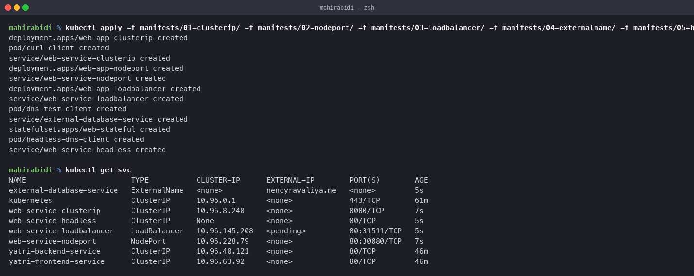
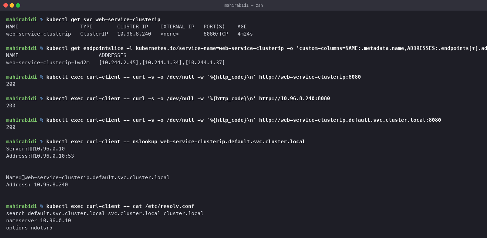
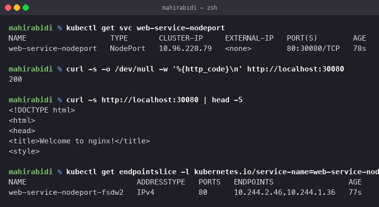
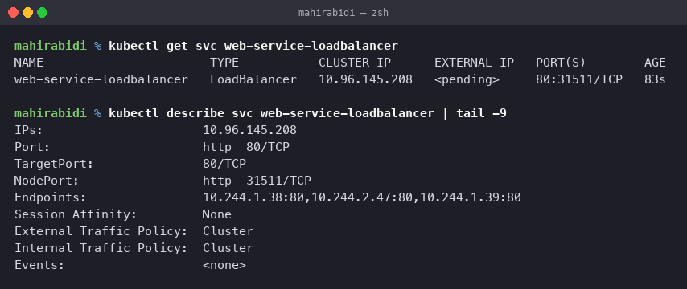
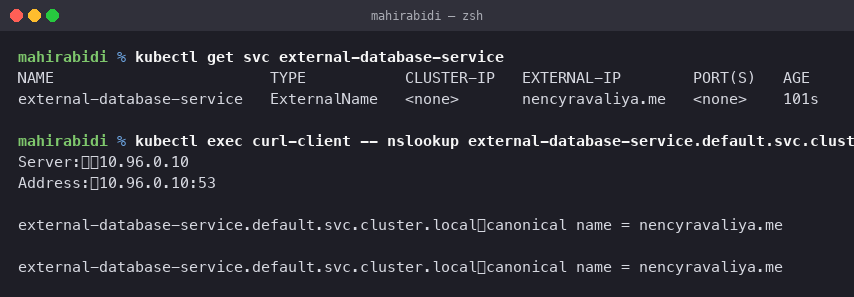
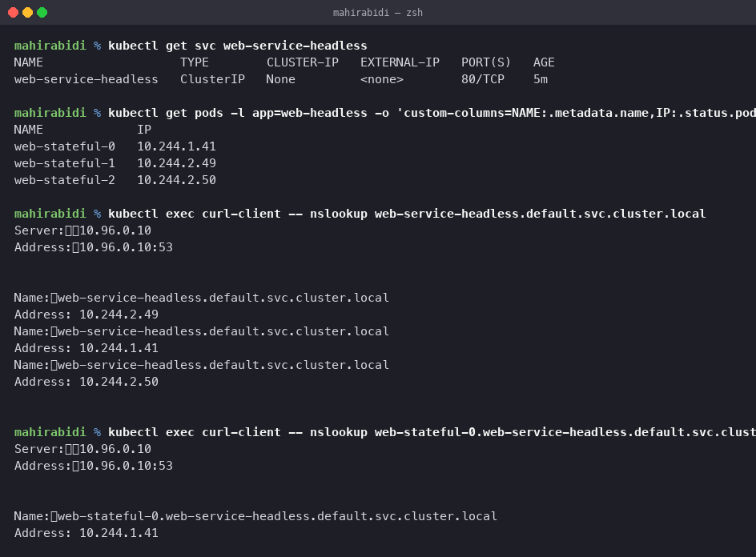
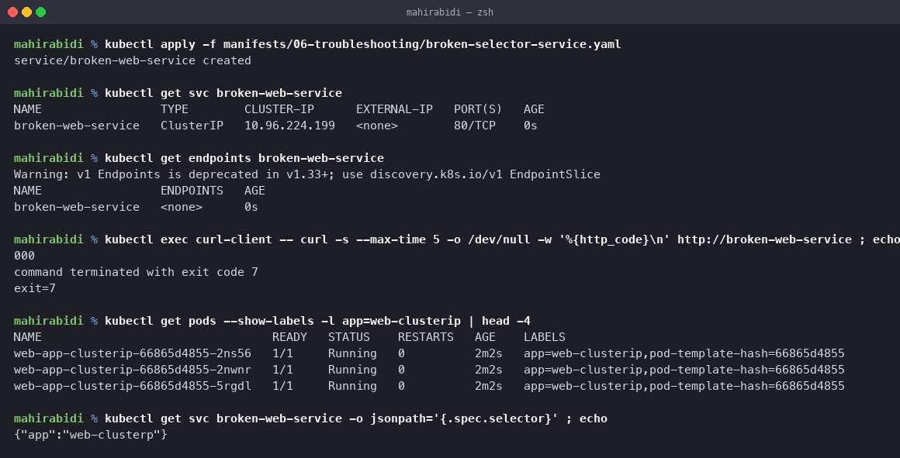

# Kubernetes Networking & Services

All five Service types applied to a real three node kind cluster, with the output that
shows how each one actually behaves. Manifests are in `manifests/`, one folder per type.

## Why Services exist

Pods are disposable. The ReplicaSet exercise in the previous task showed it directly: a
deleted pod is replaced by a new pod with a new name and a new IP. So nothing can be
built on a pod's address, because that address is guaranteed to change.

A Service is a stable name and a stable virtual IP placed in front of a changing set of
pods. It selects pods by label, tracks their addresses as they come and go, and load
balances across whatever is currently ready.

## The four ports, which are easy to confuse

| Field | Meaning |
|---|---|
| `port` | the port the Service itself listens on, inside the cluster |
| `targetPort` | the port on the pod that traffic is forwarded to |
| `nodePort` | a port opened on every node, NodePort and LoadBalancer only |
| `containerPort` | documentation on the pod spec; it does not open anything |

In `01-clusterip/service.yaml` the Service is on `port: 8080` while the pods listen on
`targetPort: 80`, deliberately different so the mapping is visible rather than assumed.

All five types applied together, so the differences in `CLUSTER-IP`, `EXTERNAL-IP` and
`PORT(S)` can be read off one listing:

## 1. ClusterIP — the default, internal only

Gives the Service a virtual IP reachable only from inside the cluster. This is the type
for anything that should not be exposed outward, which is most things.

    $ kubectl apply -f manifests/01-clusterip/
    deployment.apps/web-app-clusterip created
    pod/curl-client created
    service/web-service-clusterip created

    $ kubectl get svc web-service-clusterip
    NAME                    TYPE        CLUSTER-IP    EXTERNAL-IP   PORT(S)    AGE
    web-service-clusterip   ClusterIP   10.96.8.240   <none>        8080/TCP   4m11s

`EXTERNAL-IP` is `<none>`, which is the whole character of this type.

### What sits behind it

    $ kubectl get endpointslice -l kubernetes.io/service-name=web-service-clusterip \
        -o custom-columns=NAME:.metadata.name,ADDRESSES:.endpoints[*].addresses
    NAME                          ADDRESSES
    web-service-clusterip-lwd2m   [10.244.2.45],[10.244.1.34],[10.244.1.37]

Three pod IPs, matching the Deployment's three replicas. This EndpointSlice is maintained
by the EndpointSlice controller from the architecture notes, and it is the thing that
actually changes when pods come and go. The Service object itself never changes.

**This is the first place to look when a Service does not work.** An empty address list
means the selector matches nothing, and no amount of checking DNS or ports will help.

### Reaching it three ways from another pod

    $ kubectl exec curl-client -- curl -s -o /dev/null -w "%{http_code}\n" http://web-service-clusterip:8080
    200
    $ kubectl exec curl-client -- curl -s -o /dev/null -w "%{http_code}\n" http://10.96.8.240:8080
    200
    $ kubectl exec curl-client -- curl -s -o /dev/null -w "%{http_code}\n" http://web-service-clusterip.default.svc.cluster.local:8080
    200

Short name, ClusterIP and fully qualified name all work.

### DNS, and why the short name resolves

    $ kubectl exec curl-client -- nslookup web-service-clusterip.default.svc.cluster.local
    Server:		10.96.0.10
    Address:	10.96.0.10:53
    Name:	web-service-clusterip.default.svc.cluster.local
    Address: 10.96.8.240

    $ kubectl exec curl-client -- cat /etc/resolv.conf
    search default.svc.cluster.local svc.cluster.local cluster.local
    nameserver 10.96.0.10
    options ndots:5

The FQDN pattern is `<service>.<namespace>.svc.cluster.local`. The short name works only
because of the `search` list, which appends `default.svc.cluster.local` first. That has a
practical consequence: a short name reaches a Service in the *pod's own* namespace, so
crossing namespaces requires at least `<service>.<namespace>`.

The nameserver 10.96.0.10 is the CoreDNS Service, itself an ordinary ClusterIP.

Note also that the ClusterIP 10.96.8.240 does not answer a ping and belongs to no
interface on any machine. It exists only as packet filter rules programmed by `kube-proxy`
on every node, which is why it works identically from any pod.

## 2. NodePort — reachable from outside, via the nodes

Opens the same port on every node and forwards it to the Service. Building on ClusterIP
rather than replacing it, so the internal virtual IP still exists.

    $ kubectl get svc web-service-nodeport
    NAME                   TYPE       CLUSTER-IP      EXTERNAL-IP   PORT(S)        AGE
    web-service-nodeport   NodePort   10.96.228.79   <none>        80:30080/TCP   78s

    $ curl -s -o /dev/null -w "%{http_code}\n" http://localhost:30080
    200

`80:30080/TCP` reads as: port 80 inside the cluster, 30080 on every node. The request
above came from the Mac, outside the cluster entirely, so this is genuinely external
access.

`30080` works from `localhost` here because the kind cluster was created with an
`extraPortMappings` entry forwarding host port 30080 to the node's 30080. On a normal
cluster you would use a node's own address.

The default range is 30000–32767, which is why the port is a high number and not 80. The
limitations are real: one port per Service cluster wide, an awkward port number, and the
caller has to know a node address, so a node going away breaks whoever was using it. It
suits development and internal tooling rather than public traffic.

## 3. LoadBalancer — the cloud provider entry point

Asks the infrastructure for a real external load balancer pointing at the Service.

    $ kubectl get svc web-service-loadbalancer
    NAME                       TYPE           CLUSTER-IP     EXTERNAL-IP   PORT(S)        AGE
    web-service-loadbalancer   LoadBalancer   10.96.145.208   <pending>     80:31511/TCP   5s

`EXTERNAL-IP` is stuck at `<pending>`, and that is the instructive result rather than a
failure. From the architecture notes: provisioning a real load balancer is the job of the
`cloud-controller-manager`, and a local kind cluster has no cloud provider, so no
component exists to satisfy the request. It will stay pending forever.

On EKS, GKE or AKS the same manifest gets a real address within a minute. Locally the
equivalent is an add-on such as MetalLB, or `minikube tunnel`.

Note it still allocated a nodePort, 31511, because LoadBalancer is built on NodePort,
which is built on ClusterIP. Each type adds a layer rather than replacing the one below.

The thing to know about cost: one `LoadBalancer` Service is one billed load balancer from
the cloud provider. Ten public services means ten of them, which is the main argument for
putting an Ingress in front instead, as in the next task.

## 4. ExternalName — a DNS alias out of the cluster

Maps a Service name to an external DNS name. It has no selector, no pods, no ClusterIP
and no proxying; it is purely a CNAME record served by cluster DNS.

    $ kubectl get svc external-database-service
    NAME                        TYPE           CLUSTER-IP   EXTERNAL-IP        PORT(S)   AGE
    external-database-service   ExternalName   <none>       nencyravaliya.me   <none>    101s

    $ kubectl exec curl-client -- nslookup external-database-service.default.svc.cluster.local
    Server:		10.96.0.10
    Address:	10.96.0.10:53
    external-database-service.default.svc.cluster.local	canonical name = nencyravaliya.me

Both `CLUSTER-IP` and `PORT(S)` are empty, and the lookup returns a `canonical name`
rather than an address. Nothing is intercepted; the pod then resolves that external name
itself and connects directly.

What it is for: letting in-cluster code use a consistent internal name like
`external-database-service` for something that lives outside, typically a managed
database. Migrating that dependency into the cluster later means replacing this object
with a normal ClusterIP Service, and no application config changes.

Because it is only DNS, it cannot do port remapping, and it does nothing for a client
that connects by IP.

## 5. Headless Service — no VIP, direct pod addresses

Setting `clusterIP: None` turns off the virtual IP and the load balancing. DNS then
returns the pod addresses themselves.

    $ kubectl get svc web-service-headless
    NAME                   TYPE        CLUSTER-IP   EXTERNAL-IP   PORT(S)   AGE
    web-service-headless   ClusterIP   None         <none>        80/TCP    5m

    $ kubectl get pods -l app=web-headless -o custom-columns=NAME:.metadata.name,IP:.status.podIP
    NAME             IP
    web-stateful-0   10.244.1.41
    web-stateful-1   10.244.2.49
    web-stateful-2   10.244.2.50

### Resolving it returns every pod, not one address

    $ kubectl exec curl-client -- nslookup web-service-headless.default.svc.cluster.local
    Name:	web-service-headless.default.svc.cluster.local
    Address: 10.244.2.49
    Name:	web-service-headless.default.svc.cluster.local
    Address: 10.244.1.41
    Name:	web-service-headless.default.svc.cluster.local
    Address: 10.244.2.50

Three A records for one name, and they are pod IPs in the 10.244.x.x pod range, not a
10.96.x.x service IP. Compare with the ClusterIP lookup earlier, which returned exactly
one address. The client now picks a pod itself instead of having `kube-proxy` choose.

### Each pod addressable by its own stable name

    $ kubectl exec curl-client -- nslookup web-stateful-0.web-service-headless.default.svc.cluster.local
    Name:	web-stateful-0.web-service-headless.default.svc.cluster.local
    Address: 10.244.1.41

    web-stateful-1... -> 10.244.2.49
    web-stateful-2... -> 10.244.2.50

The pattern is `<pod>.<service>.<namespace>.svc.cluster.local`, and it only exists because
the StatefulSet names this Service in its `serviceName` field. This is the missing half of
the previous task: a StatefulSet supplies stable pod *names*, and the headless Service
turns those names into resolvable DNS.

That combination is what clustered software needs. A replica has to reach one specific
peer, not a random one, so `mysql-0` must mean that exact pod. Load balancing across
replicas would break replication entirely.

## Comparison

| Type | ClusterIP | External access | DNS returns | Typical use |
|---|---|---|---|---|
| ClusterIP | yes, virtual | none | the virtual IP | internal services, the default |
| NodePort | yes | port on every node | the virtual IP | dev, internal tooling |
| LoadBalancer | yes | cloud load balancer | the virtual IP | public services on a cloud |
| ExternalName | none | n/a, points outward | a CNAME | aliasing an external dependency |
| Headless | none | none | all pod IPs | StatefulSets, peer discovery |

## Debugging order when a Service does not work

1. `kubectl get endpointslice` — if the addresses are empty, the selector matches nothing
   and nothing else matters. Check that the Service selector and the pod labels agree.
2. Are the pods actually Ready? Only Ready pods are placed in the endpoint list, so a
   failing readiness probe silently removes a pod from a Service.
3. Is `targetPort` the port the container really listens on, rather than a copy of `port`?
4. Resolve the name from a pod with `nslookup`, to separate a DNS problem from a routing
   one, exactly the split used in the earlier Linux networking task.
5. `<pending>` on a LoadBalancer is an infrastructure question, not a manifest bug.

### The same failure, produced on purpose

`manifests/06-troubleshooting/broken-selector-service.yaml` is a Service whose selector
reads `app: web-clusterp` while the pods are labelled `app: web-clusterip`. One missing
letter, and the Service is healthy in every way except the one that matters.

    $ kubectl apply -f manifests/06-troubleshooting/broken-selector-service.yaml
    service/broken-web-service created

    $ kubectl get endpoints broken-web-service
    NAME                 ENDPOINTS   AGE
    broken-web-service   <none>      0s

    $ kubectl exec curl-client -- curl -s --max-time 5 -o /dev/null -w '%{http_code}\n' http://broken-web-service
    000
    command terminated with exit code 7

    $ kubectl get svc broken-web-service -o jsonpath='{.spec.selector}'
    {"app":"web-clusterp"}

    $ kubectl get pods --show-labels -l app=web-clusterip | head -2
    NAME                                 READY   STATUS    RESTARTS   AGE    LABELS
    web-app-clusterip-66865d4855-2ns56   1/1     Running   0          2m2s   app=web-clusterip,pod-template-hash=66865d4855

`kubectl get svc` looks entirely normal: the Service has a ClusterIP, the right port and
no error condition anywhere. Only `ENDPOINTS <none>` reveals the problem. The curl result
is worth reading carefully too: `000` with exit code 7 means the connection was refused
outright, because `kube-proxy` has no address to forward to. That is a different symptom
from a `404` or a timeout, and the distinction is what tells you to look at labels rather
than at the application.

## Cleanup

    kubectl delete -f manifests/01-clusterip/ -f manifests/02-nodeport/ \
                     -f manifests/03-loadbalancer/ -f manifests/04-externalname/ \
                     -f manifests/05-headless/
    kubectl delete -f manifests/06-troubleshooting/
    kubectl delete pvc -l app=web-headless
