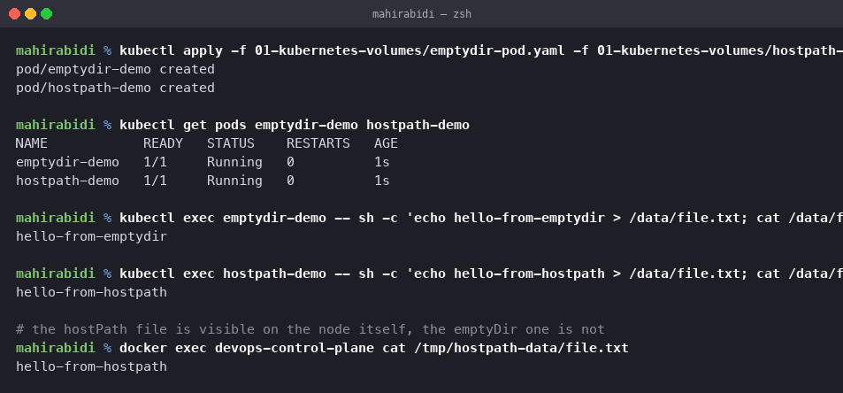
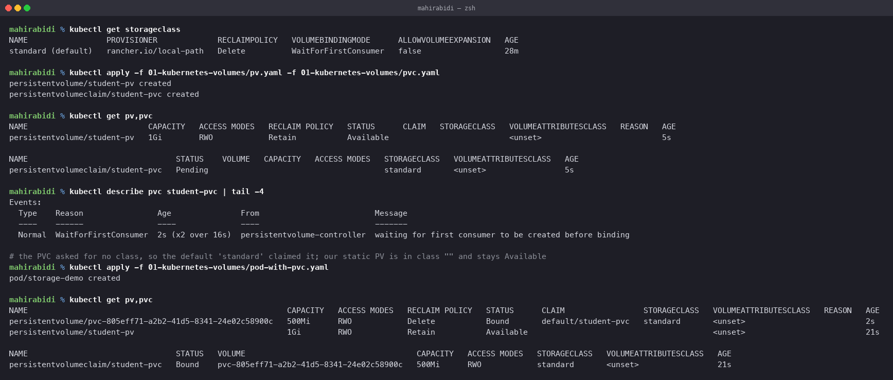
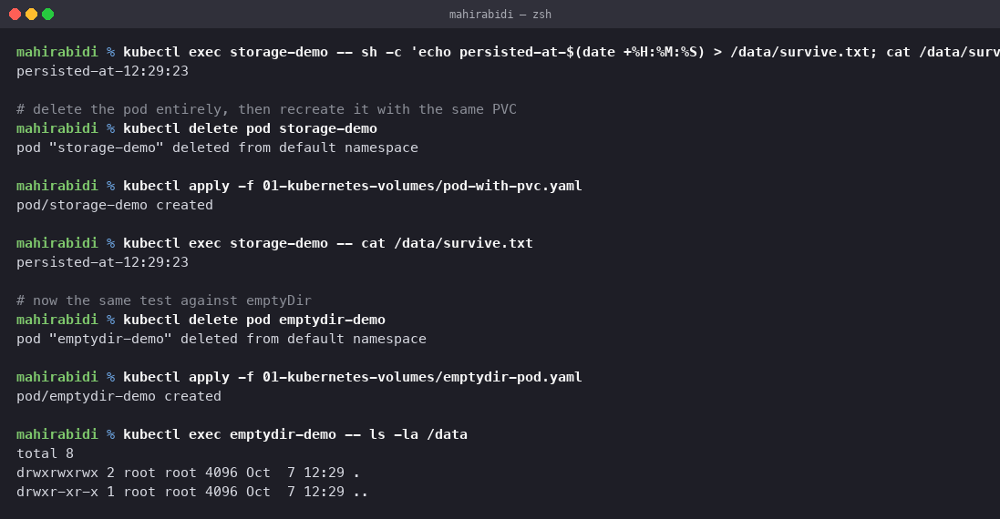

# Kubernetes Volumes

Session 13, Task 1. Every claim below was checked on the cluster, and the output is
reproduced as it appeared.

The cluster: single node kind, `v1.37.0`, which ships one StorageClass:

    $ kubectl get storageclass
    NAME                 PROVISIONER             RECLAIMPOLICY   VOLUMEBINDINGMODE      AGE
    standard (default)   rancher.io/local-path   Delete          WaitForFirstConsumer   28m

That `(default)` marker and the `WaitForFirstConsumer` mode both matter later.

## Why volumes exist at all

A container's filesystem dies with the container. Not with the pod — with the *container*.
A crash and restart is enough to lose everything written inside it. Anything that must
outlive that needs a volume.

Volumes also solve a second problem: two containers in one pod have separate filesystems,
so sharing files between them requires a volume mounted into both.

## emptyDir

An empty directory created when the pod is assigned to a node, and deleted when the pod is
removed. It lives on the node's disk.

    volumes:
      - name: app-storage
        emptyDir: {}

    $ kubectl exec emptydir-demo -- sh -c 'echo hello-from-emptydir > /data/file.txt; cat /data/file.txt'
    hello-from-emptydir

Writing works. What matters is what happens when the pod goes:

    $ kubectl delete pod emptydir-demo
    $ kubectl apply -f emptydir-pod.yaml
    $ kubectl exec emptydir-demo -- ls -la /data
    total 8
    drwxrwxrwx 2 root root 4096 Oct  7 12:29 .
    drwxr-xr-x 1 root root 4096 Oct  7 12:29 ..

Empty. The directory was recreated from scratch.

The scope is worth being precise about: an emptyDir **survives a container restart** but
**not pod deletion or rescheduling**. So it is useful for scratch space, a cache, or
passing files between containers in the same pod — and useless for anything you would miss.

Setting `emptyDir: {medium: Memory}` backs it with tmpfs instead of disk, which is fast and
counts against the pod's memory limit.

## hostPath

Mounts a file or directory from the **node's** filesystem into the pod.

    volumes:
      - name: host-storage
        hostPath:
          path: /tmp/hostpath-data
          type: DirectoryOrCreate

    $ kubectl exec hostpath-demo -- sh -c 'echo hello-from-hostpath > /data/file.txt'
    $ docker exec devops-control-plane cat /tmp/hostpath-data/file.txt
    hello-from-hostpath

The second command reads the file from the node itself, outside Kubernetes entirely. That
is the whole character of hostPath: the pod is writing to the machine.

Which is also why it is dangerous. The data is tied to one specific node, so a pod
rescheduled elsewhere sees a different directory — or an empty one. And a pod that can
mount `/` or the container runtime socket can take over the node, which is why hostPath is
usually blocked by policy in production clusters.

Legitimate uses are all node-level: a log collector reading `/var/log`, a monitoring agent
reading `/proc`, a CNI plugin writing config. These are exactly the DaemonSet workloads
from task 9, and the pattern holds — hostPath goes with DaemonSets, not Deployments.

## PersistentVolume

A piece of storage in the cluster, provisioned by an administrator or created dynamically.
It is a cluster-scoped object with a lifecycle independent of any pod.

    apiVersion: v1
    kind: PersistentVolume
    metadata:
      name: student-pv
    spec:
      capacity:
        storage: 1Gi
      accessModes:
        - ReadWriteOnce
      persistentVolumeReclaimPolicy: Retain
      hostPath:
        path: /tmp/student-data

The access modes:

| Mode | Short | Meaning |
|---|---|---|
| ReadWriteOnce | RWO | mounted read-write by a single **node** |
| ReadOnlyMany | ROX | mounted read-only by many nodes |
| ReadWriteMany | RWX | mounted read-write by many nodes |
| ReadWriteOncePod | RWOP | mounted read-write by a single **pod** |

RWO is the common one and the usual source of confusion: it restricts to one node, not one
pod, so several pods on the same node can share it. It is also why a Deployment using an
RWO volume cannot do a rolling update across nodes — the new pod cannot mount the volume
while the old one holds it. That is one of the reasons the Recreate strategy exists.

The reclaim policy decides what happens when the claim is deleted: `Retain` keeps the
volume and its data for manual cleanup, `Delete` removes the underlying storage.

## PersistentVolumeClaim

A request for storage by a user. Pods never reference a PV directly — they reference a
claim, and the claim is bound to a volume.

    apiVersion: v1
    kind: PersistentVolumeClaim
    metadata:
      name: student-pvc
    spec:
      accessModes:
        - ReadWriteOnce
      resources:
        requests:
          storage: 500Mi

The separation is the point. The claim says "I need 500Mi, writable by one node" and knows
nothing about whether that is an EBS volume, an NFS export or a directory on the node. The
same manifest works on a laptop and on EKS.

## What actually happened when I applied them

This did not go the way the manifests suggest, and the reason is worth recording.

    $ kubectl apply -f pv.yaml -f pvc.yaml
    persistentvolume/student-pv created
    persistentvolumeclaim/student-pvc created

    $ kubectl get pv,pvc
    persistentvolume/student-pv     1Gi   RWO   Retain   Available
    persistentvolumeclaim/student-pvc   Pending    ...   standard

The PVC did **not** bind to the PV. Two things caused that:

**First**, the PVC does not set `storageClassName`, so it inherited the cluster default,
`standard`. The PV does not set one either, which puts it in the empty class `""`. A claim
in class `standard` will never bind to a volume in class `""`, so they simply ignored each
other.

**Second**, the status says `Pending` rather than failing:

    Normal  WaitForFirstConsumer  persistentvolume-controller
            waiting for first consumer to be created before binding

That is the StorageClass's `volumeBindingMode: WaitForFirstConsumer`. Binding is deferred
until a pod actually needs the volume, so the scheduler can place the pod first and
provision storage in the right place. On a multi-zone cluster this prevents the classic
failure of a volume in zone A and a pod scheduled to zone B.

Creating the consumer pod resolved it — not by binding to our PV, but by provisioning a new
one:

    $ kubectl apply -f pod-with-pvc.yaml
    $ kubectl get pv,pvc
    persistentvolume/pvc-805eff71-...   500Mi   RWO   Delete   Bound   default/student-pvc   standard
    persistentvolume/student-pv         1Gi     RWO   Retain   Available

Two volumes now. The dynamically created one is exactly 500Mi, the size requested, with
reclaim policy `Delete` inherited from the StorageClass. Our hand-written 1Gi `student-pv`
is still `Available` and was never used.

To bind to the static PV instead, the claim needs `storageClassName: ""` to opt out of the
default class explicitly. Leaving the field off is not the same as setting it to empty —
that distinction is the whole bug.

## Proving persistence

    $ kubectl exec storage-demo -- sh -c 'echo persisted-at-$(date +%H:%M:%S) > /data/survive.txt'
    persisted-at-12:29:23

    $ kubectl delete pod storage-demo
    $ kubectl apply -f pod-with-pvc.yaml
    $ kubectl exec storage-demo -- cat /data/survive.txt
    persisted-at-12:29:23

Same timestamp. The pod was destroyed and recreated; the data did not care. Contrast with
the emptyDir test in the same screenshot, which came back empty.

This is the same mechanism as the StatefulSet in task 9, where `mysql-1` was deleted and
returned attached to `mysql-persistent-storage-mysql-1` — the identical claim, so the
identical data.

## StorageClass

Describes a *class* of storage the cluster can provision on demand. It names a provisioner
and the parameters to hand it.

On this cluster the provisioner is `rancher.io/local-path`, which creates a directory on
the node. On EKS it would be `ebs.csi.aws.com`, on GKE `pd.csi.storage.gke.io`, with
parameters for disk type and IOPS.

The fields that matter:

| Field | Effect |
|---|---|
| `provisioner` | which driver creates the volume |
| `reclaimPolicy` | `Delete` or `Retain` for volumes it creates |
| `volumeBindingMode` | `Immediate`, or `WaitForFirstConsumer` to bind after scheduling |
| `allowVolumeExpansion` | whether a PVC can be grown later |

A cluster typically offers several — `fast-ssd`, `standard`, `backup` — and the claim picks
one by name. That is how a developer chooses storage characteristics without knowing
anything about the infrastructure.

## Dynamic provisioning

The whole flow demonstrated above, stated plainly:

1. A PVC is created naming a StorageClass, or inheriting the default.
2. Nothing binds yet if the mode is `WaitForFirstConsumer`.
3. A pod referencing the claim is scheduled to a node.
4. The provisioner creates a real volume of the requested size.
5. A PV object is created automatically to represent it.
6. The PV and PVC bind, and the pod starts.

No administrator was involved at any step, which is the entire value. The alternative,
static provisioning, means someone creates PVs ahead of time and claims match against
whatever exists — workable for a handful of volumes, unworkable at any scale.

## Summary

| Type | Lives as long as | Survives pod delete | Scope | Use for |
|---|---|---|---|---|
| emptyDir | the pod | no | one pod | scratch, cache, sharing between containers |
| hostPath | the node's disk | yes, but tied to that node | one node | node agents, log collectors |
| PV + PVC | independent of pods | yes | cluster | databases, uploads, anything that matters |
| StorageClass | — | — | cluster | provisioning PVs automatically |

## Cleanup

    kubectl delete -f . --ignore-not-found
    kubectl delete pv student-pv --ignore-not-found
