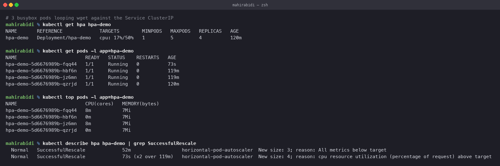
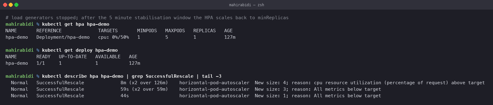

# Horizontal Pod Autoscaler

Session 13, Task 2. Deploy an application, configure an HPA, generate load, and watch the
replica count follow CPU.

## What the HPA does

The HorizontalPodAutoscaler adjusts the replica count of a Deployment to keep an observed
metric near a target. Horizontal means *more pods*; the vertical equivalent, VPA, changes
the CPU and memory of existing pods instead.

The control loop runs every 15 seconds:

    desiredReplicas = ceil(currentReplicas × currentMetric / targetMetric)

So 1 pod at 200% against a 50% target gives `ceil(1 × 200 / 50)` = 4 replicas, which is
exactly what happened below.

## Prerequisite: metrics-server

kind does not ship metrics-server, and without it the HPA has nothing to read. Installing
it needs one patch, because kind's kubelet serving certificates are self-signed:

    kubectl apply -f https://github.com/kubernetes-sigs/metrics-server/releases/latest/download/components.yaml

    kubectl patch deployment metrics-server -n kube-system --type=json \
      -p='[{"op":"add","path":"/spec/template/spec/containers/0/args/-","value":"--kubelet-insecure-tls"}]'

Until it is running the HPA reports `cpu: <unknown>/50%` and logs:

    Warning  FailedGetResourceMetric  horizontal-pod-autoscaler
             failed to get cpu utilization: no metrics returned from resource metrics API

That warning is still visible in the event history below, from before metrics-server came
up. It is worth recognising, because it is the single most common reason an HPA appears to
do nothing.

## The manifests

`deployment.yaml` runs nginx with one replica and, critically, a **CPU request**:

    resources:
      requests:
        cpu: 100m
      limits:
        cpu: 200m

The HPA target is a percentage **of the request**, not of the node. Without a request there
is no denominator and the HPA cannot compute utilisation at all. This is the second most
common reason an HPA does nothing.

`hpa.yaml` targets 50% utilisation, between 1 and 5 replicas:

    apiVersion: autoscaling/v2
    kind: HorizontalPodAutoscaler
    spec:
      scaleTargetRef:
        kind: Deployment
        name: hpa-demo
      minReplicas: 1
      maxReplicas: 5
      metrics:
        - type: Resource
          resource:
            name: cpu
            target:
              type: Utilization
              averageUtilization: 50

## The load generator

`load-generator.sh` starts busybox pods running `wget` in a loop against the Service.

Two details came out of actually running it.

**It must run inside the cluster.** Load through `kubectl port-forward` is throttled by the
tunnel and never moves the CPU far.

**It targets the Service ClusterIP, not its DNS name.** The first version used
`http://hpa-demo-service`, and with six pods resolving that name on every single request
the generators died:

    $ kubectl logs load-gen-1 --tail=3
    wget: bad address 'hpa-demo-service'
    wget: bad address 'hpa-demo-service'
    wget: bad address 'hpa-demo-service'

Meanwhile the identical command through `kubectl exec` worked fine. The cause was CoreDNS
being saturated by the query rate — a tight loop with no delay issues a DNS lookup per
request. Resolving the ClusterIP once and hammering the address removed DNS from the loop
and fixed it.

That is a real lesson rather than a lab artifact: a retry loop without backoff can take out
a shared dependency, and the failure shows up somewhere unrelated to the code that caused
it.

## Scaling up

    $ kubectl get hpa hpa-demo
    NAME       REFERENCE             TARGETS        MINPODS   MAXPODS   REPLICAS   AGE
    hpa-demo   Deployment/hpa-demo   cpu: 17%/50%   1         5         4          120m

    $ kubectl top pods -l app=hpa-demo
    NAME                        CPU(cores)   MEMORY(bytes)
    hpa-demo-5d6676989b-fqq44   8m           7Mi
    hpa-demo-5d6676989b-hbf6n   0m           7Mi
    hpa-demo-5d6676989b-jz6mn   8m           7Mi
    hpa-demo-5d6676989b-qzrjd   0m           7Mi

Four pods, and the utilisation has fallen to 17% precisely *because* there are now four of
them sharing the work. That is the feedback loop closing, and it is the thing to notice:
a healthy HPA sits near its target, not above it.

The decision itself is in the events:

    $ kubectl describe hpa hpa-demo | grep SuccessfulRescale
    Normal  SuccessfulRescale  New size: 4; reason: cpu resource utilization (percentage of request) above target
    Normal  SuccessfulRescale  New size: 3; reason: All metrics below target

At peak the HPA reported `cpu: 200%/50%` with a single pod, which is the `ceil(1 × 200/50)`
= 4 from the formula above.

## Scaling down

    $ kubectl get hpa hpa-demo
    hpa-demo   Deployment/hpa-demo   cpu: 0%/50%   1   5   4   123m

CPU is at zero and the replica count is still 4. This is not a failure — it is the
**stabilisation window**. Scale-up is immediate, but scale-down waits 5 minutes by default
(`--horizontal-pod-autoscaler-downscale-stabilization`) and uses the highest
recommendation seen in that window.

The asymmetry is deliberate. Reacting instantly to a dip would produce thrashing: scale
down, load returns, scale up, repeat. Being slow to shrink and quick to grow is the correct
bias for availability.

## Useful commands

    kubectl get hpa                          # current vs target, and replica count
    kubectl get hpa hpa-demo --watch         # live
    kubectl describe hpa hpa-demo            # events, including every scaling decision
    kubectl top pods                         # per-pod CPU and memory
    kubectl top nodes                        # node-level
    kubectl get deploy hpa-demo              # what the HPA actually changed

## When an HPA does nothing

In the order worth checking:

1. **No metrics-server.** `TARGETS` shows `<unknown>`.
2. **No resource request on the container.** No denominator, no utilisation.
3. **Already at `maxReplicas`.** The ceiling is doing its job.
4. **Within the stabilisation window.** Wait five minutes.
5. **The bottleneck is not CPU.** An app blocked on a database will not raise CPU no matter
   the traffic. Scale on a custom or external metric instead — requests per second, queue
   depth — through the `custom.metrics.k8s.io` API.
6. **Fighting another controller.** An HPA and a hardcoded `replicas` in a GitOps-managed
   manifest will overwrite each other indefinitely.

## Cleanup

    ./load-generator.sh stop
    kubectl delete -f .
