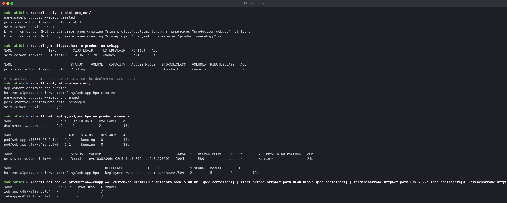

# Mini Project — Production Web App

Session 13, Task 3. A deployment that puts the whole session together: persistent storage,
an HPA, all three probes, and a namespace of its own.

## What it builds

| File | Resource |
|---|---|
| `namespace.yaml` | `production-webapp` namespace |
| `pvc.yaml` | 500Mi PersistentVolumeClaim, `web-data` |
| `deployment.yaml` | 2 nginx replicas, PVC mounted at `/data`, startup + readiness + liveness probes, CPU and memory requests and limits |
| `service.yaml` | ClusterIP in front of the pods |
| `hpa.yaml` | 2–5 replicas targeting 50% CPU |

## Deploying it

The first `kubectl apply -f mini-project/` **partially failed**, and the reason is worth
recording:

    namespace/production-webapp created
    persistentvolumeclaim/web-data created
    service/web-service created
    Error from server (NotFound): error when creating "mini-project/deployment.yaml":
      namespaces "production-webapp" not found
    Error from server (NotFound): error when creating "mini-project/hpa.yaml":
      namespaces "production-webapp" not found

`kubectl apply -f <directory>` processes files in **alphabetical order**, so
`deployment.yaml` and `hpa.yaml` were submitted before `namespace.yaml`. The namespace did
not exist yet and those two were rejected.

Running the same command a second time succeeds, because by then the namespace is there.
That is why you often see `kubectl apply` run twice in scrappy scripts — it is a workaround
for exactly this.

The real fixes are to create the namespace first as its own step, to number the files so
the order is correct, or to use a tool that understands dependencies — Helm, which is the
next session, or Kustomize.

## Result

    $ kubectl get deploy,pod,pvc,hpa -n production-webapp
    deployment.apps/web-app   2/2   2   2   13s

    pod/web-app-d45775485-9blc4   1/1   Running   0   13s
    pod/web-app-d45775485-gqtwt   1/1   Running   0   13s

    persistentvolumeclaim/web-data   Bound   pvc-0a82306e-...   500Mi   RWO   standard

    horizontalpodautoscaler.autoscaling/web-app-hpa   Deployment/web-app
      cpu: <unknown>/50%   2   5   2   13s

Everything up. Two notes on what that output shows.

**The HPA reads `<unknown>` at first.** It takes a metrics-server scrape cycle before a
figure appears — this is the transient version of the `FailedGetResourceMetric` condition
described in `../02-hpa/README.md`, not a fault.

**The PVC bound immediately** here, unlike the standalone PVC in
`../01-kubernetes-volumes/`, because the deployment that consumes it was created in the
same breath. `WaitForFirstConsumer` had its consumer straight away.

## Note on the strategy

`deployment.yaml` sets `strategy: Recreate`, which is correct and deliberate: the PVC is
`ReadWriteOnce`, so a rolling update would deadlock — the new pod cannot mount the volume
while the old pod still holds it. This is case 2 from the Recreate justification in
[`../../task-9-kubernetes-pods-replicasets-deployments/strategies/README.md`](../../task-9-kubernetes-pods-replicasets-deployments/strategies/README.md),
met in practice rather than in theory.

## Cleanup

    kubectl delete namespace production-webapp

Deleting the namespace removes everything in it, including the PVC and its dynamically
provisioned volume.
