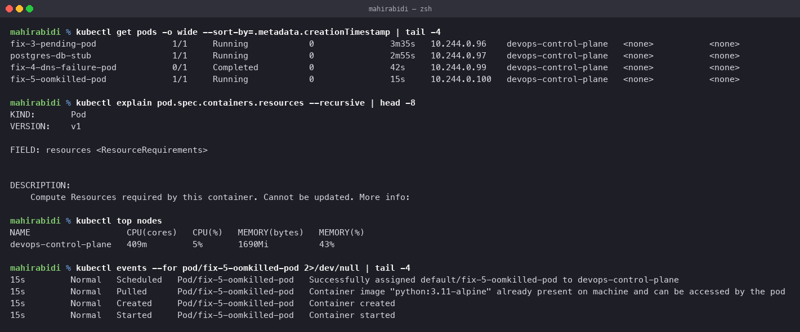

# Troubleshooting Commands

Session 14, Task 1. The commands worth knowing, what each is actually for, and when it is
the wrong one to reach for.

## The decision that matters

Before any command: **did the container run?**

- **It ran and died** → read the **logs**. The process said something before it stopped.
- **It never started** → read the **events**. There are no logs to read.

Almost every triage goes wrong by reaching for logs on a pod whose container never started,
getting `is waiting to start`, and concluding there is no information available. There is —
it is in `describe`.

## `kubectl get`

The first look. State, not detail.

    kubectl get pods
    kubectl get pods -o wide                      # adds node and pod IP
    kubectl get pods -A                           # every namespace
    kubectl get pods --show-labels                # labels, for selector problems
    kubectl get pods --sort-by=.metadata.creationTimestamp
    kubectl get pods -w                           # watch changes live
    kubectl get pod <name> -o yaml                # the full object as stored

`-o wide` is the version to use by default. Which node a pod landed on, and its IP, answer
a surprising number of questions on their own.

`--show-labels` is the one for Service problems: if a Service has no endpoints, compare its
selector against what the pods actually carry.

## `kubectl describe`

Detail and, critically, **events**. This is the command for anything that never started.

    kubectl describe pod <name>
    kubectl describe pod <name> | grep -A5 'Last State'    # why it died last time
    kubectl describe node <name>                            # taints, capacity, pressure

The sections worth reading: `Status`, `Last State` (the previous run's exit code and
reason), `Conditions`, `Events` at the bottom.

Events expire — about an hour by default. A pod broken overnight may have nothing left to
show, which is an argument for collecting events centrally.

## `kubectl logs`

What the process wrote.

    kubectl logs <pod>
    kubectl logs <pod> --previous                 # the run that already died
    kubectl logs <pod> -c <container>             # multi-container pods
    kubectl logs <pod> -f --tail=50               # follow
    kubectl logs -l app=web --all-containers      # across a whole selector

`--previous` is the one people forget. In CrashLoopBackOff the current container does not
exist yet, so a plain `logs` returns nothing useful while `--previous` holds the evidence.

A caveat found while doing this task: a language runtime buffering stdout produces an empty
log even though the application is printing. Python needs `-u`, and most runtimes have an
equivalent. Empty logs do not mean a silent process.

## `kubectl exec`

A command inside a running container. Only works if the container is actually running,
which rules it out for most failures.

    kubectl exec <pod> -- env
    kubectl exec <pod> -- cat /etc/resolv.conf
    kubectl exec <pod> -- nslookup <service>
    kubectl exec -it <pod> -- sh

Its real strength is testing from *inside* the network — DNS resolution, reaching another
Service, checking what environment variables the container actually received as opposed to
what the manifest says.

For a distroless image with no shell, `kubectl debug` attaches an ephemeral container with
tools instead.

## `kubectl events`

Events as a first-class list, sorted and filterable. Clearer than digging through
`describe` when you want a timeline.

    kubectl events
    kubectl events --for pod/<name>
    kubectl events -A --types=Warning

    $ kubectl events --for pod/fix-5-oomkilled-pod
    Normal  Scheduled  Successfully assigned default/fix-5-oomkilled-pod to devops-control-plane
    Normal  Pulled     Container image "python:3.11-alpine" already present on machine
    Normal  Created    Container created
    Normal  Started    Container started

`--types=Warning` across all namespaces is a good "what is unhappy right now" sweep.

## `kubectl explain`

The API reference, offline, for the exact cluster version.

    kubectl explain pod.spec.containers.resources
    kubectl explain deployment.spec.strategy --recursive

Answers "what is this field called" and "what are the valid values" without a browser, and
without the risk of reading documentation for a different version.

## `kubectl top`

Actual resource usage, from metrics-server.

    kubectl top nodes
    kubectl top pods
    kubectl top pods --containers

    $ kubectl top nodes
    NAME                   CPU(cores)   CPU(%)   MEMORY(bytes)   MEMORY(%)
    devops-control-plane   409m         5%       1690Mi          43%

Note what this is **not**: it shows consumption, not requests. A node at 5% CPU can still be
unschedulable if every pod on it has reserved capacity it is not using. The `Pending`
scenario in `../02-scenarios/` is exactly that distinction — the scheduler works from
requests, `top` reports reality.

## A triage order that works

1. `kubectl get pods -o wide` — what is the state, and where
2. Container never started? → `kubectl describe pod` and read events
3. Container ran and died? → `kubectl logs --previous`
4. Running but misbehaving? → `kubectl exec` and test from inside
5. Service unreachable? → `kubectl get endpointslice`, then compare selector to labels
6. Scheduling problem? → `kubectl describe node` for taints and capacity
7. Nothing obvious? → `kubectl events -A --types=Warning` for the wider picture
