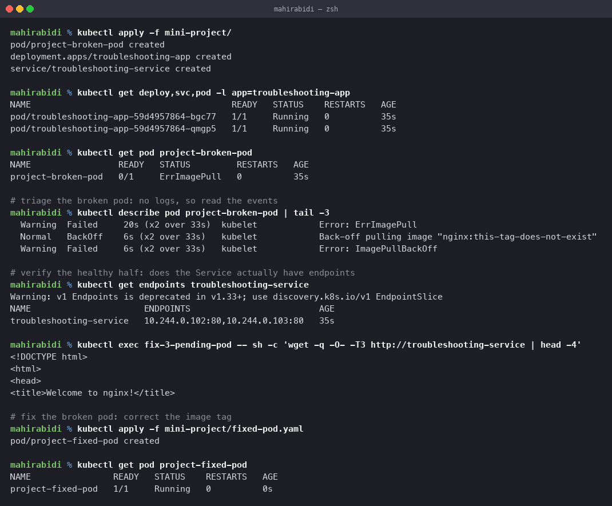

# Mini Project — Troubleshooting

Session 14, Task 3. A small stack with one deliberately broken pod alongside a working
Deployment and Service, triaged end to end.

## What it contains

| File | Resource |
|---|---|
| `deployment.yaml` | 2 nginx replicas, `troubleshooting-app` |
| `service.yaml` | ClusterIP in front of them |
| `broken-pod.yaml` | a pod referencing `nginx:this-tag-does-not-exist` |
| `fixed-pod.yaml` | the corrected version |

## Triage

**Problem statement.** After applying the stack, one pod never becomes ready.

**Step 1 — what is the state?**

    $ kubectl get deploy,svc,pod -l app=troubleshooting-app
    pod/troubleshooting-app-59d4957864-bgc77   1/1   Running   0   35s
    pod/troubleshooting-app-59d4957864-qmgp5   1/1   Running   0   35s

    $ kubectl get pod project-broken-pod
    project-broken-pod   0/1   ErrImagePull   0   35s

The Deployment is fine. One standalone pod is not.

**Step 2 — investigate.** `ErrImagePull` means the container never started, so there are no
logs. Events:

    Warning  Failed   kubelet  Error: ErrImagePull
    Normal   BackOff  kubelet  Back-off pulling image "nginx:this-tag-does-not-exist"
    Warning  Failed   kubelet  Error: ImagePullBackOff

**Step 3 — root cause.** The tag does not exist. `nginx` is a real repository and
`this-tag-does-not-exist` is not a real tag in it.

**Step 4 — fix.** `fixed-pod.yaml` uses `nginx:1.27`.

**Step 5 — verify.**

    $ kubectl get pod project-fixed-pod
    project-fixed-pod   1/1   Running   0   0s

## Verifying the healthy half too

A fix is not finished until the thing that was supposed to work is confirmed working. Two
checks, in the order from `../01-commands/README.md`:

**Does the Service have endpoints?**

    $ kubectl get endpoints troubleshooting-service
    troubleshooting-service   10.244.0.102:80,10.244.0.103:80

Two addresses, matching the two ready replicas. An empty list here would mean a selector
problem regardless of how healthy the pods looked.

**Does traffic actually flow?**

    $ kubectl exec fix-3-pending-pod -- sh -c 'wget -q -O- -T3 http://troubleshooting-service | head -4'
    <!DOCTYPE html>
    <html>
    <head>
    <title>Welcome to nginx!</title>

Resolved by name, routed through the ClusterIP, served by one of the pods. End to end.

## The point of the exercise

The broken pod is loud — it sits in `ErrImagePull` and anyone will spot it. The lesson is
the second half: having fixed it, confirm the rest of the stack is genuinely working rather
than assuming it. Scenario 4 in `../02-scenarios/` is the case where that assumption would
have been wrong, because the broken pod reported `Running` the entire time.

## Cleanup

    kubectl delete -f .
