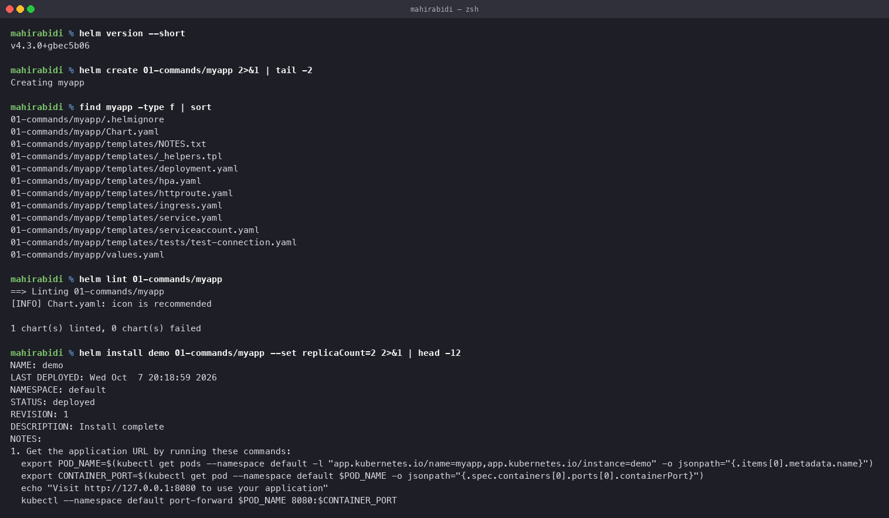
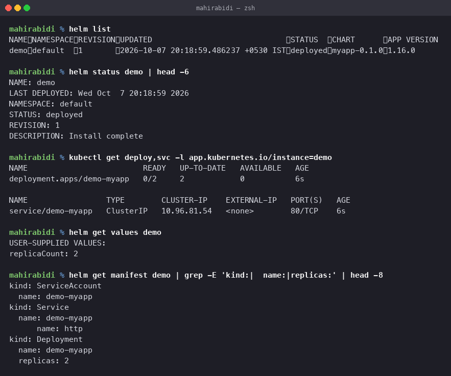
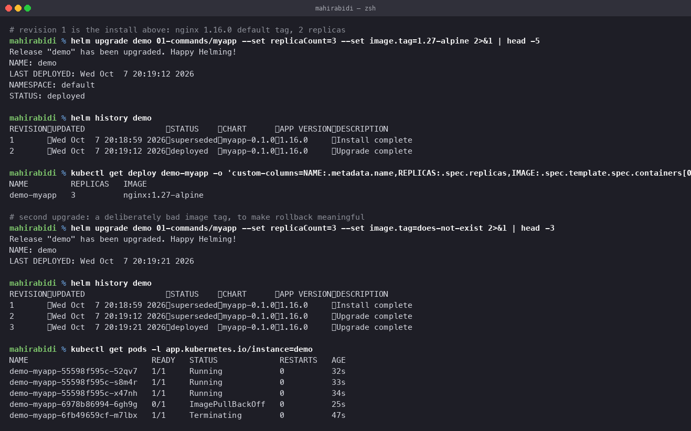
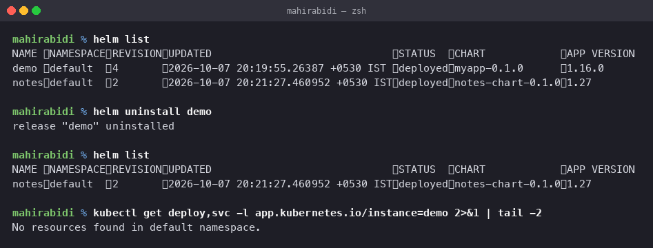
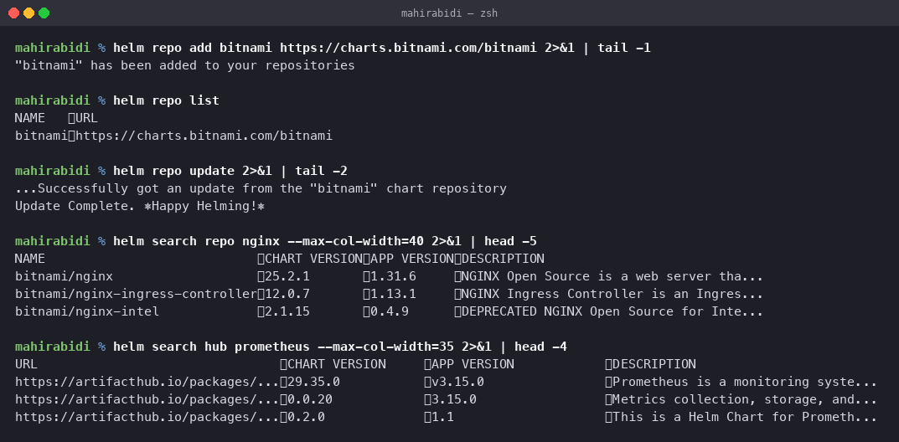

# Helm Commands

Session 15, Task 1. Every command executed, with its real output.

Helm version used: **v4.3.0**.

## What Helm is for

`kubectl apply -f` has no concept of a release. It submits YAML and forgets. Helm wraps a
set of manifests into a **chart**, installs it as a named **release**, templates the values
that differ between environments, and keeps a revision history so you can go back.

The three problems it solves, in order of how much they hurt:

1. The same manifests differ per environment, so you end up with `deployment-dev.yaml`,
   `deployment-prod.yaml` and a diff between them nobody maintains.
2. `kubectl apply -f dir/` has no dependency ordering — the namespace problem hit in
   [session 13's mini-project](../../task-12-kubernetes-storage-hpa-probes/mini-project/README.md).
3. Rolling back means finding the old YAML, assuming it was committed.

## `helm create`

Scaffolds a chart with working defaults.

    $ helm create myapp
    Creating myapp

    myapp/Chart.yaml                      chart metadata: name, version, appVersion
    myapp/values.yaml                     default values
    myapp/templates/deployment.yaml       the templates
    myapp/templates/service.yaml
    myapp/templates/ingress.yaml
    myapp/templates/hpa.yaml
    myapp/templates/serviceaccount.yaml
    myapp/templates/_helpers.tpl          named template definitions, not rendered
    myapp/templates/NOTES.txt             printed after install
    myapp/templates/tests/                run by `helm test`
    myapp/.helmignore                     what to exclude when packaging

Files beginning with `_` are not rendered as Kubernetes objects — `_helpers.tpl` holds
reusable definitions included elsewhere.

## `helm lint`

Static checks before anything touches a cluster.

    $ helm lint myapp
    ==> Linting myapp
    [INFO] Chart.yaml: icon is recommended
    1 chart(s) linted, 0 chart(s) failed

`[INFO]` is advisory; `[ERROR]` fails. This belongs in CI.

## `helm install`

Renders the templates and submits the result as a named release.

    $ helm install demo myapp --set replicaCount=2
    NAME: demo
    LAST DEPLOYED: Wed Oct  7 20:18:59 2026
    NAMESPACE: default
    STATUS: deployed
    REVISION: 1
    DESCRIPTION: Install complete

`demo` is the release name, and it prefixes every object created — `demo-myapp`. Installing
the same chart twice under different names gives two independent copies.

Useful flags: `--dry-run --debug` to render without applying, `-f values-prod.yaml` for a
values file, `--set key=value` for one-off overrides, `--create-namespace`, and `--wait` to
block until resources are ready.

## `helm list`

    $ helm list
    NAME  NAMESPACE  REVISION  UPDATED                  STATUS    CHART        APP VERSION
    demo  default    1         2026-10-07 20:18:59      deployed  myapp-0.1.0  1.16.0

Only the current namespace by default; `-A` for all. `--uninstalled` and `--failed` filter
by state.

## `helm status`

The release's current state, plus the rendered NOTES.

    $ helm status demo
    STATUS: deployed
    REVISION: 1
    DESCRIPTION: Install complete

## `helm get`

What was actually deployed, read back from the release record.

    $ helm get values demo
    USER-SUPPLIED VALUES:
    replicaCount: 2

    $ helm get manifest demo | grep -E 'kind:|  name:|replicas:'
    kind: ServiceAccount
      name: demo-myapp
    kind: Service
      name: demo-myapp
    kind: Deployment
      name: demo-myapp
      replicas: 2

`get values` shows only what you overrode; `get values -a` shows the full merged set.
`get manifest` is the authoritative answer to "what is actually running", which matters when
the chart in git has moved on since the last deploy.

## `helm upgrade`

    $ helm upgrade demo myapp --set replicaCount=3 --set image.tag=1.27-alpine
    Release "demo" has been upgraded. Happy Helming!

    $ kubectl get deploy demo-myapp -o custom-columns=...
    NAME         REPLICAS   IMAGE
    demo-myapp   3          nginx:1.27-alpine

`--install` makes it create the release if it does not exist, which is what CI pipelines use
so the first deploy and every later one are the same command.

A caution: `--set` values are **not** remembered across upgrades unless you pass
`--reuse-values`. An upgrade that omits a flag silently reverts that setting to the chart
default.

## `helm history`

    $ helm history demo
    REVISION  UPDATED               STATUS      CHART        DESCRIPTION
    1         Wed Oct 7 20:18:59    superseded  myapp-0.1.0  Install complete
    2         Wed Oct 7 20:19:12    superseded  myapp-0.1.0  Upgrade complete
    3         Wed Oct 7 20:19:21    deployed    myapp-0.1.0  Upgrade complete

Every revision is stored as a Secret in the release's namespace, which is how Helm can roll
back without the original chart.

## `helm rollback`

Covered in full in [`../02-rollback/`](../02-rollback/README.md).

    $ helm rollback demo 2
    Rollback was a success! Happy Helming!

## `helm uninstall`

    $ helm uninstall demo
    release "demo" uninstalled

    $ kubectl get deploy,svc -l app.kubernetes.io/instance=demo
    No resources found in default namespace.

Everything the release created is removed. `--keep-history` retains the revision records so
the release can be rolled back afterwards.

Note what it does **not** remove: PersistentVolumeClaims created by a StatefulSet's
`volumeClaimTemplates`, which survive deliberately so data is not lost by accident.

## `helm repo`

    $ helm repo add bitnami https://charts.bitnami.com/bitnami
    "bitnami" has been added to your repositories

    $ helm repo list
    NAME     URL
    bitnami  https://charts.bitnami.com/bitnami

    $ helm repo update
    ...Successfully got an update from the "bitnami" chart repository
    Update Complete. ⎈Happy Helming!⎈

`repo update` refreshes the local index. A chart version that "does not exist" is almost
always a stale index.

## `helm search`

    $ helm search repo nginx
    NAME                              CHART VERSION  APP VERSION  DESCRIPTION
    bitnami/nginx                     25.2.1         1.31.6       NGINX Open Source is a web server tha...
    bitnami/nginx-ingress-controller  12.0.7         1.13.1       NGINX Ingress Controller is an Ingres...

    $ helm search hub prometheus
    URL                                  CHART VERSION  APP VERSION  DESCRIPTION
    https://artifacthub.io/packages/...  29.35.0        v3.15.0      Prometheus is a monitoring syste...

`search repo` looks in repositories you have added; `search hub` searches Artifact Hub
across every public repository.

Note the two version columns and keep them straight: **CHART VERSION** is the packaging,
**APP VERSION** is the software inside. They move independently.

## Command summary

| Command | Does |
|---|---|
| `helm create` | scaffold a new chart |
| `helm lint` | static checks |
| `helm install` | render and deploy as a named release |
| `helm list` | releases and their state |
| `helm status` | one release's state |
| `helm get values/manifest` | what was actually deployed |
| `helm upgrade` | new revision from changed chart or values |
| `helm history` | every revision |
| `helm rollback` | return to an earlier revision |
| `helm uninstall` | remove the release |
| `helm repo add/list/update` | manage chart repositories |
| `helm search repo/hub` | find charts |
