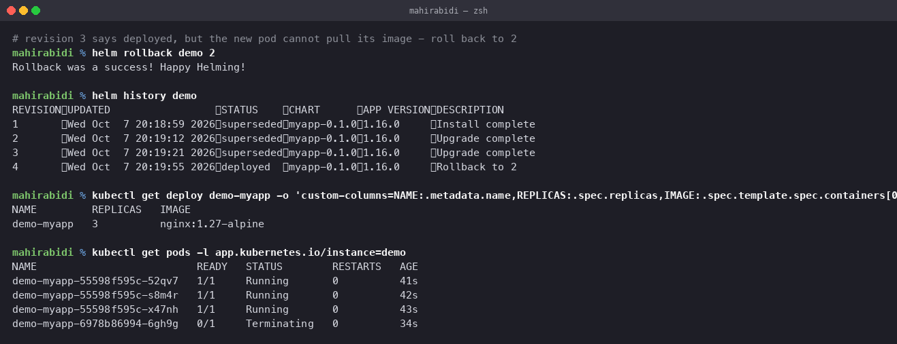

# Helm Rollback Workflow

Session 15, Task 2. The complete cycle: install → upgrade → verify → upgrade again →
verify → rollback → verify.

The release used is `demo`, from the chart in [`../01-commands/myapp/`](../01-commands/myapp).

## Install

    $ helm install demo ../01-commands/myapp --set replicaCount=2
    STATUS: deployed
    REVISION: 1

Revision 1. Two replicas, the chart's default image.

## Upgrade

    $ helm upgrade demo ../01-commands/myapp --set replicaCount=3 --set image.tag=1.27-alpine
    Release "demo" has been upgraded. Happy Helming!

### Verify

    $ helm history demo
    REVISION  STATUS      DESCRIPTION
    1         superseded  Install complete
    2         deployed    Upgrade complete

    $ kubectl get deploy demo-myapp -o custom-columns=NAME:...,REPLICAS:...,IMAGE:...
    NAME         REPLICAS   IMAGE
    demo-myapp   3          nginx:1.27-alpine

Three replicas on the new tag. Revision 1 is marked `superseded` rather than deleted — that
is what makes the rollback possible.

## Upgrade again, this time badly

A deliberately broken image tag, so the rollback has a reason to exist:

    $ helm upgrade demo ../01-commands/myapp --set replicaCount=3 --set image.tag=does-not-exist

### Verify

    $ helm history demo
    REVISION  STATUS      DESCRIPTION
    1         superseded  Install complete
    2         superseded  Upgrade complete
    3         deployed    Upgrade complete

    $ kubectl get pods -l app.kubernetes.io/instance=demo
    NAME                          READY   STATUS             RESTARTS   AGE
    demo-myapp-55598f595c-52qv7   1/1     Running            0          32s
    demo-myapp-55598f595c-s8m4r   1/1     Running            0          33s
    demo-myapp-55598f595c-x47nh   1/1     Running            0          34s
    demo-myapp-6978b86994-6gh9g   0/1     ImagePullBackOff   0          25s

**This is the important part of the whole exercise.** Helm reports revision 3 as
`deployed`. The application is broken.

Helm's `STATUS` means "the manifests were accepted by the API server", not "the application
is working". `kubectl apply` returned success for a Deployment whose new pod cannot pull its
image; whether that pod ever becomes Ready is a separate question Helm did not wait for.

Two things save you here, and both are worth noticing:

- The **rolling update strategy** kept the three old pods serving. The new ReplicaSet could
  not produce a ready pod, so `maxUnavailable` stopped the rollout from removing the
  working ones. This is the mechanism from
  [task 9's strategies](../../task-9-kubernetes-pods-replicasets-deployments/strategies/README.md)
  doing its job without being asked.
- `helm upgrade --wait --timeout 5m` would have blocked until the pods were actually ready
  and reported failure instead of success. In CI that flag is the difference between a
  pipeline that goes green on a broken deploy and one that does not. `--atomic` goes
  further and rolls back automatically on failure.

## Rollback

    $ helm rollback demo 2
    Rollback was a success! Happy Helming!

### Verify

    $ helm history demo
    REVISION  UPDATED               STATUS      DESCRIPTION
    1         Wed Oct 7 20:18:59    superseded  Install complete
    2         Wed Oct 7 20:19:12    superseded  Upgrade complete
    3         Wed Oct 7 20:19:21    superseded  Upgrade complete
    4         Wed Oct 7 20:19:55    deployed    Rollback to 2

    $ kubectl get deploy demo-myapp -o custom-columns=NAME:...,REPLICAS:...,IMAGE:...
    NAME         REPLICAS   IMAGE
    demo-myapp   3          nginx:1.27-alpine

    $ kubectl get pods -l app.kubernetes.io/instance=demo
    demo-myapp-55598f595c-52qv7   1/1   Running       0   41s
    demo-myapp-55598f595c-s8m4r   1/1   Running       0   42s
    demo-myapp-55598f595c-x47nh   1/1   Running       0   43s
    demo-myapp-6978b86994-6gh9g   0/1   Terminating   0   34s

Back on `1.27-alpine`, and the failing pod is terminating.

**Rollback created revision 4; it did not delete revision 3.** The history is append-only,
which is the same design as `kubectl rollout undo` creating a new revision rather than
rewinding — recorded in
[task 9's README](../../task-9-kubernetes-pods-replicasets-deployments/README.md), where
rolling back took the deployment from revision 2 to revision 3.

The reason is auditability: you can always see that a rollback happened and when. It also
means rolling back a rollback is just another rollback.

## Where the history is stored

As Secrets in the release's namespace:

    kubectl get secret -l owner=helm

One per revision, holding the rendered manifests and the values. That is how Helm can roll
back without needing the original chart files, and it is also why the default history limit
is 10 — `--history-max` controls it.

## Summary

| Step | Revision | State |
|---|---|---|
| install | 1 | 2 replicas, default image |
| upgrade | 2 | 3 replicas, `1.27-alpine` |
| upgrade | 3 | broken tag, Helm says `deployed` anyway |
| rollback to 2 | **4** | back to `1.27-alpine` |

The two things to take away: Helm's `deployed` status is not a health check, and rollback
moves forward through history rather than backwards.
