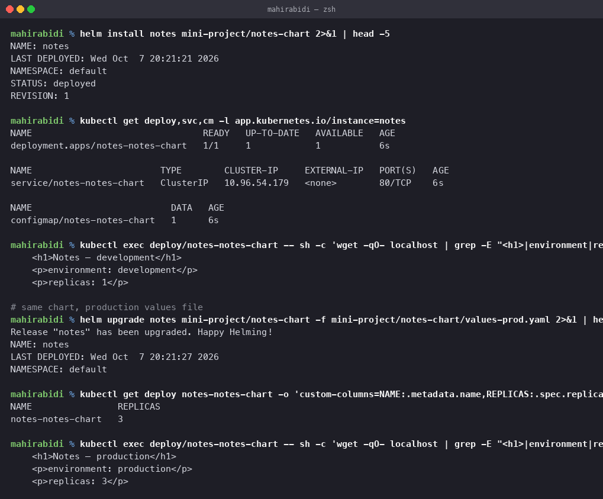

# Mini Project — Notes Chart

Session 15, Task 3. A chart written from scratch rather than scaffolded, demonstrating
templates, values, per-environment overrides and the upgrade path.

## Structure

    notes-chart/
    ├── Chart.yaml                  name, version, appVersion
    ├── values.yaml                 defaults (development)
    ├── values-prod.yaml            production overrides
    └── templates/
        ├── _helpers.tpl            named templates for names and labels
        ├── configmap.yaml          the served page, rendered from values
        ├── deployment.yaml
        └── service.yaml

## Design choices worth explaining

**The page content comes from a ConfigMap rendered from values.** That is deliberate: it
makes a values change *visible in the browser* rather than only in a manifest diff, so the
difference between environments can actually be demonstrated.

**`_helpers.tpl` defines the names and labels once.**

    {{- define "notes-chart.fullname" -}}
    {{- printf "%s-%s" .Release.Name (include "notes-chart.name" .) | trunc 63 | trimSuffix "-" -}}
    {{- end -}}

The `trunc 63` matters — Kubernetes names are limited to 63 characters, and a long release
name plus a long chart name will exceed it. Scaffolded charts do this for the same reason.

**Selector labels are a separate, smaller template than the full label set.**

    {{- define "notes-chart.selectorLabels" -}}
    app.kubernetes.io/name: {{ include "notes-chart.name" . }}
    app.kubernetes.io/instance: {{ .Release.Name }}
    {{- end -}}

The full set includes `app.kubernetes.io/version`. If that were in the selector, bumping
`appVersion` would change a Deployment's `spec.selector`, which Kubernetes rejects as
immutable. Keeping the two sets apart avoids an upgrade that cannot be applied.

**The ConfigMap is hashed into the pod template annotation.**

    annotations:
      checksum/config: {{ include (print $.Template.BasePath "/configmap.yaml") . | sha256sum }}

This is the standard answer to the gotcha found in
[task 11](../../task-11-kubernetes-ingress-configmaps-secrets/README.md): changing a
ConfigMap does not restart the pods using it, so the old values keep serving. Hashing the
ConfigMap into the pod template means any change to it changes the template, which triggers
a rollout automatically. No `kubectl rollout restart` needed.

## Installing it

    $ helm install notes notes-chart
    STATUS: deployed
    REVISION: 1

    $ kubectl get deploy,svc,cm -l app.kubernetes.io/instance=notes
    deployment.apps/notes-notes-chart   1/1   1   1   6s
    service/notes-notes-chart           ClusterIP   10.96.54.179   <none>   80/TCP   6s
    configmap/notes-notes-chart         1     6s

Three objects from one command, all named from the release.

Checking what is actually served:

    $ kubectl exec deploy/notes-notes-chart -- sh -c 'wget -qO- localhost | grep -E "<h1>|environment|replicas"'
        <h1>Notes — development</h1>
        
environment: development

        
replicas: 1

## The same chart, production values

    $ helm upgrade notes notes-chart -f notes-chart/values-prod.yaml
    Release "notes" has been upgraded. Happy Helming!

    $ kubectl get deploy notes-notes-chart -o custom-columns=NAME:...,REPLICAS:...
    NAME                REPLICAS
    notes-notes-chart   3

    $ kubectl exec deploy/notes-notes-chart -- sh -c 'wget -qO- localhost | grep -E "<h1>|environment|replicas"'
        <h1>Notes — production</h1>
        
environment: production

        
replicas: 3

**Same chart, same command, different file.** Replica count, resource limits, title and
banner colour all changed, and the running application reflects it.

This is the problem Helm exists to solve. Without it the alternative is two directories of
near-identical YAML that drift apart, or a templating script of your own.

Note also that the page updated at all — the ConfigMap changed, and the checksum annotation
forced a new rollout. Without that annotation the pods would still be serving the
development page while the ConfigMap said production.

## Values precedence

Lowest to highest:

1. `values.yaml` in the chart
2. a file passed with `-f` (later `-f` wins over earlier)
3. `--set` on the command line

So `helm upgrade notes notes-chart -f values-prod.yaml --set replicaCount=5` gives five
replicas with everything else from the production file.

## Cleanup

    helm uninstall notes
