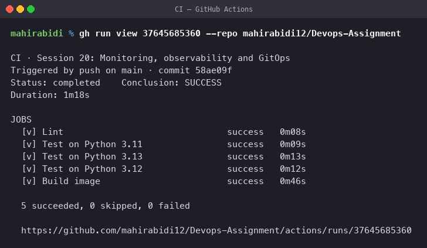
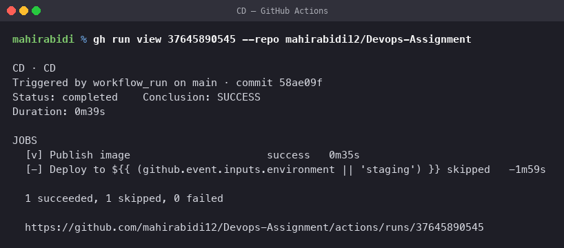
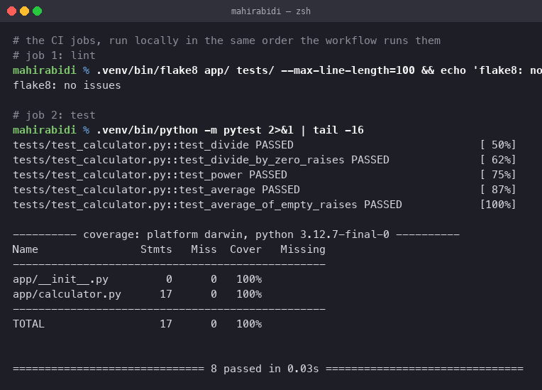
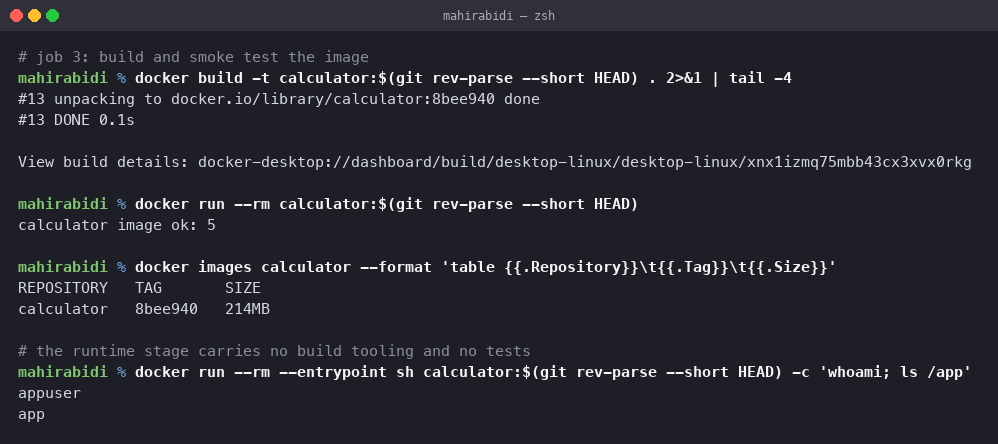

# CI/CD & GitHub Actions

Session 16. A complete CI/CD demo project: a Python application, tests, a Dockerfile, and
GitHub Actions workflows covering build, test, artifacts, secrets, matrix runners and
deployment.

## Where the workflows live

At **`.github/workflows/`** in the repository root — `ci.yml`, `cd.yml` and `hello.yml` —
because GitHub only reads workflows from there. They carry `paths:` filters scoping them to
this folder, so editing any other task does not trigger them:

    on:
      push:
        branches: [main]
        paths:
          - 'task-15-cicd-github-actions/**'
          - '.github/workflows/ci.yml'

Each job sets `defaults.run.working-directory` to this folder, since the project is a
subdirectory rather than the repository root.

## The pipeline running

Both workflows passed on their first real run, commit `58ae09f`.

    CI · Triggered by push on main · commit 58ae09f
    Status: completed    Conclusion: SUCCESS
    Duration: 1m18s

      [v] Lint                           success   0m08s
      [v] Test on Python 3.11            success   0m09s
      [v] Test on Python 3.13            success   0m13s
      [v] Test on Python 3.12            success   0m12s
      [v] Build image                    success   0m46s

      5 succeeded, 0 skipped, 0 failed

The three matrix jobs confirm the `pythonpath` fix below was correct — without it every
one of them would have failed collection.

    CD · Triggered by workflow_run on main · commit 58ae09f
    Status: completed    Conclusion: SUCCESS
    Duration: 0m39s

      [v] Publish image                  success   0m35s
      [-] Deploy to staging              skipped

CD ran only because CI succeeded — that is the `workflow_run` trigger with its
`conclusion == 'success'` guard. The image was built and pushed to GHCR.

`Deploy` is **skipped, not failed**. It sits behind `if: vars.DEPLOY_ENABLED == 'true'`
because it needs a cluster and a `KUBECONFIG` secret. Without that guard the job would fail
on every run and turn the pipeline red for no useful reason.

## A real bug caught before pushing

Running the workflow's exact command rather than the convenient one exposed a failure:

    $ pytest                     # what CI runs
    ERROR tests/test_calculator.py
    !!!!!! Interrupted: 1 error during collection !!!!!!

    $ python -m pytest           # what I had been running
    8 passed

`python -m pytest` adds the working directory to `sys.path`; bare `pytest` does not, so
`from app.calculator import ...` could not resolve. Fixed by adding `pythonpath = .` to
`pytest.ini`.

Worth running the CI command locally rather than the one that is convenient — they are not
the same thing.

## Project layout

    task-15-cicd-github-actions/
    ├── app/calculator.py           the application
    ├── tests/test_calculator.py    8 tests
    ├── requirements.txt
    ├── pytest.ini
    ├── Dockerfile                  multi-stage, non-root
    ├── .dockerignore
    └── .github-workflows/
        ├── hello.yml               the vocabulary, minimal
        ├── ci.yml                  lint → test → build
        └── cd.yml                  publish → deploy

## CI vs CD

| | Continuous Integration | Continuous Delivery / Deployment |
|---|---|---|
| Question | does this change break anything? | can this change reach users? |
| Runs on | every push and pull request | merges to the main branch |
| Ends with | a tested, built artifact | that artifact running in an environment |
| Fails when | lint, tests or build fail | the deploy or its health check fails |

The split here is deliberate: `ci.yml` builds the image but sets `push: false`. CI proves
the code; CD moves it. That separation means a pull request from a fork can run the full
test suite without ever being handed registry credentials.

## Pipeline concepts

    workflow   one YAML file, triggered by events
      └─ job   runs on its own runner, parallel by default, ordered with `needs`
         └─ step   one command (`run`) or one action (`uses`), sequential, shared filesystem

Jobs get a **fresh machine each**. Nothing is shared between them except through artifacts
or job outputs — which is exactly why the build job has to `upload-artifact` rather than
just leaving a file behind.

## Triggers

`ci.yml` demonstrates four:

    on:
      push:
        branches: [main]
        paths: ['app/**', 'tests/**', 'requirements.txt', 'Dockerfile']
      pull_request:
        branches: [main]
      workflow_dispatch:
      schedule:
        - cron: '0 3 * * 1'

`paths` is the one worth adopting early — without it, editing a README runs the whole
pipeline. `workflow_dispatch` adds a manual button. `schedule` catches dependency rot on a
repository nobody has touched.

`cd.yml` uses `workflow_run`, which chains it after CI and guards on the conclusion:

    if: github.event.workflow_run.conclusion == 'success'

so a deploy can never follow a failed test run.

## Jobs and steps

`ci.yml` has three jobs in a chain:

    lint ──▶ test ──▶ build

`needs: lint` on the test job and `needs: test` on build is what makes it a chain. Without
`needs`, all three would start at once and the image would be built from code that failed
its tests.

## Runners and the matrix

    strategy:
      fail-fast: false
      matrix:
        python-version: ['3.11', '3.12', '3.13']

Three parallel jobs, one per version. `fail-fast: false` matters: the default cancels every
sibling the moment one fails, so you find out 3.11 is broken and learn nothing about 3.13.

`runs-on: ubuntu-latest` is a GitHub-hosted runner — fresh VM, discarded after the job.
Self-hosted runners are the alternative when you need cluster access, special hardware, or
a fixed IP, at the cost of maintaining and securing them.

## Secrets

    - name: Log in to the registry
      uses: docker/login-action@v3
      with:
        password: ${{ secrets.GITHUB_TOKEN }}

`GITHUB_TOKEN` is provided automatically and scoped to the repository — pushing to GHCR
needs no secret to be created at all, just `permissions: packages: write`.

Secrets are masked in logs: anything echoed appears as `***`. That masking is not a security
boundary, though — a workflow that can read a secret can exfiltrate it, so the real control
is scope. Hence `permissions:` declared per job rather than relying on the default.

The strongest version for cloud deploys is **OIDC** — `id-token: write` lets the runner
exchange a short-lived token for a cloud role, so no long-lived credential exists in the
repository at all. This is the federation case from
[the IAM notes](../task-17-terraform-iac/aws-services/01-iam/README.md).

## Artifacts

    - name: Upload coverage report
      if: always()
      uses: actions/upload-artifact@v4
      with:
        name: coverage-${{ matrix.python-version }}
        path: coverage.xml
        retention-days: 7

`if: always()` is the important part — the default is to skip a step when an earlier one
failed, which means the coverage report you most want is the one you do not get.

The matrix makes the artifact name dynamic, because three jobs uploading to the same name
would collide.

## Running the pipeline locally

### Lint and test

    $ flake8 app/ tests/ --max-line-length=100
    flake8: no issues

    $ pytest
    tests/test_calculator.py::test_divide PASSED                [ 50%]
    ...
    tests/test_calculator.py::test_average_of_empty_raises PASSED  [100%]

    Name                Stmts   Miss  Cover
    app/calculator.py      17      0   100%
    TOTAL                  17      0   100%

    8 passed in 0.03s

### Build

    $ docker build -t calculator:$(git rev-parse --short HEAD) .
    $ docker run --rm calculator:8bee940
    calculator image ok: 5

    REPOSITORY   TAG       SIZE
    calculator   8bee940   214MB

    $ docker run --rm --entrypoint sh calculator:8bee940 -c 'whoami; ls /app'
    appuser
    app

Two things that screenshot shows about the Dockerfile:

**It runs as `appuser`, not root.** A container that does not need root should not have it,
and this is the single cheapest security improvement available in a Dockerfile.

**`/app` contains only `app/`.** No tests, no `requirements.txt`, no build tooling — the
multi-stage build left all of that in the builder stage, as in task 6.

The image is tagged with the commit SHA rather than `latest`, so a deployed image can always
be traced back to the exact commit that produced it. `latest` is ambiguous the moment two
builds exist.

## Deliverables checklist

| Required | Where |
|---|---|
| Application source code | `app/calculator.py` |
| Dockerfile | `Dockerfile`, multi-stage, non-root |
| GitHub Actions workflow | `.github-workflows/` — three of them |
| CI pipeline | `ci.yml`: lint → test (3-version matrix) → build |
| CD pipeline | `cd.yml`: publish to GHCR → deploy with Helm |
| Screenshots of successful execution | **locally executed jobs only** — see the note at the top |
| README.md | this file |

## Cleanup

    docker rmi calculator:$(git rev-parse --short HEAD) cicd-calculator:local
    rm -rf .venv
