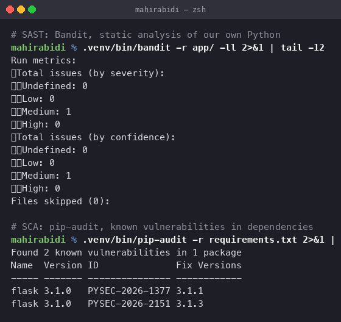
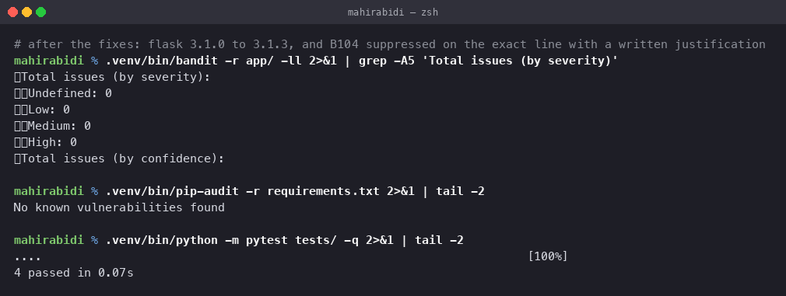
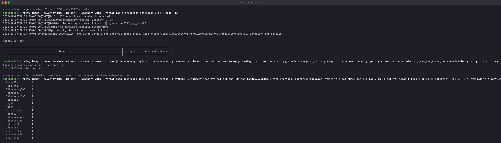
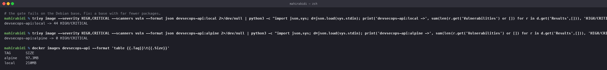

# Complete CI/CD & DevSecOps

Session 17. A CI/CD pipeline with security gates: SAST, SCA, secret scanning and container
image scanning, each able to fail the build.

## Where the workflow lives

At **`.github/workflows/devsecops.yml`** in the repository root, with `paths:` filters
scoping it to this folder so other tasks do not trigger it.

Every scanner below was **run for real locally**, including genuine vulnerabilities found
and fixed. **Screenshot of the Actions run:** add it to `screenshots/` after the first push.

Two things were fixed so the pipeline passes on a runner rather than failing on it:

- `bandit -f sarif` is not available in the base package. `requirements-dev.txt` now pins
  `bandit[sarif]`, and the publish job gained `docker/setup-buildx-action`, without which
  the `provenance` and `sbom` attestations cannot be produced.
- The `deploy` job is gated behind `if: vars.DEPLOY_ENABLED == 'true'`. It needs a
  `KUBECONFIG` secret and a cluster; without the guard it fails on every run and turns the
  whole pipeline red for no useful reason.

## Pipeline shape

    secrets ─┐
    sast    ─┼─▶ test ──▶ build ──▶ image-scan ──▶ publish ──▶ deploy
    sca     ─┘

The three security jobs run **first and in parallel**, before anything is built. A committed
credential fails the run in seconds rather than after a five-minute image build. Ordering a
pipeline by cost is most of what makes security gates tolerable to work with.

## The four gates

| Stage | Tool | Catches | Fails on |
|---|---|---|---|
| **SAST** | Bandit | insecure patterns in our own code | medium and above |
| **SCA** | pip-audit | known CVEs in dependencies | any known vulnerability |
| **Secret scanning** | Gitleaks | credentials in the repo or its history | any match |
| **Image scanning** | Trivy | CVEs in OS packages and language deps | HIGH or CRITICAL, fixable |

## SAST and SCA — what they actually found

Both found real problems on the first run.

**Bandit, 1 medium finding:**

    >> Issue: [B104:hardcoded_bind_all_interfaces] Possible binding to all interfaces.
       Severity: Medium   Confidence: Medium
       CWE: CWE-605
       Location: app/app.py:50:17
    50  app.run(host="0.0.0.0", port=int(os.environ.get("PORT", 5000)), debug=False)

**pip-audit, 2 real CVEs:**

    Found 2 known vulnerabilities in 1 package
    Name   Version  ID               Fix Versions
    flask  3.1.0    PYSEC-2026-1377  3.1.1
    flask  3.1.0    PYSEC-2026-2151  3.1.3

These are the two kinds of finding you get, and they need opposite responses.

### The Flask CVEs: real, so fix them

Pinned version bumped from `3.1.0` to `3.1.3`, which covers both advisories. Tests re-run
to confirm the upgrade broke nothing.

### The Bandit finding: a false positive, so justify and suppress it

Binding to `0.0.0.0` is correct **inside a container**. Binding to `127.0.0.1` would make
the process unreachable from outside the container — exactly the problem hit in the Docker
task earlier in this homework. The network boundary is the container and the
NetworkPolicy, not the bind address.

Suppressed on the precise line, with the reasoning written next to it:

    host="0.0.0.0",  # nosec B104 - containers must bind all interfaces

The reasoning matters more than the suppression. A `# nosec` with no explanation is
indistinguishable from someone silencing a real finding, and six months later nobody can
tell which it was.

### After both fixes

    Total issues (by severity):
      Medium: 0
      High: 0

    No known vulnerabilities found

    4 passed in 0.07s

## Secret scanning

Gitleaks runs with `fetch-depth: 0` — the full history, not just the tip. That is the whole
point: a secret committed and then removed in the next commit is still in the history and
still has to be treated as compromised.

The application is written so there is nothing to find. Every secret is read from the
environment, and `/api/config` reports *whether* each is configured rather than its value:

    return jsonify(
        environment=os.environ.get("ENVIRONMENT", "development"),
        api_key_configured=bool(API_KEY),
        database_configured=bool(DATABASE_URL),
    )

A test enforces that:

    def test_config_does_not_leak_secrets(client):
        body = client.get("/api/config").get_json()
        assert "api_key" not in body

Worth connecting to [task 11](../task-11-kubernetes-ingress-configmaps-secrets/README.md):
a Kubernetes Secret is base64, not encryption, and `kubectl exec -- env` showed the password
in plaintext inside the container. Keeping secrets out of source is necessary but nowhere
near sufficient.

## Container image scanning — the interesting one

The Debian-based image scanned badly:

    target: devsecops-api:local (debian 13.7)
    HIGH/CRITICAL findings: 44

And every single one is in the base layer, not in our code or our Python dependencies:

      bsdutils         4
      libblkid1        4
      liblastlog2-2    4
      libmount1        4
      libsmartcols1    4
      libuuid1         4
      login            4
      mount            4
      util-linux       4
      libacl1          1
      ...

`util-linux`, `login`, `mount`, `ncurses`. A Flask API calls none of them. They are present
because `python:3.12-slim` is a Debian image and Debian ships a base package set.

This is the central lesson of image scanning: **most of your vulnerability surface is
inherited, not written.** You can write flawless code and still ship an image with 44
HIGH/CRITICAL CVEs.

### The fix: a smaller base

    devsecops-api:local  -> 44 HIGH/CRITICAL
    devsecops-api:alpine -> 0 HIGH/CRITICAL

    TAG       SIZE
    alpine    97.3MB
    local     210MB

Zero findings, and less than half the size. Fewer packages means less to be vulnerable and
less to download.

The trade is real and worth stating: Alpine uses musl libc rather than glibc, which can
break Python wheels shipping compiled extensions. For a pure-Python application it costs
nothing; for one depending on numpy or psycopg2 it may mean compiling from source. The
other direction is a distroless image, which has no shell at all — better still, and harder
to debug, since `kubectl exec -- sh` no longer works.

`Dockerfile.alpine` is what the pipeline builds for that reason.

## Security gates

A gate is a step that **fails the build**. The Trivy one:

    - uses: aquasecurity/trivy-action@0.28.0
      with:
        severity: HIGH,CRITICAL
        ignore-unfixed: true
        exit-code: '1'

`exit-code: '1'` is what makes it a gate rather than a report. Without it the scan produces
a nice table nobody reads.

`ignore-unfixed: true` is the pragmatic half. A CVE with no available patch cannot be acted
on, and a gate that is permanently red gets switched off — which is worse than a gate tuned
to only block on things you can actually fix.

Two more supply-chain controls in the publish job:

    provenance: true    # attestation of how and where the image was built
    sbom: true          # software bill of materials

An SBOM is what lets you answer "are we affected?" the morning a new CVE lands, without
rebuilding anything.

## Why the schedule trigger matters

    schedule:
      - cron: '0 4 * * 1'

A CVE published after your last commit still affects the running image. Without a scheduled
re-scan, a repository that nobody has touched for a month quietly accumulates
vulnerabilities with nothing reporting them.

## Deliverables checklist

| Required | Where |
|---|---|
| Application build | `Dockerfile`, `Dockerfile.alpine`, multi-stage, non-root |
| CI/CD pipeline | `.github-workflows/devsecops.yml`, 8 jobs |
| SAST | Bandit — 1 finding, triaged and justified |
| SCA | pip-audit — 2 real CVEs, fixed |
| Secret scanning | Gitleaks with full history |
| Container image scanning | Trivy — 44 findings, fixed by changing base |
| Security gates | `exit-code: 1` on Trivy, build-failing SAST and SCA |
| Kubernetes manifests | `k8s/` — deployment, service, configmap, secret template, network policy |
| Security policy | `SECURITY.md` |
| Screenshots | 4, of locally executed scans |

## Kubernetes manifests

`k8s/` carries the runtime half of the same security posture the pipeline enforces on the
image. A scanner that gates the build is worth little if the cluster then hands the
container root.

| File | Purpose |
|---|---|
| `deployment.yaml` | 2 replicas, all three probes, resource limits |
| `service.yaml` | ClusterIP |
| `configmap.yaml` | non-secret configuration |
| `secret.yaml.example` | template; the real file is gitignored |
| `networkpolicy.yaml` | default-deny ingress, allow only from the ingress controller |

The security context is the part that matters:

    securityContext:
      runAsNonRoot: true
      runAsUser: 10001
      seccompProfile:
        type: RuntimeDefault

    # per container
    allowPrivilegeEscalation: false
    readOnlyRootFilesystem: true
    capabilities:
      drop: ["ALL"]

`readOnlyRootFilesystem: true` is the one that changes how you write the manifest — anything
the process writes needs an explicit volume, which is why there is an `emptyDir` on `/tmp`.
It also means a compromised container cannot drop a binary on disk.

The image tag is a placeholder replaced by the pipeline with the commit SHA. Never
`:latest` — a deployed image has to be traceable to the commit that built it.

`secret.yaml.example` uses `stringData` rather than `data`, which takes plaintext and
encodes it for you. That sidesteps the trailing-newline bug from
[task 11](../task-11-kubernetes-ingress-configmaps-secrets/README.md), where
`echo "password" | base64` silently included a `\n`.

## Cleanup

    docker rmi devsecops-api:local devsecops-api:alpine
    rm -rf .venv
