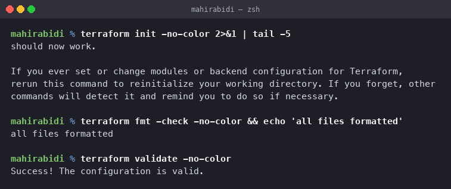
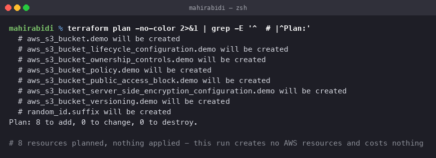
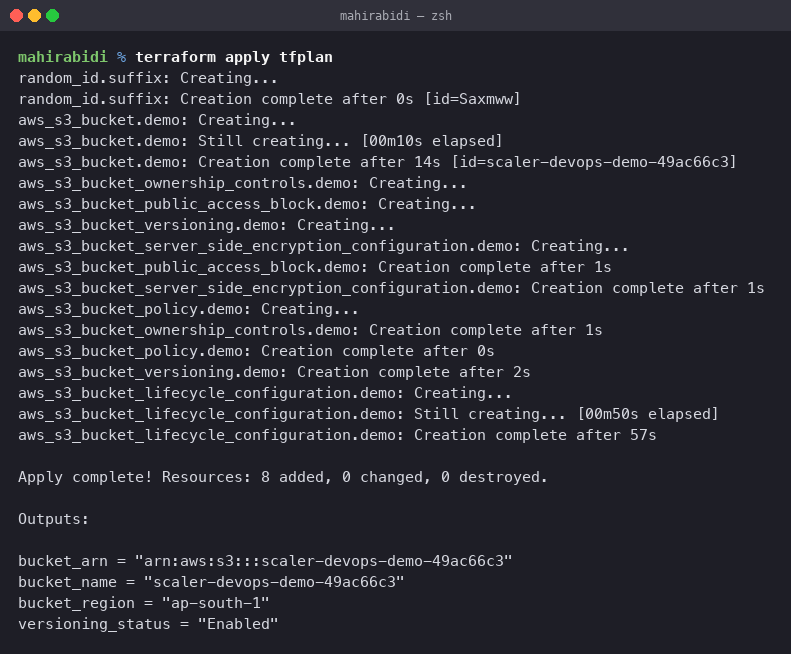
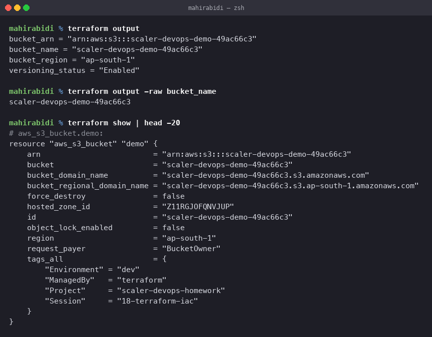
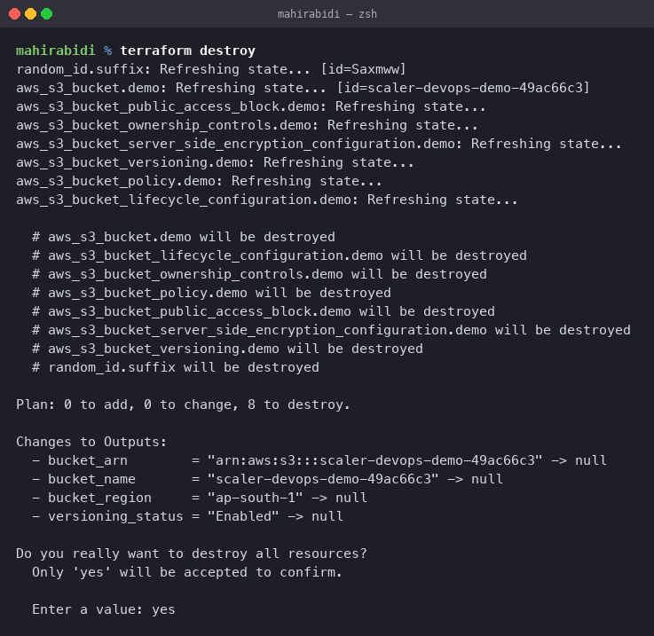

# Terraform S3 Demo

Session 18, Task 1. An S3 bucket created with Terraform, with the full command workflow
documented.

## All eight commands were run for real

`init`, `fmt`, `validate`, `plan`, `apply`, `show`, `output` and `destroy` were all
executed against a live AWS account in `ap-south-1`. The bucket
`scaler-devops-demo-49ac66c3` existed, and was destroyed immediately afterwards.

An empty S3 bucket costs essentially nothing, which is why this was a safe one to apply —
unlike the EC2 resources in session 19.

## File layout

    terraform-s3-demo/
    ├── provider.tf                 provider and version constraints
    ├── variables.tf                input variables with defaults and validation
    ├── main.tf                     the bucket and its settings
    ├── outputs.tf                  values exposed after apply
    ├── terraform.tfvars.example    template; copy to terraform.tfvars
    ├── .gitignore                  keeps state and real tfvars out of git
    └── README.md

Splitting the configuration this way is convention rather than requirement — Terraform
reads every `.tf` file in the directory and builds one graph regardless of filenames. The
split exists so a reader knows where to look.

## What it creates

Eight resources, which is more than "a bucket" because a bucket's settings are separate
resources in the AWS provider:

| Resource | Purpose |
|---|---|
| `random_id.suffix` | four random bytes appended to the name |
| `aws_s3_bucket.demo` | the bucket itself |
| `aws_s3_bucket_versioning.demo` | keeps every object version |
| `aws_s3_bucket_server_side_encryption_configuration.demo` | AES256 at rest |
| `aws_s3_bucket_public_access_block.demo` | blocks all public access |
| `aws_s3_bucket_ownership_controls.demo` | disables legacy ACLs |
| `aws_s3_bucket_lifecycle_configuration.demo` | expires old versions, aborts stale multipart uploads |
| `aws_s3_bucket_policy.demo` | denies any non-TLS request |

The random suffix is not decoration. S3 bucket names are globally unique across every AWS
account, so any fixed name in shared example code will already be taken.

## The workflow

### terraform init

Downloads the providers and writes the dependency lock file.

    $ terraform init
    Terraform has been successfully initialized!

Run it again whenever providers or backend configuration change. Everything else refuses to
run until it has been.

### terraform fmt

Rewrites files to canonical formatting. `-check` reports instead of rewriting, which is what
belongs in CI.

    $ terraform fmt -check
    all files formatted

No output means nothing needed changing.

### terraform validate

Checks syntax and internal consistency — types, required arguments, references that resolve.
It does **not** talk to AWS, so it cannot catch a bucket name already in use or a missing
permission.

    $ terraform validate
    Success! The configuration is valid.

### terraform plan

Compares the configuration against state and against reality, then prints what it would do.
This is the step that talks to AWS, read-only.

    # aws_s3_bucket.demo will be created
    # aws_s3_bucket_lifecycle_configuration.demo will be created
    # aws_s3_bucket_ownership_controls.demo will be created
    # aws_s3_bucket_policy.demo will be created
    # aws_s3_bucket_public_access_block.demo will be created
    # aws_s3_bucket_server_side_encryption_configuration.demo will be created
    # aws_s3_bucket_versioning.demo will be created
    # random_id.suffix will be created

    Plan: 8 to add, 0 to change, 0 to destroy.

The summary line is the thing to read. `0 to change, 0 to destroy` on a first run is
expected; a `destroy` count you did not intend is the warning sign.

Note how many values are `(known after apply)` — the bucket name depends on the random ID,
which does not exist yet. Terraform tracks these unknowns through the graph.

For anything real, save the plan and apply exactly that:

    terraform plan -out=tfplan
    terraform apply tfplan

Otherwise `apply` re-plans, and what it does may differ from what you reviewed.

### terraform apply

    $ terraform apply tfplan
    random_id.suffix: Creation complete after 0s [id=Saxmww]
    aws_s3_bucket.demo: Still creating... [00m10s elapsed]
    aws_s3_bucket.demo: Creation complete after 14s [id=scaler-devops-demo-49ac66c3]
    aws_s3_bucket_public_access_block.demo: Creation complete after 1s
    aws_s3_bucket_server_side_encryption_configuration.demo: Creation complete after 1s
    aws_s3_bucket_ownership_controls.demo: Creation complete after 1s
    aws_s3_bucket_policy.demo: Creation complete after 0s
    aws_s3_bucket_versioning.demo: Creation complete after 2s
    aws_s3_bucket_lifecycle_configuration.demo: Still creating... [00m50s elapsed]
    aws_s3_bucket_lifecycle_configuration.demo: Creation complete after 57s

    Apply complete! Resources: 8 added, 0 changed, 0 destroyed.

    Outputs:

    bucket_arn        = "arn:aws:s3:::scaler-devops-demo-49ac66c3"
    bucket_name       = "scaler-devops-demo-49ac66c3"
    bucket_region     = "ap-south-1"
    versioning_status = "Enabled"

Three things in that output are worth reading rather than skipping.

**The dependency graph is visible in the ordering.** `random_id` finished first because the
bucket name interpolates it. Then the bucket. Then the five settings resources started
**in parallel**, because each depends only on the bucket and not on each other. Nothing in
the configuration states that order.

**The lifecycle configuration took 57 seconds** while everything else took one or two. S3
lifecycle rules are eventually consistent, and the provider polls until the rule is
readable. This is normal and worth knowing before assuming an apply has hung.

**The bucket name carries the random suffix**, `49ac66c3`, derived from `random_id.suffix`.
Re-running from scratch would produce a different bucket, which is the point — a fixed name
would collide with the global S3 namespace.

Terraform works out the order from the references: `random_id` before the bucket, because
the name interpolates it; the bucket before everything that takes `bucket = aws_s3_bucket.demo.id`.
Nothing declares that ordering explicitly — it falls out of the dependency graph, which is
the central idea of the tool.

`depends_on` appears twice in `main.tf` for the two cases the graph cannot infer: the
lifecycle rule must come after versioning is enabled, and the bucket policy after public
access is blocked.

### terraform show

Prints the current state in human-readable form, including every attribute AWS filled in.

    $ terraform show | head -20
    # aws_s3_bucket.demo:
    resource "aws_s3_bucket" "demo" {
        arn                         = "arn:aws:s3:::scaler-devops-demo-49ac66c3"
        bucket                      = "scaler-devops-demo-49ac66c3"
        bucket_domain_name          = "scaler-devops-demo-49ac66c3.s3.amazonaws.com"
        bucket_regional_domain_name = "scaler-devops-demo-49ac66c3.s3.ap-south-1.amazonaws.com"
        hosted_zone_id              = "Z11RGJOFQNVJUP"
        region                      = "ap-south-1"
        request_payer               = "BucketOwner"
        tags_all                    = {
            "Environment" = "dev"
            "ManagedBy"   = "terraform"
            "Project"     = "scaler-devops-homework"
            "Session"     = "18-terraform-iac"
        }
    }

Note `tags_all` rather than `tags`. The four tags came from `default_tags` on the provider,
not from the resource, so they appear in the computed `tags_all` while `tags` itself is
empty. That distinction causes real confusion when a plan shows a tag change nobody made.

One oddity in the full output worth recording: the deprecated inline `versioning` block on
`aws_s3_bucket` reported `enabled = false` immediately after apply, while the separate
`aws_s3_bucket_versioning` resource correctly reported `status = "Enabled"`. The inline
block is legacy and is not refreshed by the newer resource; the destroy plan a moment later
showed it as `enabled = true`. Trust the dedicated resource, not the deprecated field.

### terraform output

Prints just the declared outputs.

    $ terraform output
    bucket_arn        = "arn:aws:s3:::scaler-devops-demo-49ac66c3"
    bucket_name       = "scaler-devops-demo-49ac66c3"
    bucket_region     = "ap-south-1"
    versioning_status = "Enabled"

    $ terraform output -raw bucket_name
    scaler-devops-demo-49ac66c3

`-raw` gives an unquoted value, which is what you pipe into other commands in a script.

### terraform destroy

Removes everything in state. Run immediately after the demonstration.

    $ terraform destroy
    random_id.suffix: Refreshing state... [id=Saxmww]
    aws_s3_bucket.demo: Refreshing state... [id=scaler-devops-demo-49ac66c3]
    ...

      # aws_s3_bucket.demo will be destroyed
      # aws_s3_bucket_lifecycle_configuration.demo will be destroyed
      # aws_s3_bucket_ownership_controls.demo will be destroyed
      # aws_s3_bucket_policy.demo will be destroyed
      # aws_s3_bucket_public_access_block.demo will be destroyed
      # aws_s3_bucket_server_side_encryption_configuration.demo will be destroyed
      # aws_s3_bucket_versioning.demo will be destroyed
      # random_id.suffix will be destroyed

    Plan: 0 to add, 0 to change, 8 to destroy.

    Changes to Outputs:
      - bucket_arn        = "arn:aws:s3:::scaler-devops-demo-49ac66c3" -> null
      - bucket_name       = "scaler-devops-demo-49ac66c3" -> null
      - bucket_region     = "ap-south-1" -> null
      - versioning_status = "Enabled" -> null

    Do you really want to destroy all resources?
      Only 'yes' will be accepted to confirm.

      Enter a value: yes

`destroy` refreshes state first — it checks what still exists before deciding what to
remove, so a resource deleted by hand in the console does not cause a failure. It then
walks the dependency graph **backwards**: the settings resources go before the bucket they
attach to.

The interactive confirmation has no `-auto-approve` here on purpose. In CI you would pass
it; at a terminal, typing `yes` is the last chance to read the plan.

A bucket must be empty to be deleted. If objects were uploaded, `destroy` fails with
`BucketNotEmpty` and they must be removed first:

    aws s3 rm s3://$(terraform output -raw bucket_name) --recursive

With versioning enabled, deleting the visible objects is not enough — every noncurrent
version and delete marker must go too. `force_destroy = true` on the bucket resource makes
Terraform handle that, and is deliberately left off here so the failure is instructive
rather than silent.

## State

`terraform.tfstate` maps the configuration to real resource IDs. It is how Terraform knows
that `aws_s3_bucket.demo` means that specific bucket.

Two consequences:

**It can contain secrets.** State holds every attribute, including ones marked sensitive.
It is gitignored here for that reason.

**Local state does not work for a team.** Two people applying at once will corrupt it. The
fix is remote state in S3 with a DynamoDB lock table:

    terraform {
      backend "s3" {
        bucket         = "my-tf-state"
        key            = "s3-demo/terraform.tfstate"
        region         = "ap-south-1"
        dynamodb_table = "terraform-locks"
        encrypt        = true
      }
    }

Which is its own chicken-and-egg problem: the state bucket has to be created before it can
hold state.

## Variables

Defined in `variables.tf` with defaults, so the configuration runs with no input. Precedence,
lowest to highest: default, `terraform.tfvars`, `*.auto.tfvars`, `TF_VAR_` environment
variables, `-var` on the command line.

`bucket_name_prefix` carries a validation block rejecting anything but lowercase letters,
digits and hyphens — S3's naming rules enforced before AWS rejects it.

`terraform.tfvars` is gitignored and `terraform.tfvars.example` is committed, which is the
standard way to share the shape of the configuration without the values.

## Credentials

Terraform uses the standard AWS credential chain — environment variables, shared config,
instance or container roles. Nothing about credentials appears in any `.tf` file here, and
nothing should.

    $ aws sts get-caller-identity --query Account --output text
    <account-id>

For CI, OIDC federation into a role is better than access keys: no long-lived secret exists
to leak, as covered in the IAM notes in `../aws-services/01-iam/`.
