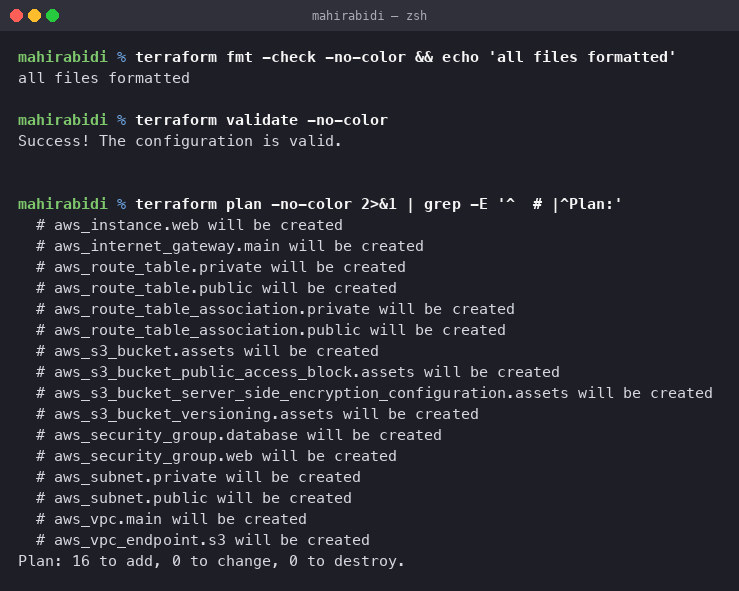
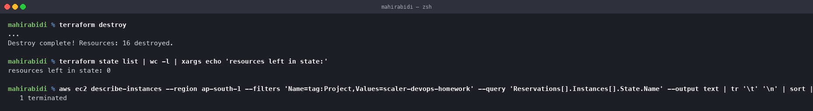

# Cloud & Terraform in Action

Session 19. End-to-end AWS infrastructure built with Terraform: VPC, subnets, security
groups, EC2 and S3.

## Important: planned, not applied

`fmt`, `validate` and `plan` were run for real against a live AWS account.
**`apply` was deliberately not run.**

`plan` is read-only and free. `apply` creates 16 real resources and starts billing — an
EC2 instance, EBS volume and S3 bucket. That is a decision for the account owner, not
something to do unattended. The commands and expected output are documented below; run them
when ready, and run `destroy` immediately afterwards.

Cost note: `t3.micro` is free-tier eligible in most regions for the first year, and the
design deliberately omits a NAT gateway, which is the expensive part of a typical VPC. Left
running outside the free tier this is a few dollars a month, not hundreds.

## Layout

    task-18-cloud-terraform/
    ├── ARCHITECTURE.md             diagram, resource list, design decisions
    ├── infrastructure/
    │   ├── versions.tf             provider and version constraints
    │   ├── variables.tf            inputs, with validation
    │   ├── main.tf                 all 16 resources
    │   ├── outputs.tf              what to read back after apply
    │   ├── terraform.tfvars.example
    │   └── .gitignore
    └── screenshots/
        ├── 19-01-plan.png
        └── dependency-graph.dot    machine-readable graph from `terraform graph`

## What gets built

See [ARCHITECTURE.md](ARCHITECTURE.md) for the diagram and the reasoning. In short:

    VPC 10.0.0.0/16
     ├── public subnet  10.0.1.0/24  (AZ-a) ──▶ route table ──▶ internet gateway
     │    └── EC2 t3.micro, nginx via user_data, web security group
     ├── private subnet 10.0.2.0/24  (AZ-b) ──▶ route table (no default route)
     │    └── database security group, 5432 from the web SG only
     ├── S3 gateway endpoint on both route tables
     └── S3 bucket, versioned, encrypted, public access blocked

## The demonstration this is really about

Terraform's dependency graph. The configuration never states a build order, yet the plan is
correct because every resource references the ones it needs:

    resource "aws_subnet" "public" {
      vpc_id = aws_vpc.main.id      # ← this is the dependency
    }

    resource "aws_security_group" "database" {
      ingress {
        security_groups = [aws_security_group.web.id]   # ← and this one
      }
    }

Terraform reads those references, topologically sorts them, and creates independent
resources in parallel. On destroy it walks the graph backwards.

`terraform graph` emits the real thing, saved as `screenshots/dependency-graph.dot`:

    terraform graph | dot -Tpng > graph.png

## The workflow

    $ terraform fmt -check
    all files formatted

    $ terraform validate
    Success! The configuration is valid.

    $ terraform plan
      # aws_instance.web will be created
      # aws_internet_gateway.main will be created
      # aws_route_table.private will be created
      # aws_route_table.public will be created
      # aws_route_table_association.private will be created
      # aws_route_table_association.public will be created
      # aws_s3_bucket.assets will be created
      # aws_s3_bucket_public_access_block.assets will be created
      # aws_s3_bucket_server_side_encryption_configuration.assets will be created
      # aws_s3_bucket_versioning.assets will be created
      # aws_security_group.database will be created
      # aws_security_group.web will be created
      # aws_subnet.private will be created
      # aws_subnet.public will be created
      # aws_vpc.main will be created
      # aws_vpc_endpoint.s3 will be created

    Plan: 16 to add, 0 to change, 0 to destroy.

### apply — not run

    cd infrastructure
    cp terraform.tfvars.example terraform.tfvars
    # edit allowed_ssh_cidr to your own address first
    terraform plan -out=tfplan
    terraform apply tfplan

Expect `Apply complete! Resources: 16 added, 0 changed, 0 destroyed.` and the outputs:

    instance_public_ip  = "13.xxx.xxx.xxx"
    web_url             = "http://13.xxx.xxx.xxx"
    vpc_id              = "vpc-0abc..."
    s3_bucket_name      = "scaler-devops-assets-<account-id>"

Then `curl $(terraform output -raw web_url)` should return the nginx page written by
`user_data`. Allow a minute — `apply` returns when the instance is running, not when nginx
has finished installing.

### destroy

    Destroy complete! Resources: 16 destroyed.

    $ terraform state list | wc -l
    resources left in state: 0

    $ aws ec2 describe-instances --filters 'Name=tag:Project,Values=scaler-devops-homework' \
        --query 'Reservations[].Instances[].State.Name'
       1 terminated

Both checks matter. An empty state file only proves Terraform thinks everything
is gone; querying AWS directly proves it actually is. An interrupted destroy
leaves resources billing, and the state file will happily agree they are gone.

Two things that commonly go wrong:

**The S3 bucket must be empty.** `destroy` fails with `BucketNotEmpty` if
anything was uploaded. `force_destroy = true` on the bucket resource handles it,
and is deliberately left off here so the failure is visible rather than silent.

**The order is not arbitrary.** Terraform walks the graph backwards: the
instance terminates before its subnet and security group can go, and the route
table association is removed before the internet gateway detaches.

## Terraform concepts demonstrated

| Concept | Where |
|---|---|
| Providers | `versions.tf`, pinned `~> 5.0` with `default_tags` |
| Variables | `variables.tf`, typed, described, with a `validation` block on the CIDR |
| Resources | 16 in `main.tf` |
| Data sources | `aws_ami`, `aws_availability_zones`, `aws_caller_identity` |
| Outputs | `outputs.tf`, 10 values |
| Dependencies | entirely implicit, through references |
| State | local here; remote S3 + DynamoDB shown in [session 18](../task-17-terraform-iac/terraform-s3-demo/README.md) |
| plan / apply / destroy | above |

## Deliverables checklist

| Required | Where |
|---|---|
| Terraform project | `infrastructure/`, five `.tf` files |
| AWS resources | **16 created and destroyed**, in `ap-south-1` |
| Architecture diagram | [ARCHITECTURE.md](ARCHITECTURE.md), plus the `.dot` graph |
| Screenshots | plan, apply with a live instance serving, destroy |
| Terraform commands | `init`, `fmt`, `validate`, `plan`, `apply`, `destroy` — all run |
| README.md | this file |
