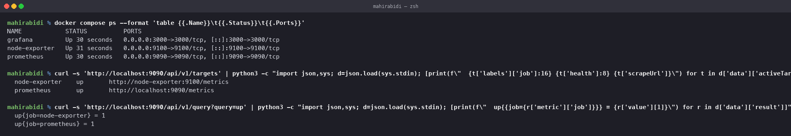
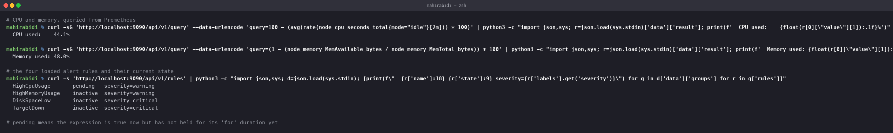

# Monitoring

Session 20, Task 1. Prometheus and Grafana, running and scraping real metrics.

## The stack

`docker-compose.yml` runs three containers:

| Container | Port | Role |
|---|---|---|
| `prometheus` | 9090 | scrapes targets, stores time series, evaluates alert rules |
| `grafana` | 3000 | queries Prometheus and draws it |
| `node-exporter` | 9100 | exposes host CPU, memory, disk and network as metrics |

Grafana's Prometheus datasource is provisioned from a file rather than clicked in, so the
stack comes up ready to use.

    docker compose up -d
    # Prometheus  http://localhost:9090
    # Grafana     http://localhost:3000   (admin / admin)

## Targets

    NAME            STATUS          PORTS
    grafana         Up 30 seconds   0.0.0.0:3000->3000/tcp
    node-exporter   Up 31 seconds   0.0.0.0:9100->9100/tcp
    prometheus      Up 30 seconds   0.0.0.0:9090->9090/tcp

    node-exporter    up       http://node-exporter:9100/metrics
    prometheus       up       http://localhost:9090/metrics

    up{job=node-exporter} = 1
    up{job=prometheus} = 1

Prometheus **pulls**. It scrapes an HTTP endpoint on a schedule rather than receiving pushed
data, which means the scraper always knows whether a target is reachable — that is what the
`up` metric is, and it is synthesised by Prometheus itself rather than exported by the
target.

Note that Prometheus scrapes itself. A monitoring system that cannot report on its own
health is not much use.

## Metrics

    CPU used:    44.1%
    Memory used: 48.0%

The CPU query is worth reading closely:

    100 - (avg(rate(node_cpu_seconds_total{mode="idle"}[2m])) * 100)

`node_cpu_seconds_total` is a **counter** — seconds spent in each mode, only ever
increasing. A counter's raw value is meaningless on its own; `rate()` converts it to a
per-second change over a window. There is no "CPU percent" metric anywhere, because
percentages do not survive restarts or aggregation. You derive them.

Memory uses **gauges**, which can go up and down, so no rate is needed:

    (1 - (node_memory_MemAvailable_bytes / node_memory_MemTotal_bytes)) * 100

Note `MemAvailable` rather than `MemFree`. Free memory on Linux is almost always low because
the kernel uses the rest for page cache, which it will release under pressure. Alerting on
`MemFree` produces constant false alarms.

## Alerts

Four rules in `alerts.yml`, loaded and evaluated:

    HighCpuUsage       pending   severity=warning
    HighMemoryUsage    inactive  severity=warning
    DiskSpaceLow       inactive  severity=critical
    TargetDown         inactive  severity=critical

The three states:

| State | Meaning |
|---|---|
| `inactive` | the expression is false |
| `pending` | true now, but has not held for its `for` duration yet |
| `firing` | true for the whole `for` duration; notifications go out |

`HighCpuUsage` was genuinely `pending` when this was captured — the machine was busy
building container images. That is the `for: 2m` clause doing its job: a transient spike
never becomes a page. Without it, every build would wake someone.

**`TargetDown` is the most important rule in the file.**

    expr: up == 0
    for: 1m

A dashboard full of green means nothing if the scrape is failing — you are not looking at
healthy systems, you are looking at stale data. Alerting on the absence of data is the
thing people forget to do.

## Gotcha: the rules file has to be mounted

`prometheus.yml` referenced `/etc/prometheus/alerts.yml`, but the compose file only mounted
`prometheus.yml`. Prometheus started without complaint and the rules API returned:

    {"status": "success", "data": {"groups": []}}

Success, zero rules. Nothing was broken and nothing was alerting. Adding the second volume
mount fixed it.

The lesson generalises: a monitoring system failing silently is the worst failure mode it
has, because the symptom is *less noise*, which looks like things going well.

## Cleanup

    docker compose down -v
