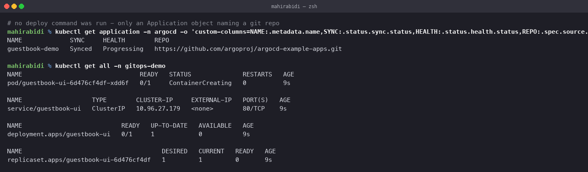
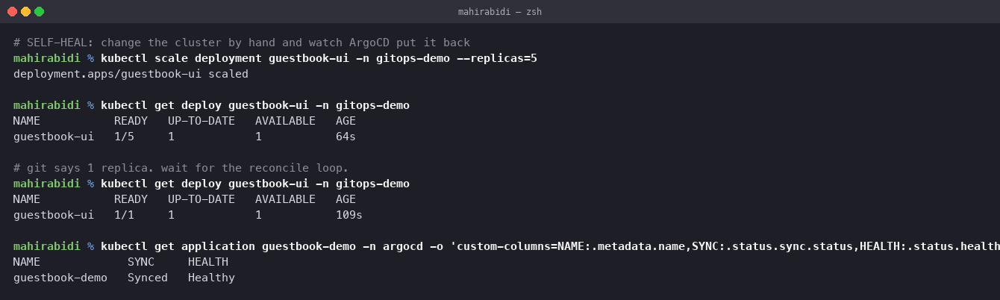

# GitOps

Session 20, Task 3. Git as the source of truth, with ArgoCD reconciling the cluster to
match it.

## What GitOps is

Four principles:

1. **Declarative.** The whole system is described as data, not as a sequence of commands.
2. **Versioned and immutable.** That description lives in git, so every change has an
   author, a timestamp, a diff and a review.
3. **Pulled automatically.** An agent inside the cluster pulls the desired state. Nothing
   outside needs credentials to push into the cluster.
4. **Continuously reconciled.** The agent does not apply once and stop — it keeps comparing
   and correcting.

## Push vs pull, and why it matters

The CD pipeline in [session 16](../../task-15-cicd-github-actions/README.md) **pushes**:

    GitHub Actions ──(kubeconfig secret)──▶ cluster

That works, and it has a real cost: the CI system holds cluster credentials. Anyone who can
modify a workflow file, or compromise the runner, can reach production. The credentials also
have to be rotated, and the cluster has to be reachable from GitHub's network.

GitOps **pulls**:

    git repo ◀──(polls)── ArgoCD (inside the cluster) ──▶ cluster

No credential leaves the cluster. CI's job ends at pushing an image and updating a tag in a
manifest repository; it never touches the cluster at all. A cluster with no inbound access
can still be deployed to.

## Git as the source of truth

The phrase is only meaningful if divergence is actively corrected. Otherwise git is just
where the YAML happens to be kept.

`argocd-application.yaml` sets both options that make it true:

    syncPolicy:
      automated:
        prune: true       # delete what is no longer in git
        selfHeal: true    # revert changes made outside git

Without `prune`, deleting a manifest from the repository leaves it running in the cluster
forever — git no longer describes the system. Without `selfHeal`, a `kubectl edit` persists
indefinitely, and the cluster quietly drifts from the repository everyone believes describes
it.

## The Application object

The entire configuration is one manifest:

    spec:
      source:
        repoURL: https://github.com/argoproj/argocd-example-apps.git
        targetRevision: HEAD
        path: guestbook
      destination:
        server: https://kubernetes.default.svc
        namespace: gitops-demo

A repository, a path, a revision, a destination. **There is no deploy step anywhere.**

## Installing ArgoCD

    kubectl create namespace argocd
    kubectl apply --server-side -n argocd \
      -f https://raw.githubusercontent.com/argoproj/argo-cd/stable/manifests/install.yaml

`--server-side` is required. A plain `kubectl apply` fails:

    The CustomResourceDefinition "applicationsets.argoproj.io" is invalid:
      metadata.annotations: Too long: may not be more than 262144 bytes

Client-side apply stores the entire previous object in the
`kubectl.kubernetes.io/last-applied-configuration` annotation, and this CRD exceeds the
256KB annotation limit on its own. Server-side apply tracks field ownership in managed
fields instead, with no annotation.

Seven pods come up:

    argocd-application-controller-0          Running   ← the reconcile loop
    argocd-applicationset-controller-...     Running
    argocd-dex-server-...                    Running   ← SSO
    argocd-notifications-controller-...      Running
    argocd-redis-...                         Running   ← cache
    argocd-repo-server-...                   Running   ← clones repos, renders manifests
    argocd-server-...                        Running   ← API and web UI

## The sync

    $ kubectl apply -f argocd-application-demo.yaml
    application.argoproj.io/guestbook-demo created

    $ kubectl get application -n argocd
    NAME             SYNC     HEALTH        REPO
    guestbook-demo   Synced   Progressing   https://github.com/argoproj/argocd-example-apps.git

    $ kubectl get all -n gitops-demo
    pod/guestbook-ui-6d476cf4df-xdd6f   0/1   ContainerCreating
    service/guestbook-ui                ClusterIP   10.96.27.179
    deployment.apps/guestbook-ui        0/1   1   0

**One `kubectl apply`, of an object that contains no application manifests.** The Deployment
and Service were created because ArgoCD cloned the repository, rendered what it found and
applied it — including creating the namespace, from `CreateNamespace=true`.

Note the two independent status fields. `SYNC` compares the cluster to git. `HEALTH` asks
whether the resources are actually working. `Synced` and `Progressing` together means "the
cluster matches git, and git describes something still starting up" — the same distinction
Helm's `deployed` status failed to make in [task 14](../../task-14-helm/02-rollback/README.md).

## Self-heal

    $ kubectl scale deployment guestbook-ui -n gitops-demo --replicas=5
    deployment.apps/guestbook-ui scaled

    $ kubectl get deploy guestbook-ui -n gitops-demo
    NAME           READY   UP-TO-DATE   AVAILABLE   AGE
    guestbook-ui   1/5     1            1           64s

    # git says 1 replica. wait for the reconcile loop.

    $ kubectl get deploy guestbook-ui -n gitops-demo
    NAME           READY   UP-TO-DATE   AVAILABLE   AGE
    guestbook-ui   1/1     1            1           109s

    $ kubectl get application guestbook-demo -n argocd
    NAME             SYNC     HEALTH
    guestbook-demo   Synced   Healthy

Scaled to 5 by hand. Within the reconcile interval it was back to 1, because that is what
the repository says. The manual change was simply undone.

This is the behaviour that makes git genuinely authoritative, and it is also the one that
surprises people: **manual fixes do not survive.** An operator who scales up during an
incident will watch it revert. The correct response is to commit the change, or to disable
`selfHeal` on that Application deliberately while the incident is live.

## The two Applications here

| File | Points at | State |
|---|---|---|
| `argocd-application-demo.yaml` | ArgoCD's public example repo | **synced for real**, shown above |
| `argocd-application.yaml` | this homework repository, `03-gitops/app` | will sync once this directory is pushed |

The second cannot sync yet because ArgoCD pulls from GitHub and these manifests are still
only local. That is itself a demonstration of the model: in GitOps nothing is deployed
because you ran a command, it is deployed because it is in the repository.

## Repository patterns

| | |
|---|---|
| **Mono-repo** | app code and manifests together. Simple, but a manifest change triggers the app CI pipeline |
| **Separate config repo** | app code in one repo, manifests in another. CI builds the image and commits a new tag to the config repo. The common production choice |
| **Repo per environment** | a branch or repo per environment. Clear boundaries, lots of duplication |

The second is what the CD workflow in session 16 would become under GitOps: instead of
`helm upgrade` against the cluster, the pipeline commits an image tag and ArgoCD does the
rest.

## Cleanup

    kubectl delete -f argocd-application-demo.yaml
    kubectl delete namespace argocd gitops-demo
