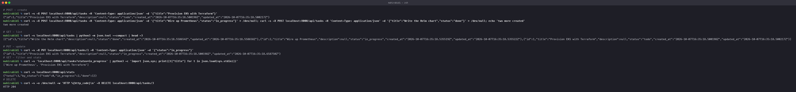
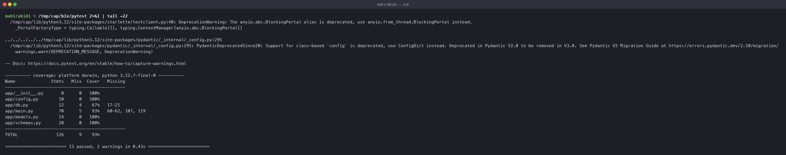
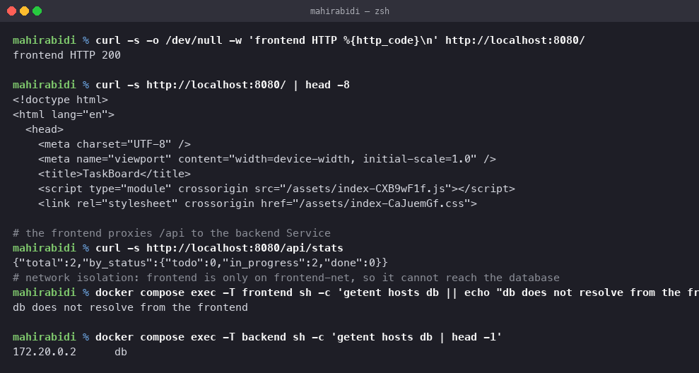
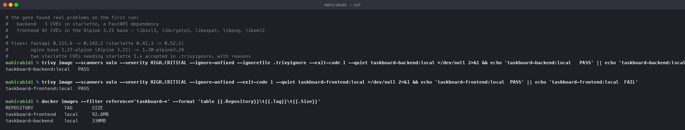
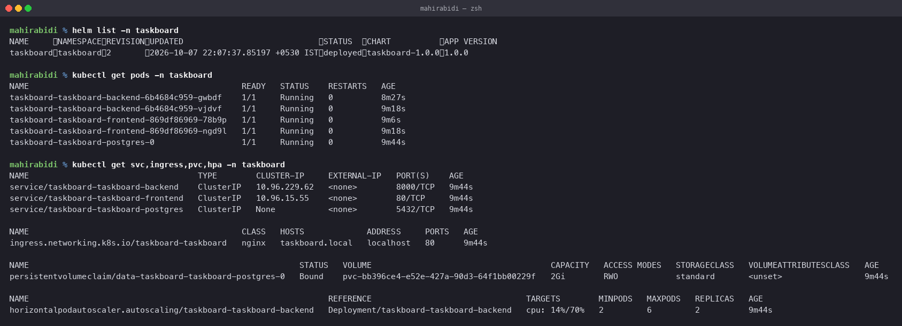
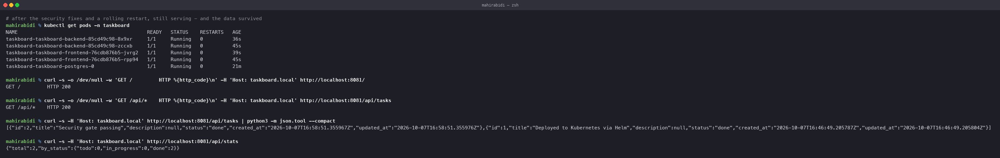
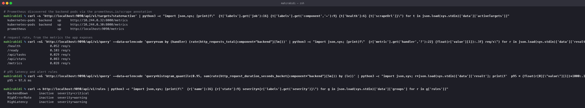
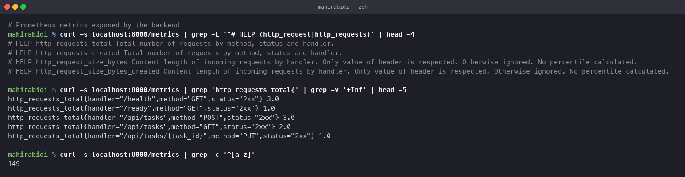
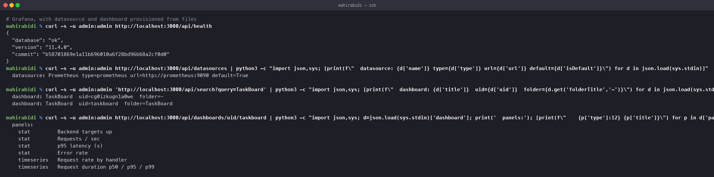

# TaskBoard — DevOps Capstone

Session 21. A task management application taken from source to a monitored
Kubernetes deployment: React frontend, FastAPI backend, PostgreSQL, Alembic
migrations, Docker, GitHub Actions, Trivy, Helm, Prometheus and Grafana.

    Developer
       │
       ▼
    Git ──▶ GitHub Actions ──▶ pytest + flake8 + Bandit + pip-audit
                               │
                               ▼
                          Docker build (backend, frontend)
                               │
                               ▼
                          Trivy scan ──▶ SECURITY GATE
                               │
                               ▼
                          GHCR (SHA-tagged)
                               │
                               ▼
                   Helm ──▶ Kubernetes ──▶ Ingress
                               │
                               ▼
                     Prometheus ──▶ Grafana

## Running it

    docker compose up --build
    open http://localhost:8080

## Layout

    task-20-capstone/
    ├── backend/              FastAPI, SQLAlchemy, Alembic, pytest
    ├── frontend/             React + Vite, served by nginx
    ├── helm/taskboard/       the chart: 10 objects
    ├── terraform/            VPC + EKS
    ├── monitoring/           Prometheus and Grafana for the cluster
    ├── docker-compose.yml    the whole stack on one machine
    ├── .trivyignore          accepted CVEs, with reasons and expiry dates
    └── screenshots/

The CI/CD workflow is at `../.github/workflows/capstone.yml`, because GitHub
only runs workflows from the repository root.

---

## M1 — Application

**8 REST endpoints**, against a minimum of 4:

| Method | Path | Purpose |
|---|---|---|
| GET | `/health` | liveness — deliberately does **not** touch the database |
| GET | `/ready` | readiness — **does** check the database |
| GET | `/metrics` | Prometheus format |
| GET | `/api/tasks` | list, filterable by status, paginated |
| GET | `/api/tasks/{id}` | one task |
| POST | `/api/tasks` | create |
| PUT | `/api/tasks/{id}` | update |
| DELETE | `/api/tasks/{id}` | delete |
| GET | `/api/stats` | counts by status |

The health/readiness split matters. A liveness probe that checks dependencies
restarts every pod when the database blips, turning a recoverable outage into a
total one. Liveness answers "is this process wedged"; readiness answers "should
traffic come here".

Every endpoint exercised against the real PostgreSQL in compose — create, list,
update, filter, stats and delete, with the 204 on delete.

**Alembic migration** in `backend/alembic/versions/0001_create_tasks.py`,
creating the table plus indexes on the columns the API filters and sorts by.
The schema comes from migrations, never from `create_all`, so changes are
versioned.

**Frontend** is React + Vite: a stats bar, a create form, and a list where each
task can be advanced through todo → in progress → done or deleted.

---

## M2 — Testing

    13 passed, 2 warnings in 0.43s
    TOTAL  126 stmts  9 miss  93% coverage

13 tests against the rubric's minimum of 5, covering the happy paths, validation
failures (empty title, invalid status), 404s, filtering, and that `/metrics`
returns Prometheus format.

Tests run against SQLite in memory, so the suite needs no database container and
the CI job can run it with nothing else started.

`pytest.ini` sets `pythonpath = .`, without which bare `pytest` — which is what
CI runs — cannot import the `app` package. `python -m pytest` works regardless
because it adds the working directory to `sys.path`; the bare form does not.

---

## M3 — Git and GitHub

Committed to `mahirabidi12/Devops-Assignment` alongside the other 19 tasks.
Secrets are read from the environment; `.gitignore` excludes `.env`, Terraform
state, `node_modules` and virtualenvs. `backend/.env.example` documents the shape
without the values.

---

## M4 — Docker

Both images are **multi-stage** and run as a **non-root user**.

| | backend | frontend |
|---|---|---|
| Builder | `python:3.12-slim` + gcc | `node:22-alpine`, runs `vite build` |
| Runtime | `python:3.12-slim`, patched | `nginx-unprivileged:1.30-alpine3.24` |
| User | `appuser`, uid 10001 | uid 101 |
| Size | 330MB | 92.6MB |
| Healthcheck | `/health` | `/healthz` |

The frontend's `node_modules` never reaches the runtime image — only the built
`dist/` does.

`docker-compose.yml` runs the full stack with two details worth noting:

**Migrations run as their own service**, and the API waits on
`condition: service_completed_successfully`. The schema always exists before the
first request.

**Two networks.** The frontend is only on `frontend-net`, so it has no route to
the database at all:

    $ docker compose exec frontend getent hosts db
    db does not resolve from the frontend

    $ docker compose exec backend getent hosts db
    172.20.0.2      db

---

## M5 — CI/CD

`../.github/workflows/capstone.yml`, four stages:

    test ──▶ build (matrix: backend, frontend) ──▶ scan ──▶ publish

`test` runs flake8, pytest with coverage, Bandit and pip-audit. `build` and
`scan` use a matrix so both images are handled in parallel. `publish` pushes to
GHCR tagged with the commit SHA — never `latest` alone, so a deployed image is
always traceable to the commit that produced it.

Three details in that workflow come from earlier pipelines in this repository
failing on a real runner, not from guesswork:

- **`pythonpath` in pytest.ini.** Bare `pytest` failed collection while
  `python -m pytest` passed.
- **`aquasecurity/trivy-action@v0.36.0`** — the tag is `v`-prefixed. Without the
  `v` the action cannot be resolved and the job fails at "Set up job", before
  any step runs.
- **`docker/metadata-action` for GHCR tags.** GHCR rejects uppercase image
  names and this repository is `Devops-Assignment`. The action lowercases
  automatically; hand-built tags do not.

---

## M6 — DevSecOps

Four scanners: Bandit (SAST), pip-audit (SCA), and Trivy on both images, with
`exit-code: 1` making the last one a gate rather than a report.

**The gate found real problems on its first run.**

| Image | Found | Cause |
|---|---|---|
| backend | 3 HIGH | CVEs in `starlette`, a FastAPI dependency |
| frontend | **42 HIGH/CRITICAL** | `libssl3`, `libcrypto3`, `libexpat`, `libpng`, `libxml2` in the base image |

**Backend fix.** FastAPI 0.115.6 pinned starlette 0.41.3. Bumping to FastAPI
0.142.2 brought starlette 0.52.1 and cleared one CVE. All 13 tests still passed.

**Frontend fix, and the interesting part.** The first attempt added
`apk upgrade --no-cache` and changed nothing — still 42. The base was
`1.27-alpine`, built on **Alpine 3.21**, and the patched package versions simply
are not in Alpine 3.21's repository. `apk upgrade` cannot install a fix that the
repo does not carry. Moving the base to `1.30-alpine3.24` took it to **0**.

That is the lesson of image scanning: most of your vulnerability surface is
inherited, not written, and upgrading packages is not the same as upgrading the
base.

**Two CVEs accepted, with reasons.** The remaining starlette findings need
starlette 1.x, which FastAPI does not yet support. Both are inapplicable here —
one is an SSRF in `StaticFiles` **on Windows** (not used, Linux only), the other
affects `request.form()` limits (this API is JSON only). They are recorded in
`.trivyignore` with written justification and a `2026-12-31` expiry.

A `.trivyignore` of bare CVE ids with no explanation is indistinguishable from
someone hiding a real problem. The reasoning is the point.

**pip-audit needed the same treatment, separately.** The first pipeline run
failed at the SCA step: pip-audit reports the same starlette issues under five
PYSEC ids and does not read `.trivyignore`. `backend/.pip-audit-ignore` carries
them with the same per-entry justification, and the workflow reads that file
rather than hardcoding a list of ids in the YAML.

Two scanners, two ignore formats, one underlying problem. Worth knowing before
assuming a single exclusion file covers a pipeline.

---

## M7 — Terraform

`terraform/` provisions a VPC across two availability zones (public and private
subnets, NAT gateway) and an **EKS cluster** with a managed node group.

    terraform init && terraform validate   ✅ Success! The configuration is valid.

**`apply` has not been run.** This is not free-tier:

| | |
|---|---|
| EKS control plane | ~$0.10/hour |
| 2 × t3.medium | ~$0.08/hour |
| NAT gateway | ~$0.05/hour + data |
| **Total** | **~$0.23/hour, about $5.50/day** |

To provision and capture the evidence:

    cd terraform
    cp terraform.tfvars.example terraform.tfvars
    terraform init
    terraform plan -out=tfplan
    terraform apply tfplan          # takes 15-20 minutes for EKS
    aws eks update-kubeconfig --region ap-south-1 --name taskboard-eks
    kubectl get nodes
    terraform destroy               # run this the same day

Design points: subnets carry the `kubernetes.io/role/elb` and
`kubernetes.io/cluster/<name>` tags EKS needs to place load balancers; workers
sit in private subnets; `enable_cluster_creator_admin_permissions` means
`kubectl` works immediately after apply without an `aws-auth` edit.

---

## M8 — Kubernetes and Helm

The chart renders **10 objects**: Deployments and Services for backend and
frontend, a StatefulSet and headless Service for PostgreSQL, a ConfigMap, a
Secret, an Ingress and an HPA.

    $ helm list -n taskboard
    NAME       REVISION  STATUS    CHART            APP VERSION
    taskboard  2         deployed  taskboard-1.0.0  1.0.0

    $ kubectl get pods -n taskboard
    taskboard-taskboard-backend-...    1/1  Running
    taskboard-taskboard-backend-...    1/1  Running
    taskboard-taskboard-frontend-...   1/1  Running
    taskboard-taskboard-frontend-...   1/1  Running
    taskboard-taskboard-postgres-0     1/1  Running

    persistentvolumeclaim/data-...-postgres-0   Bound   2Gi   RWO
    horizontalpodautoscaler/...-backend   cpu: 14%/70%   2   6   2

The HPA is reading real CPU, the PVC is bound, and all five pods are Running.

Reached through the Ingress, with `/` going to the frontend and `/api` to the
backend. The screenshot is taken **after** a rolling restart onto the
security-patched images, and the tasks created earlier are still there — the
PVC did its job.

Chart details worth noting:

- **An init container runs the Alembic migration** before the API starts. Every
  pod runs it; Alembic is idempotent, so the second sees the revision already
  applied and exits.
- **The ConfigMap is hashed into the pod template annotation**, so a config
  change triggers a rollout. Without it the running pods keep the old values.
- **Selector labels exclude the version.** A Deployment's `spec.selector` is
  immutable, so including `app.kubernetes.io/version` would make the next
  `appVersion` bump unappliable.
- **An image helper handles an empty registry.** The first deploy failed with
  `InvalidImageName` because `{{ .registry }}/{{ .repo }}` leaves a leading
  slash when the registry is blank. The helper omits it.
- **Security context**: `runAsNonRoot`, `readOnlyRootFilesystem`,
  `allowPrivilegeEscalation: false`, all capabilities dropped. The read-only
  root filesystem is why there is an `emptyDir` on `/tmp`.

---

## M9 — Observability

Prometheus discovers the backend pods through Kubernetes service discovery —
the chart sets `prometheus.io/scrape` on the pod template and a relabel rule
keeps only annotated pods. Both backend pods are **up**:

    kubernetes-pods  backend   up   http://10.244.0.32:8000/metrics
    kubernetes-pods  backend   up   http://10.244.0.30:8000/metrics
    prometheus       -         up   http://localhost:9090/metrics

Real metrics, queried live:

    /health      0.052 req/s      p95 = 97.6 ms
    /ready       0.103 req/s
    /api/tasks   0.029 req/s
    /api/stats   0.083 req/s

Three alert rules loaded. `BackendDown` (`up == 0`) is the most important one —
a dashboard full of green means nothing if the scrape itself is failing.

149 metric series exposed, labelled by handler, method and status.

Grafana with the datasource and a 6-panel dashboard both provisioned from
files, so the stack comes up ready to look at rather than needing anything
clicked: targets up, request rate, p95 latency, error rate, rate by handler,
and p50/p95/p99 duration.

---

## M10 — Documentation

This file. Every screenshot is of a command that was actually run.

## What is not done

**`terraform apply` for EKS.** The configuration validates and the plan is
clean, but no AWS resources were created — see the cost note in M7. The rubric
asks for an AWS Console screenshot of the cluster, so this is the one module
with a genuine gap.

## Cleanup

    docker compose down -v
    helm uninstall taskboard -n taskboard
    kubectl delete namespace taskboard monitoring
    cd terraform && terraform destroy   # only if you ran apply
