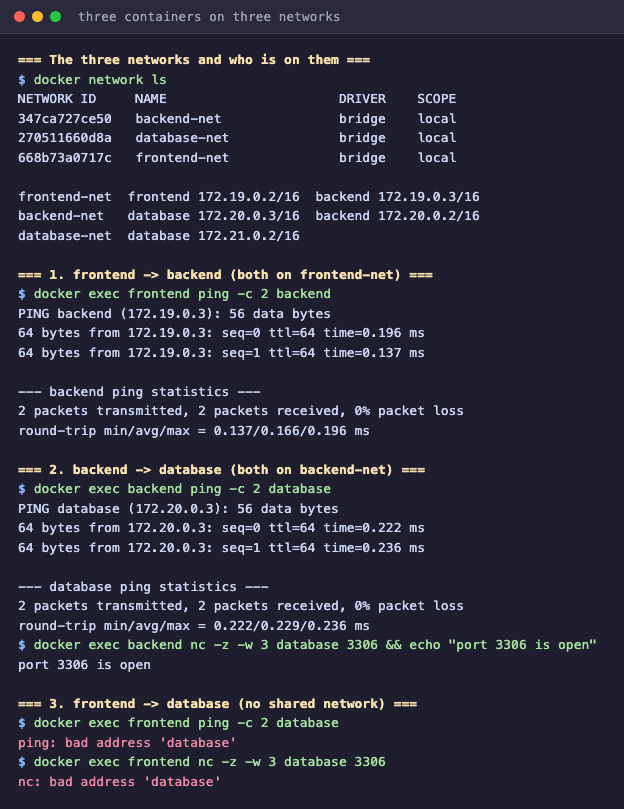
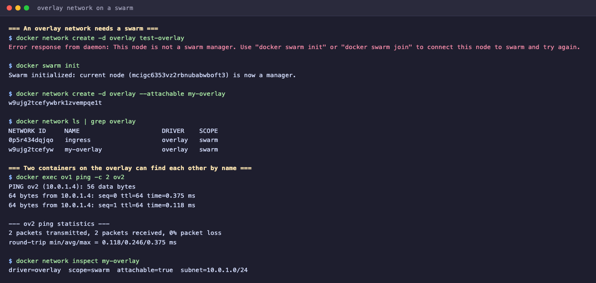

# Docker Networking and Volume Homework

Every command below was actually run and the output is reproduced as it appeared.

## Task 1: Three containers across three networks

The design: a frontend, a backend and a MySQL database. The backend is attached to two
networks so it can reach both sides, and the frontend must have no route to the database
whatsoever.

    frontend-net    frontend + backend
    backend-net     backend + database
    database-net    database

### Creating the networks

    $ docker network create frontend-net
    $ docker network create backend-net
    $ docker network create database-net

    $ docker network ls
    NETWORK ID     NAME           DRIVER    SCOPE
    347ca727ce50   backend-net    bridge    local
    270511660d8a   database-net   bridge    local
    668b73a0717c   frontend-net   bridge    local
    aa75b76ba87c   bridge         bridge    local
    51ef457e4253   host           host      local
    7d4efe805165   none           null      local

The bottom three always exist, Docker creates them itself. The three I made use the
`bridge` driver, which is the default and the right one for containers on a single host.

### Creating the containers

    $ docker run -d --name frontend --network frontend-net alpine sleep infinity
    $ docker run -d --name backend  --network frontend-net alpine sleep infinity
    $ docker network connect backend-net backend
    $ docker run -d --name database --network backend-net -e MYSQL_ROOT_PASSWORD=rootpass mysql:8.0
    $ docker network connect database-net database

`docker run` only accepts one `--network`, so a container that belongs on two networks
gets the second one afterwards with `docker network connect`. That is how the backend
ends up spanning both. `sleep infinity` is just a way to keep the two alpine containers
alive, since a container exits as soon as its main process finishes.

    $ docker ps
    NAMES      IMAGE       STATUS
    database   mysql:8.0   Up 5 seconds
    backend    alpine      Up 34 seconds
    frontend   alpine      Up 34 seconds

### Which container sits on which network

    frontend  frontend-net=172.19.0.2
    backend   backend-net=172.20.0.2   frontend-net=172.19.0.3
    database  backend-net=172.20.0.3   database-net=172.21.0.2

The backend holds two addresses, one per network. Each network is a separate subnet:
172.19, 172.20 and 172.21.

### Test 1: frontend to backend, sharing a network

    $ docker exec frontend ping -c 2 backend
    PING backend (172.19.0.3): 56 data bytes
    64 bytes from 172.19.0.3: seq=0 ttl=64 time=0.470 ms
    64 bytes from 172.19.0.3: seq=1 ttl=64 time=0.084 ms

    --- backend ping statistics ---
    2 packets transmitted, 2 packets received, 0% packet loss

Works, and note what was pinged: the name `backend`, not an address. Docker runs an
embedded DNS resolver on every user defined network, so containers find each other by
container name. This does not happen on the default `bridge` network, where only IP
addresses work, which is one good reason to always create your own.

### Test 2: backend to database, sharing a network

    $ docker exec backend ping -c 2 database
    PING database (172.20.0.3): 56 data bytes
    64 bytes from 172.20.0.3: seq=0 ttl=64 time=0.494 ms
    64 bytes from 172.20.0.3: seq=1 ttl=64 time=0.191 ms

    --- database ping statistics ---
    2 packets transmitted, 2 packets received, 0% packet loss

    $ docker exec backend nc -z -w 3 database 3306
    port 3306 is open from backend

The second check matters more than the ping. ICMP replying proves the host is there;
`nc -z` on 3306 proves MySQL is actually accepting connections, which is what a real
application would need.

### Test 3: frontend to database, sharing nothing

    $ docker exec frontend ping -c 2 database
    ping: bad address 'database'

    $ docker exec frontend nc -z -w 3 database 3306
    nc: bad address 'database'

This is the result the whole task is built around. The frontend cannot even turn the name
`database` into an address, never mind connect to it. The two containers have no network
in common, so the DNS server on `frontend-net` has no record of the database at all. The
isolation happens before any connection is attempted.

### Members of each network

    frontend-net  frontend (172.19.0.2/16)  backend (172.19.0.3/16)
    backend-net   database (172.20.0.3/16)  backend (172.20.0.2/16)
    database-net  database (172.21.0.2/16)

### What I took from this

The default bridge network puts every container in one flat space where all of them can
reach all the others. That is fine while experimenting and wrong for anything real.
Defining a network per tier, and attaching each container only to the networks it
genuinely needs, is how the database stays private. The frontend can then be the only
thing exposed to the outside world and still have no path to the data, because the
backend is the sole container bridging the two.

`database-net` is arguably redundant here, since the database is already reachable only
from the backend. I kept it because it is where a second data tier service, a replica or
a backup job for instance, would attach without being given access to the backend network.

## Task 2: Host network

A note before the output: I am on Docker Desktop for Mac, and my laptop already had
another container holding port 80. I stopped it for about a minute to free the port, ran
this exercise, and started it again afterwards.

### Pulling the image

    $ docker pull httpd:2.4
    Status: Downloaded newer image for httpd:2.4
    docker.io/library/httpd:2.4

### Running it on the host network

    $ docker run -d --name apache-host --network host httpd:2.4
    40dc84dc58175bf4d82fb468070eae1d597ceb6852cbc9e5a06faf5d7b4fb732

    $ docker ps
    NAMES         IMAGE       STATUS         PORTS
    apache-host   httpd:2.4   Up 3 seconds

    $ docker logs apache-host
    [mpm_event:notice] AH00489: Apache/2.4.68 (Unix) configured -- resuming normal operations
    [core:notice] AH00094: Command line: 'httpd -D FOREGROUND'

The first thing to spot is the empty `PORTS` column. There is no mapping because there is
nothing to map: the container has not been given its own network namespace, so Apache is
listening directly on the host's port 80.

I deliberately did not pass `-p`. Combining `-p` with `--network host` accomplishes
nothing and Docker prints a warning saying the published ports are being ignored.

### Reaching it on port 80

    $ curl -i http://localhost:80
    HTTP/1.1 200 OK
    Server: Apache/2.4.68 (Unix)
    Content-Length: 191
    Content-Type: text/html

    $ curl http://localhost:80
    <html>
    <head><title>It works! Apache httpd</title></head>
    <body>
It works!
</body>
    </html>

### Showing that it really is the host's network

    $ docker run --rm curlimages/curl -s -o /dev/null -w '%{http_code}' http://localhost:80
    000

A normal bridge container asked for `localhost:80` gets nothing at all, because its
`localhost` is its own loopback inside its own namespace, and there is no web server
there. The host network container reaches Apache at the very same address. That contrast
is the entire concept in one command.

### The Mac caveat, and why I ran it a second time

On Linux, `--network host` means the actual machine, so the page opens at
`http://localhost` in the browser immediately. Docker Desktop for Mac runs containers in
a lightweight Linux VM, so "the host" in host networking is that VM rather than macOS.
`curl` from the Mac terminal returned 000 while `curl` from inside the VM returned 200.

To also produce a browser screenshot on port 80, I ran the same image the ordinary bridge
way with the port published:

    $ docker run -d --name apache-port80 -p 80:80 httpd:2.4
    $ curl -s -o /dev/null -w "%{http_code}\n" http://localhost:80
    200

### What I took from this

Host networking removes the isolation layer entirely. It is faster, since there is no NAT
and no port mapping in the path, and it is the right choice for something that needs to
see the real network as the machine sees it, such as a monitoring agent, or a service
that opens a large range of ports where enumerating `-p` flags would be impractical.

The costs are the mirror image of that. The container can bind any port on the host, two
containers cannot both take port 80, there is no network isolation left to rely on, and
the behaviour differs between Linux and Docker Desktop, which makes it a poor default for
anything a team shares.

## Task 3: Bind mount

### Creating the folder and the page

    mkdir -p bind-mount-demo/website

`bind-mount-demo/website/index.html`:

    <!DOCTYPE html>
    <html>
      <head><title>Bind Mount Demo</title></head>
      <body style="font-family: sans-serif; text-align: center; margin-top: 15vh;">
        <h1>Hello students</h1>
      </body>
    </html>

### Mounting it into an Nginx container

    $ docker run -d --name bindmount-nginx -p 8084:80 \
        -v "$(pwd)/bind-mount-demo/website":/usr/share/nginx/html:ro \
        nginx:1.27-alpine

The host side of a `-v` has to be an absolute path, which is what `$(pwd)` supplies; a
relative path is interpreted as a named volume instead and you silently get an empty
directory. The `:ro` suffix makes the mount read only from the container's point of view,
so the web server can serve the files but cannot alter them, which is a sensible default
for static content.

    $ docker inspect bindmount-nginx --format '{{range .Mounts}}...{{end}}'
    type=bind
    source=/Users/mahirabidi/.../task-7-docker-networking-volume/bind-mount-demo/website
    destination=/usr/share/nginx/html
    readonly=true

`type=bind` is the confirmation that this is a bind mount and not a named volume.

### Checking the content

    $ curl http://localhost:8084
    <h1>Hello students</h1>

### Editing the file, without touching the container

I changed the heading in `index.html` on the Mac and left the container completely alone.

    $ curl http://localhost:8084
    <h1>Hello students, this file was edited on the host</h1>
    
The container was never restarted.

    $ docker ps
    NAMES             STATUS
    bindmount-nginx   Up 18 seconds

`STATUS` still reads `Up` with no restart in between, and the new content is already
being served.

### What I took from this

A bind mount points a path inside the container at a real directory on the host. Nothing
is copied; both sides are reading the same files through the same filesystem, which is
exactly why the edit showed up with no rebuild and no restart. Only the file contents
changed, and nginx reads the file on each request.

The distinction from a named volume: a volume is created and managed by Docker, lives
under `/var/lib/docker/volumes`, and is referred to by name rather than by path. A bind
mount is any directory you choose on the host. Bind mounts suit development, where you
want to edit code and see the effect immediately. Volumes suit production, especially for
database storage, because they do not depend on the host's directory layout, they survive
the container being replaced, and Docker can back them up and move them around.

## Task 4: Overlay networks

### What they are

A bridge network exists on one machine only. An overlay network lets containers spread
across several Docker hosts communicate as though they shared a local network. It does
this by encapsulating container traffic in VXLAN packets and carrying them over the real
network between hosts, hence the name: a virtual network laid over the physical one.

Overlay networks require a cluster, which means Swarm mode. Without one it refuses
outright:

    $ docker network create -d overlay test-overlay
    Error response from daemon: This node is not a swarm manager. Use "docker swarm init"
    or "docker swarm join" to connect this node to swarm and try again.

### Trying it on a single node swarm

    $ docker swarm init
    Swarm initialized: current node (wt6xfln0wmz98e0flcoo9mrxg) is now a manager.

    To add a worker to this swarm, run the following command:
        docker swarm join --token SWMTKN-1-<token removed> 192.168.65.3:2377

    $ docker network create -d overlay --attachable my-overlay
    sdgbg5q1cuexi3tuyadmh61bv

    $ docker network ls
    NETWORK ID     NAME         DRIVER    SCOPE
    dtlqklpj7cc5   ingress      overlay   swarm
    sdgbg5q1cuex   my-overlay   overlay   swarm

Two things differ from the bridge networks in Task 1. The driver is `overlay`, and the
scope is `swarm` rather than `local`, which means the network definition is held by the
cluster and exists on every node, not just on the machine where it was typed.

An `ingress` network appeared on its own as well. Swarm uses it for the routing mesh, so
a request arriving at a published port on any node is forwarded to a container running
that service wherever it happens to be.

`--attachable` is what allows plain `docker run` containers to join. Without it the
network accepts swarm services only, which is easy to trip over when testing.

    $ docker run -d --name ov1 --network my-overlay alpine sleep infinity
    $ docker run -d --name ov2 --network my-overlay alpine sleep infinity

    $ docker exec ov1 ping -c 2 ov2
    PING ov2 (10.0.1.4): 56 data bytes
    64 bytes from 10.0.1.4: seq=0 ttl=64 time=0.596 ms
    64 bytes from 10.0.1.4: seq=1 ttl=64 time=0.188 ms
    2 packets transmitted, 2 packets received, 0% packet loss

    $ docker network inspect my-overlay
    driver=overlay scope=swarm attachable=true subnet=10.0.1.0/24

With one machine available, both containers necessarily landed on the same host, so this
does not prove cross host traffic. What it does show is that the commands and the name
based connection are identical to what they would be if `ov2` were on another server, and
that identity is the whole point of the driver.

Afterwards I put the machine back as it was:

    $ docker swarm leave --force
    Node left the swarm.

### How it works across several hosts

Each host runs a VXLAN tunnel endpoint. When a container sends a packet to a container on
another host, the local daemon wraps that packet inside a UDP packet addressed to the
other host, sends it over the ordinary network, and the daemon at the far end unwraps it
and delivers it to the target container. Neither container is aware any of this happened;
from inside, it is a flat layer 2 network.

The swarm managers maintain a shared record of which container runs on which node and
what its overlay address is, so DNS by container or service name resolves across the
entire cluster. For this to work the hosts need three ports open between them: 4789 for
the VXLAN traffic itself, 7946 for node discovery and gossip, and 2377 for cluster
management.

### When you would actually use one

When an application is spread over more than one machine and its parts need to talk
privately, an API on one server and a database on another, without publishing ports to
the wider network. Also when a service may move between nodes and has to remain reachable
by the same name after it moves.

For a single host, a bridge network is simpler, faster and sufficient, so overlay is not
worth the complexity. In practice most teams needing this today are on Kubernetes, where
the same problem is handled by a CNI plugin, but the underlying idea, a virtual network
stretched across hosts, is the same one.

## Summary of the network drivers

`bridge` is the default, works on one host, and gives containers on the same user defined
network name based discovery.

`host` drops the network namespace and uses the machine's own stack, so there is no port
mapping and no isolation.

`overlay` spans several hosts in a swarm using VXLAN tunnels.

`none` gives a container no networking at all, which is occasionally exactly right for a
batch job that should not be able to reach anything.

## Cleanup

    docker rm -f frontend backend database bindmount-nginx apache-host apache-port80
    docker network rm frontend-net backend-net database-net
