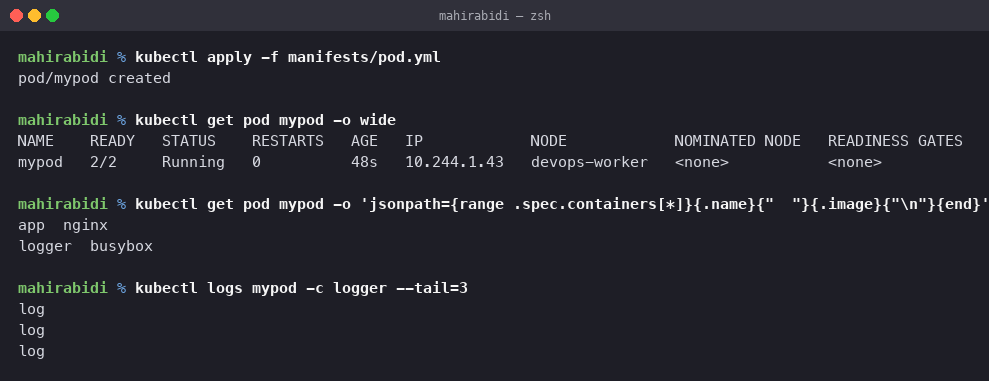
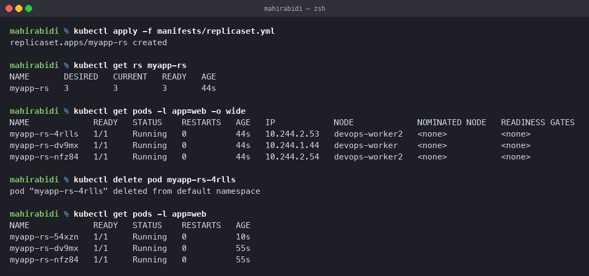
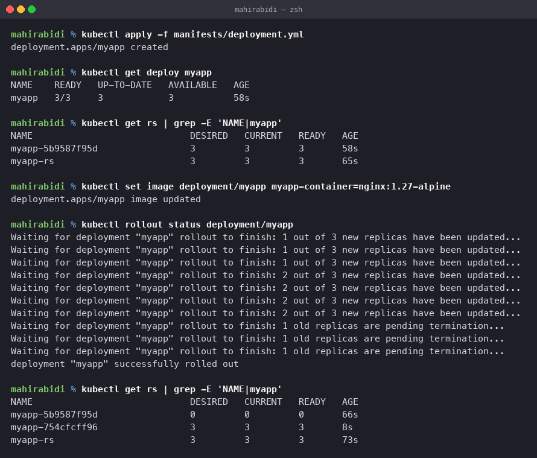
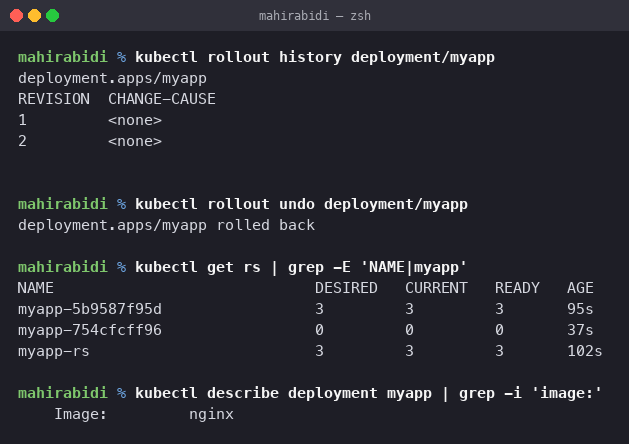
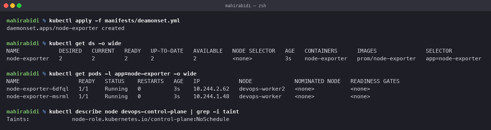
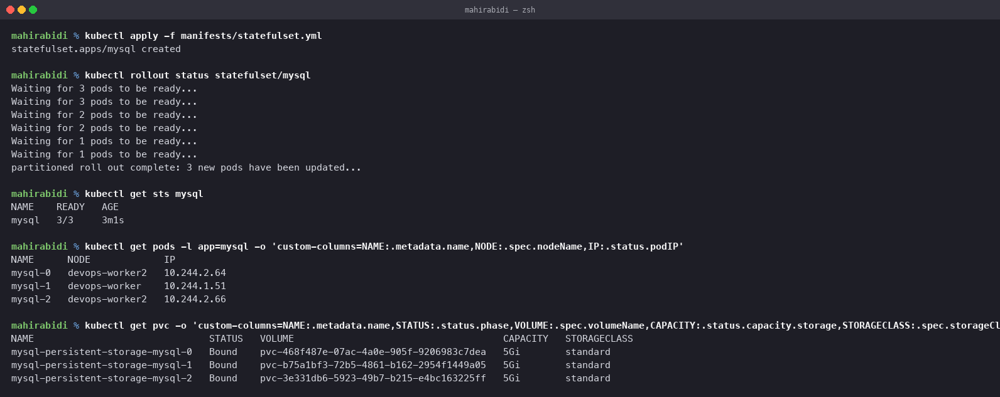
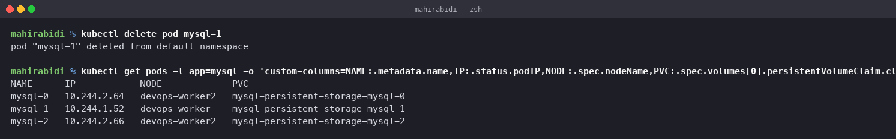

# Kubernetes Pods, ReplicaSets & Deployments

The core workload objects, applied to a real cluster and inspected. The manifests in
`manifests/` are the ones from the session repo; every command output below was captured
from the cluster described next.

## The cluster used

A three node cluster created locally with kind, one control plane and two workers:

    $ kubectl get nodes
    NAME                   STATUS   ROLES           AGE   VERSION
    devops-control-plane   Ready    control-plane   40s   v1.37.0
    devops-worker          Ready    <none>          20s   v1.37.0
    devops-worker2         Ready    <none>          20s   v1.37.0

Two workers matters for the DaemonSet section below; on a single node cluster that
exercise has nothing to show.

## 1. Pod

A Pod is the smallest unit Kubernetes schedules. It is one or more containers that share
a network namespace and storage, and are always placed on the same node. Containers in
one pod reach each other on `localhost`.

`manifests/pod.yml` is deliberately a two container pod: `nginx` as the application and
a `busybox` sidecar looping an `echo`.

    $ kubectl apply -f manifests/pod.yml
    pod/mypod created

    $ kubectl get pod mypod -o wide
    NAME    READY   STATUS    RESTARTS   AGE   IP            NODE            NOMINATED NODE   READINESS GATES
    mypod   2/2     Running   0          48s   10.244.1.43   devops-worker   <none>           <none>

    $ kubectl get pod mypod -o jsonpath='{range .spec.containers[*]}{.name}{"  "}{.image}{"\n"}{end}'
    app  nginx
    logger  busybox

    $ kubectl logs mypod -c logger --tail=3
    log
    log
    log

`READY 2/2` is the detail to read: two containers, both ready, one pod, one IP. Because
there are two containers, `kubectl logs` needs `-c` to say which one.

A bare pod like this has nothing watching it. Delete it and it is simply gone, which is
why pods are almost never created directly. Everything below exists to manage pods on
your behalf.

## 2. ReplicaSet

A ReplicaSet keeps a stable number of identical pod replicas running. It guarantees the
requested count exists, so the application has capacity to serve its load. You can create
one directly, but in practice a Deployment manages it for you.

    $ kubectl apply -f manifests/replicaset.yml
    replicaset.apps/myapp-rs created

    $ kubectl get rs myapp-rs
    NAME       DESIRED   CURRENT   READY   AGE
    myapp-rs   3         3         3       44s

    $ kubectl get pods -l app=web -o wide
    NAME             READY   STATUS    RESTARTS   AGE   IP            NODE             NOMINATED NODE   READINESS GATES
    myapp-rs-4rlls   1/1     Running   0          44s   10.244.2.53   devops-worker2   <none>           <none>
    myapp-rs-dv9mx   1/1     Running   0          44s   10.244.1.44   devops-worker    <none>           <none>
    myapp-rs-nfz84   1/1     Running   0          44s   10.244.2.54   devops-worker2   <none>           <none>

Names are generated with a random suffix, and the scheduler spread them across both
workers without being asked to.

### Proving it self-heals

    $ kubectl delete pod myapp-rs-4rlls
    pod "myapp-rs-4rlls" deleted from default namespace

    $ kubectl get pods -l app=web
    NAME             READY   STATUS    RESTARTS   AGE
    myapp-rs-54xzn   1/1     Running   0          10s
    myapp-rs-dv9mx   1/1     Running   0          55s
    myapp-rs-nfz84   1/1     Running   0          55s

Still three. `myapp-rs-4rlls` is gone for good and `myapp-rs-54xzn` is a brand new pod,
10 seconds old. This is the reconciliation loop from the architecture notes in action: the
controller observed 2 against a desired 3 and created one. Note it is a *replacement*,
not a restart, so the name and the IP are both different.

The selector is what ties them together. `myapp-rs` owns pods matching `app: web`, and it
counts whatever carries that label.

## 3. Deployment

A Deployment adds declarative updates on top of ReplicaSets. You state the desired end
state and the Deployment controller moves the cluster there at a controlled rate. It does
not manage pods itself; it creates a ReplicaSet per version of the pod template and
scales them.

    $ kubectl apply -f manifests/deployment.yml
    deployment.apps/myapp created

    $ kubectl get deploy myapp
    NAME    READY   UP-TO-DATE   AVAILABLE   AGE
    myapp   3/3     3            3           58s

    $ kubectl get rs | grep -E 'NAME|myapp'
    NAME                             DESIRED   CURRENT   READY   AGE
    myapp-5b9587f95d                 3         3         3       58s
    myapp-rs                         3         3         3       65s

`myapp-5b9587f95d` was created by the Deployment; the hash in the name is derived from
the pod template. `myapp-rs` is the standalone ReplicaSet from the previous section, and
it is unrelated.

### Rolling update

    $ kubectl set image deployment/myapp myapp-container=nginx:1.27-alpine
    deployment.apps/myapp image updated

    $ kubectl rollout status deployment/myapp
    Waiting for deployment "myapp" rollout to finish: 1 out of 3 new replicas have been updated...
    Waiting for deployment "myapp" rollout to finish: 2 out of 3 new replicas have been updated...
    Waiting for deployment "myapp" rollout to finish: 1 old replicas are pending termination...
    deployment "myapp" successfully rolled out

    $ kubectl get rs | grep -E 'NAME|myapp'
    NAME                             DESIRED   CURRENT   READY   AGE
    myapp-5b9587f95d                 0         0         0       66s
    myapp-754cfcff96                 3         3         3       8s
    myapp-rs                         3         3         3       73s

This is the mechanism, visible in one table. A second ReplicaSet `myapp-754cfcff96`
appeared for the new template and was scaled up to 3 while the original was scaled down
to 0. The old ReplicaSet is *kept* at zero rather than deleted, which is precisely what
makes a rollback cheap.

The progress messages show it was incremental, never taking all three down at once, which
is what "zero downtime" means here.

### Rollback

    $ kubectl rollout history deployment/myapp
    deployment.apps/myapp
    REVISION  CHANGE-CAUSE
    1         <none>
    2         <none>

    $ kubectl rollout undo deployment/myapp
    deployment.apps/myapp rolled back

    $ kubectl get rs | grep -E 'NAME|myapp'
    NAME                             DESIRED   CURRENT   READY   AGE
    myapp-5b9587f95d                 3         3         3       95s
    myapp-754cfcff96                 0         0         0       37s
    myapp-rs                         3         3         3       102s

    $ kubectl describe deployment myapp | grep -i 'image:'
        Image:         nginx

The two ReplicaSets swapped back. Nothing was rebuilt or re-pulled from a registry; the
old ReplicaSet was simply scaled up again.

`CHANGE-CAUSE` is `<none>` on both revisions because the change was made with
`kubectl set image`. Adding `--record` (deprecated) or annotating with
`kubernetes.io/change-cause` is what populates that column, and it is worth doing on a
shared cluster so the history is readable.

## 4. DaemonSet

A DaemonSet ensures that all, or a specified subset of, nodes run exactly one copy of a
pod. Pods are added automatically as nodes join the cluster and garbage collected as
nodes leave.

It is used for cluster wide infrastructure that has to be present on every machine:

- log collection agents such as Fluentd, Logstash or Promtail
- node monitoring agents such as Prometheus Node Exporter or a Datadog agent
- cluster storage daemons such as GlusterFS or Ceph

`manifests/deamonset.yml` runs `prom/node-exporter`, which is a textbook case: metrics
about a node can only be gathered from that node.

    $ kubectl apply -f manifests/deamonset.yml
    daemonset.apps/node-exporter created

    $ kubectl get ds -o wide
    NAME            DESIRED   CURRENT   READY   UP-TO-DATE   AVAILABLE   NODE SELECTOR   AGE   CONTAINERS      IMAGES               SELECTOR
    node-exporter   2         2         2       2            2           <none>          3s    node-exporter   prom/node-exporter   app=node-exporter

    $ kubectl get pods -l app=node-exporter -o wide
    NAME                  READY   STATUS    RESTARTS   AGE   IP            NODE             NOMINATED NODE   READINESS GATES
    node-exporter-6dfql   1/1     Running   0          3s    10.244.2.62   devops-worker2   <none>           <none>
    node-exporter-msrml   1/1     Running   0          3s    10.244.1.48   devops-worker    <none>           <none>

### Why DESIRED is 2 and not 3

The cluster has three nodes, so the obvious expectation is three pods. The reason it is
two:

    $ kubectl describe node devops-control-plane | grep -i taint
    Taints:             node-role.kubernetes.io/control-plane:NoSchedule

The control plane node carries a `NoSchedule` taint, so ordinary workloads are kept off
it, and the DaemonSet controller excludes it from the desired count. "One pod per node"
really means one pod per node the pod is *allowed* to run on.

A monitoring DaemonSet in production would normally want the control plane too, and gets
there by adding a toleration for that taint. Note DESIRED went to 2 on its own rather
than leaving a pod `Pending`, which is the difference between a taint being respected by
a controller and a pod that simply cannot be placed.

## 5. StatefulSet

A StatefulSet also manages a set of pods, but unlike a Deployment, whose pods are
interchangeable and disposable, it gives each pod a persistent identity that survives
rescheduling. Each one gets a stable ordinal name (`mysql-0`, `mysql-1`, `mysql-2`), a
stable DNS name, and its own PersistentVolume that it reattaches to on restart. Creation,
scaling and updates happen in order.

It is the right choice when the workload needs any of:

- stable, unique network identifiers, so each pod is addressable by a fixed name
- stable persistent storage that follows the pod identity rather than the pod instance
- ordered, graceful deployment and scaling, pod 0 then 1 then 2
- ordered, automated rolling updates

Typical uses: distributed databases (Cassandra, MongoDB, MySQL clusters), message brokers
(Kafka, RabbitMQ) and distributed key-value stores (ZooKeeper, etcd, Redis).

    $ kubectl apply -f manifests/statefulset.yml
    statefulset.apps/mysql created

    $ kubectl rollout status statefulset/mysql
    Waiting for 3 pods to be ready...
    Waiting for 3 pods to be ready...
    Waiting for 2 pods to be ready...
    Waiting for 2 pods to be ready...
    Waiting for 1 pods to be ready...
    Waiting for 1 pods to be ready...
    partitioned roll out complete: 3 new pods have been updated...

    $ kubectl get sts mysql
    NAME    READY   AGE
    mysql   3/3     3m1s

    $ kubectl get pods -l app=mysql -o 'custom-columns=NAME:.metadata.name,NODE:.spec.nodeName,IP:.status.podIP'
    NAME      NODE             IP
    mysql-0   devops-worker2   10.244.2.64
    mysql-1   devops-worker    10.244.1.51
    mysql-2   devops-worker2   10.244.2.66

Ordinal names, not random suffixes. The `rollout status` output above is the ordering made
visible: it counted down from three pods waiting, to two, to one, because each pod only
starts once the previous one is Ready. A Deployment would have started all three at once.

### One PVC per pod, created automatically

    $ kubectl get pvc -o 'custom-columns=NAME:.metadata.name,STATUS:.status.phase,VOLUME:.spec.volumeName,CAPACITY:.status.capacity.storage,STORAGECLASS:.spec.storageClassName'
    NAME                               STATUS   VOLUME                                     CAPACITY   STORAGECLASS
    mysql-persistent-storage-mysql-0   Bound    pvc-468f487e-07ac-4a0e-905f-9206983c7dea   5Gi        standard
    mysql-persistent-storage-mysql-1   Bound    pvc-b75a1bf3-72b5-4861-b162-2954f1449a05   5Gi        standard
    mysql-persistent-storage-mysql-2   Bound    pvc-3e331db6-5923-49b7-b215-e4bc163225ff   5Gi        standard

The `volumeClaimTemplates` block generated one claim per pod, each named after the pod.
A Deployment cannot do this; all its replicas would share whatever volume the template
names.

### Proving the identity is stable

    $ kubectl delete pod mysql-1
    pod "mysql-1" deleted from default namespace

    $ kubectl get pods -l app=mysql -o 'custom-columns=NAME:.metadata.name,IP:.status.podIP,NODE:.spec.nodeName,PVC:.spec.volumes[0].persistentVolumeClaim.claimName'
    NAME      IP            NODE             PVC
    mysql-0   10.244.2.64   devops-worker2   mysql-persistent-storage-mysql-0
    mysql-1   10.244.1.52   devops-worker    mysql-persistent-storage-mysql-1
    mysql-2   10.244.2.66   devops-worker2   mysql-persistent-storage-mysql-2

It came back as `mysql-1`, not as a new random name, and reattached to
`mysql-persistent-storage-mysql-1`, the same claim and therefore the same data. Only the
IP changed, from 10.244.1.51 to 10.244.1.52. Compare with the ReplicaSet earlier, where
the replacement pod had a different name entirely. That difference is the whole point of
the object.

### A real problem hit while running this

The session manifest specifies `mysql:5.7`, and it would not start:

    $ kubectl describe pod mysql-0
    Failed to pull image "mysql:5.7": no match for platform in manifest: not found
    Error: ErrImagePull

    $ uname -m
    arm64
    $ docker manifest inspect mysql:5.7 | grep architecture
    "architecture": "amd64"

`mysql:5.7` was never published for arm64, and this is an Apple Silicon machine, so there
is no image to pull. `mysql:8.0` does publish an arm64 build, so `manifests/statefulset.yml`
pins 8.0 with a comment recording why. Everything else in that file is unchanged.

Worth noting the failure mode: the pod was scheduled successfully and only then failed.
Scheduling considers resources and constraints, not whether the image can actually be
pulled for the node's architecture, so an image problem always surfaces at the kubelet,
never at the scheduler.

## Summary of the objects

| Object | Guarantees | Pod identity | Use for |
|---|---|---|---|
| Pod | nothing, nothing restarts it | n/a | never directly, except debugging |
| ReplicaSet | N replicas exist | random, disposable | rarely direct, a Deployment owns it |
| Deployment | N replicas + versioned updates | random, disposable | stateless applications |
| DaemonSet | one pod per eligible node | tied to the node | node agents, log and metric collectors |
| StatefulSet | N replicas, ordered, stable identity | ordinal, sticky, own volume | databases, brokers, quorum systems |

The single idea running through all of them is the controller loop. Each object records a
desired state, and a controller watches the live state and works to close the difference.
Deleting a pod does not fight Kubernetes, it just gives the relevant controller something
to reconcile.

## Cleanup

    kubectl delete -f manifests/
    kubectl delete pvc -l app=mysql       # StatefulSet PVCs are deliberately not cascaded
    kind delete cluster --name devops

The PVC note is worth keeping: deleting a StatefulSet leaves its PersistentVolumeClaims
behind on purpose, so that data is not destroyed by removing a workload. They have to be
deleted deliberately.
