# Pod Lifecycle

Session 10, Task 2. Twelve manifests, each one producing a state a pod can be in. Every
one was applied to a kind cluster, the status and details checked, and the output captured
below.

The cluster for this task was a single node kind cluster, `v1.37.0`, with about 3.8 GiB
allocatable memory. That number matters for the Pending demonstration.

## Phase vs STATUS: not the same thing

Worth getting straight before the states themselves, because the two are easy to confuse.

A pod has exactly five **phases**, and that is all the API defines: `Pending`, `Running`,
`Succeeded`, `Failed`, `Unknown`.

The `STATUS` column in `kubectl get pods` is **not** the phase. It is a friendlier summary
that mixes in the container's waiting reason, which is why you see things like
`CrashLoopBackOff`, `ImagePullBackOff`, `Init:0/1`, `Completed` and `Terminating` — none of
which are phases. `CrashLoopBackOff` is a pod in the `Running` phase whose container keeps
dying; `Completed` is the `Succeeded` phase.

That distinction is visible below, where `kubectl get` and the `jsonpath` of
`.status.phase` disagree on purpose.

---

## 1. Running

    kubectl apply -f 01-running.yaml

A plain nginx pod, nothing unusual. Scheduled, image pulled, container started, probe
default-passing.

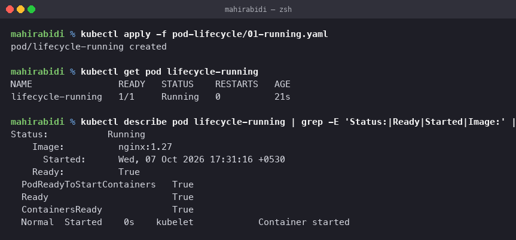

`READY 1/1` and `STATUS Running`. In `describe`, `Status: Running` with
`Ready: True` and all three of `PodReadyToStartContainers`, `Ready` and `ContainersReady`
true. This is the baseline everything else is measured against.

---

## 2. Pending

    kubectl apply -f 02-pending.yaml

The pod requests 9Gi of memory and 1 CPU. The node has roughly 3.8 GiB, so the scheduler
cannot place it anywhere.

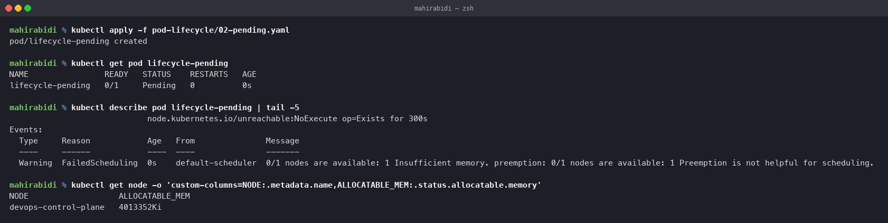

    Warning  FailedScheduling  default-scheduler  0/1 nodes are available: 1 Insufficient memory.
             preemption: 0/1 nodes are available: 1 Preemption is not helpful for scheduling.

`Pending` means the pod exists in etcd but is not running anywhere yet. The key detail is
that the reason is in the **events**, not the logs — there are no logs, because no
container ever started. The second clause is also informative: the scheduler considered
evicting lower-priority pods to make room and concluded it would not help.

Pending is not always a resource problem. The other common causes are an unsatisfied node
selector or affinity rule, a taint with no matching toleration, or a PersistentVolumeClaim
that cannot be bound.

---

## 3. Succeeded

    kubectl apply -f 03-succeeded.yaml

A busybox container that prints, sleeps 5 seconds and exits 0, with `restartPolicy: Never`.

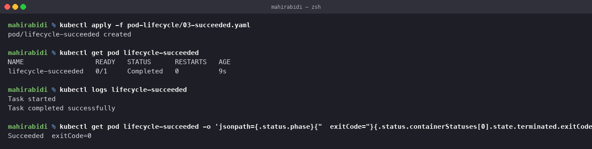

Here the phase and the STATUS column disagree, which is the point:

    $ kubectl get pod lifecycle-succeeded
    lifecycle-succeeded   0/1   Completed   0   16s

    $ kubectl get pod lifecycle-succeeded -o jsonpath='{.status.phase} exitCode={...}'
    Succeeded  exitCode=0

`STATUS` says `Completed`, the phase says `Succeeded`. `READY 0/1` is not a failure — the
container is gone, so zero of one are ready, and that is the correct end state for work
that finished. The logs survive the container, which is why `kubectl logs` still returns
both lines.

`restartPolicy: Never` is what makes this terminal. The default, `Always`, would restart
the container even on a clean exit, which is how a successful run turns into
CrashLoopBackOff.

---

## 4. Failed

    kubectl apply -f 04-failed.yaml

Identical to the previous one except it exits 1.

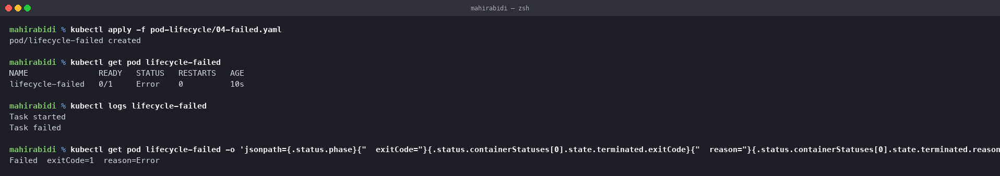

    $ kubectl get pod lifecycle-failed
    lifecycle-failed   0/1   Error   0   10s

    Failed  exitCode=1  reason=Error

Same shape as Succeeded, opposite outcome. The exit code is the whole difference. Logs are
still readable, which is where you look first — the container ran and said something
before dying.

---

## 5. CrashLoopBackOff

    kubectl apply -f 05-crashloopbackoff.yaml

The same failing command, but with the default `restartPolicy: Always`. The container
exits, Kubernetes restarts it, it exits again.

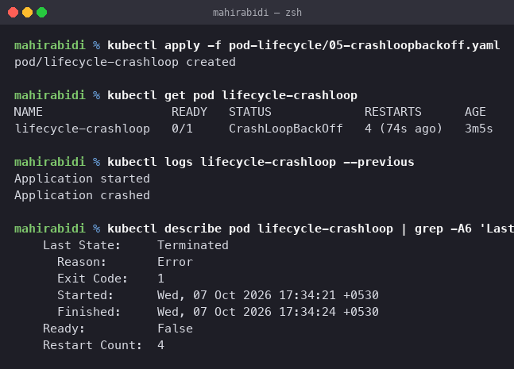

    lifecycle-crashloop   0/1   CrashLoopBackOff   4 (74s ago)   3m5s

The name is routinely misread as the error. It is not an error at all — it describes
Kubernetes **backing off**, waiting longer and longer between restart attempts (10s, 20s,
40s, up to five minutes) so a broken container does not spin the node.

The actual reason is in the logs of the run that already died, which needs `--previous`,
because the current container does not exist yet:

    $ kubectl logs lifecycle-crashloop --previous
    Application started
    Application crashed

and `describe` confirms it under `Last State`:

    Last State:     Terminated
      Reason:       Error
      Exit Code:    1
      Restart Count: 4

Catching this state takes a little patience: between restarts the pod briefly shows
`Error` rather than `CrashLoopBackOff`, so a single `kubectl get` can miss it.

---

## 6. ImagePullBackOff

    kubectl apply -f 06-imagepullbackoff.yaml

The image name is deliberate nonsense: `jakwehrgkaejw:kahsdfgkhj`.

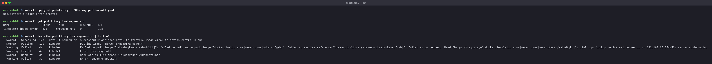

    lifecycle-image-error   0/1   ErrImagePull   0   12s

The progression is `ErrImagePull` on the first failure, then `ImagePullBackOff` once the
kubelet starts backing off, which is why the first `kubectl get` can show either.

This failure never reaches the container, so **there are no logs at all**. The information
is entirely in the events:

    Normal   Pulling  kubelet  Pulling image "jakwehrgkaejw:kahsdfgkhj"
    Warning  Failed   kubelet  Failed to pull image ... failed to resolve reference ...
    Warning  Failed   kubelet  Error: ErrImagePull
    Normal   BackOff  kubelet  Back-off pulling image "jakwehrgkaejw:kahsdfgkhj"
    Warning  Failed   kubelet  Error: ImagePullBackOff

So the rule worth remembering: **CrashLoopBackOff, read the logs. ImagePullBackOff, read
the events.** One ran and said something; the other never started.

A note on this particular capture: the underlying error reads `dial tcp: lookup
registry-1.docker.io ... server misbehaving`, a DNS failure reaching the registry, rather
than the cleaner "manifest unknown" you would get for a well-formed but nonexistent tag.
The outcome is the same and so is the lesson. In practice the usual causes are a typo in
the tag, a private registry with no `imagePullSecret`, or an image that was never pushed.

Worth connecting to task 9's main README, where this state was hit for real rather than on
purpose: `mysql:5.7` has no arm64 build, so the pull failed on this Apple Silicon machine.
Note also what that case shows — the pod was **scheduled successfully** and only then
failed. Scheduling considers resources and constraints, not whether the image can actually
be pulled for the node's architecture, so an image problem always surfaces at the kubelet,
never at the scheduler.

---

## 7. Readiness probe

    kubectl apply -f 07-readiness.yaml

An HTTP GET on `/` every 5 seconds, after a 5 second delay.

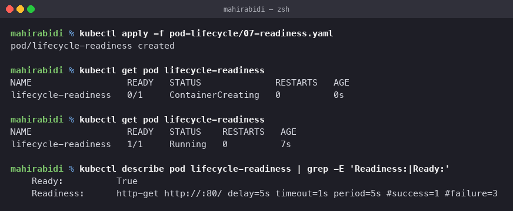

    lifecycle-readiness   0/1   ContainerCreating   0   0s
    ...
    lifecycle-readiness   1/1   Running             0   7s

    Readiness:  http-get http://:80/ delay=5s timeout=1s period=5s #success=1 #failure=3

The pod is `Running` before it is `1/1`. That gap is the whole purpose of a readiness
probe: the container is up but not yet willing to serve, and until it passes, Kubernetes
keeps it **out of Service endpoints**. No traffic is sent to it.

This connects directly to task 10's debugging order — a Service with no endpoints is often
a readiness probe failing, not a selector problem. A failing readiness probe does not
restart anything; it silently removes the pod from load balancing, which is exactly what
you want during a slow start or a temporary dependency outage.

---

## 8. Liveness probe

    kubectl apply -f 08-liveness.yaml

The container creates `/tmp/healthy`, sleeps 20 seconds, then deletes it. The probe tests
for that file every 5 seconds with `failureThreshold: 2`.

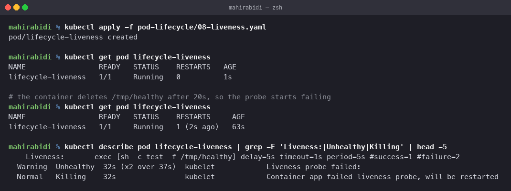

    lifecycle-liveness   1/1   Running   0            1s
    ...
    lifecycle-liveness   1/1   Running   1 (2s ago)   63s

    Warning  Unhealthy  32s (x2 over 37s)  kubelet  Liveness probe failed:
    Normal   Killing    32s                kubelet  Container app failed liveness probe, will be restarted

Two consecutive failures and the kubelet killed and restarted the container. `RESTARTS`
went from 0 to 1.

The contrast with readiness is the thing to hold on to:

| | Readiness | Liveness |
|---|---|---|
| On failure | removed from Service endpoints | container killed and restarted |
| Use for | "not ready for traffic yet" | "wedged, needs a restart" |
| Risk of getting it wrong | traffic sent to a pod that cannot serve | healthy pods restarted in a loop |

A liveness probe that is too aggressive is actively harmful — it will restart a container
that was merely slow, which is a common way to turn a latency spike into an outage.

---

## 9. Startup probe

    kubectl apply -f 09-startup.yaml

The app sleeps 30 seconds before creating `/tmp/started`. The startup probe polls every 5
seconds and allows 10 failures.

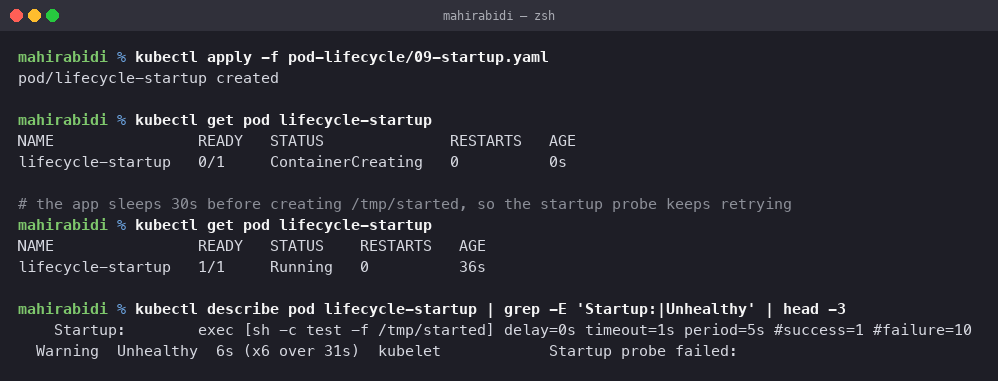

    Startup:  exec [sh -c test -f /tmp/started] delay=0s timeout=1s period=5s #success=1 #failure=10
    Warning  Unhealthy  6s (x6 over 31s)  kubelet  Startup probe failed:

Six failures over 31 seconds, then Ready at 36 seconds. Nothing was restarted.

That is the point of a startup probe. It exists to protect slow-starting applications from
the liveness probe: while a startup probe is running, the liveness and readiness probes are
**disabled entirely**. Without it you would have to set a liveness `initialDelaySeconds`
long enough for the worst-case boot, which makes the probe useless for detecting a genuine
hang later on. With it you get a generous budget for startup and a tight probe afterwards.

Its budget is `periodSeconds × failureThreshold` — here 5 × 10 = 50 seconds. Exceed that
and the container is killed.

---

## 10. Init container

    kubectl apply -f 10-init-container.yaml

A busybox init container that sleeps 10 seconds, then an nginx app container.

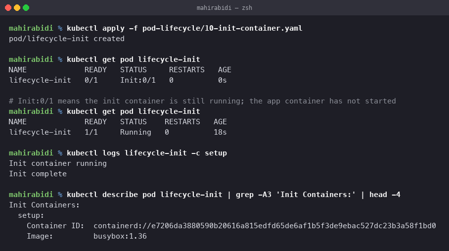

    lifecycle-init   0/1   Init:0/1   0    0s
    ...
    lifecycle-init   1/1   Running    0   18s

`Init:0/1` is its own STATUS, meaning zero of one init containers have finished and the app
container has not been started at all. Init containers run **to completion, in order,
before** any app container starts, and their logs need `-c`:

    $ kubectl logs lifecycle-init -c setup
    Init container running
    Init complete

Typical real uses: waiting for a database to accept connections, running a schema
migration, cloning config from git, or fixing volume permissions. If an init container
fails, the pod restarts it according to the restart policy and the app container never
runs — which is the desired behaviour, since the precondition was not met.

---

## 11. Multi-container pod

    kubectl apply -f 11-multi-container.yaml

nginx plus a busybox sidecar looping an echo.

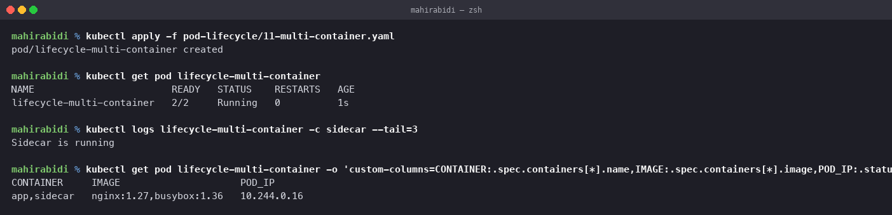

    lifecycle-multi-container   2/2   Running   0   1s

    CONTAINER     IMAGE                     POD_IP
    app,sidecar   nginx:1.27,busybox:1.36   10.244.0.16

`READY 2/2` — two containers, both ready, **one pod and one IP**. That shared IP is the
defining property: the containers share a network namespace, so they reach each other on
`localhost`, and they share the pod's volumes. They are always scheduled together on the
same node and scale together, because the pod is the scheduling unit, not the container.

Because there are two containers, `kubectl logs` requires `-c` to say which one.

Common sidecar patterns: a log shipper reading a shared volume, a service mesh proxy
intercepting traffic, or a config reloader watching for changes.

---

## 12. Graceful termination

    kubectl apply -f 12-termination.yaml

A container that traps `SIGTERM`, prints, sleeps 10 seconds, then exits. The pod sets
`terminationGracePeriodSeconds: 20`.

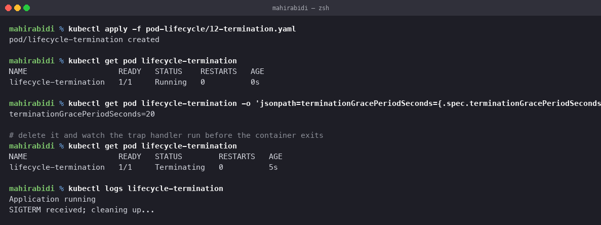

    $ kubectl delete pod lifecycle-termination --wait=false
    $ kubectl get pod lifecycle-termination
    lifecycle-termination   1/1   Terminating   0   5s

    $ kubectl logs lifecycle-termination
    Application running
    SIGTERM received; cleaning up...

The shutdown sequence, which is worth knowing exactly:

1. The pod is marked for deletion and immediately removed from all Service endpoints, so
   no new traffic arrives.
2. The kubelet sends `SIGTERM` to PID 1 in each container.
3. The grace period starts — 20 seconds here, 30 by default.
4. If the container exits before the period ends, the pod is removed straight away.
5. If it does not, the kubelet sends `SIGKILL`, which cannot be caught.

The handler got its 10 seconds and finished well inside the 20 second budget, so no
`SIGKILL` was needed. That is what "graceful" means: in-flight requests finish, connections
close properly, and buffers flush.

Two failure modes this guards against. If the application ignores `SIGTERM`, it is killed
at the end of the grace period and loses whatever it was doing. If the grace period is
shorter than the cleanup takes, the same thing happens even though the handler was written
correctly. And a subtlety: a process started through a shell may not be PID 1, in which
case it never receives the signal at all — which is why `exec` form in a Dockerfile
`CMD` matters.

---

## Summary

| # | STATUS seen | Phase | What it means | Where to look |
|---|---|---|---|---|
| 1 | `Running` | Running | normal, container up and ready | — |
| 2 | `Pending` | Pending | cannot be scheduled | events |
| 3 | `Completed` | Succeeded | finished, exit 0 | logs |
| 4 | `Error` | Failed | finished, non-zero exit | logs |
| 5 | `CrashLoopBackOff` | Running | keeps dying, restarts backing off | `logs --previous` |
| 6 | `ErrImagePull` / `ImagePullBackOff` | Pending | image cannot be fetched | events |
| 7 | `Running` 0/1 → 1/1 | Running | not ready for traffic yet | probe config |
| 8 | `Running` with restarts | Running | probe killed a wedged container | events |
| 9 | `Running` 0/1 → 1/1 | Running | slow start, protected from liveness | events |
| 10 | `Init:0/1` | Pending | init container still running | `logs -c <init>` |
| 11 | `Running` 2/2 | Running | two containers, one IP | `logs -c <name>` |
| 12 | `Terminating` | Running | shutting down inside the grace period | logs |

## Cleanup

    kubectl delete -f . --ignore-not-found
