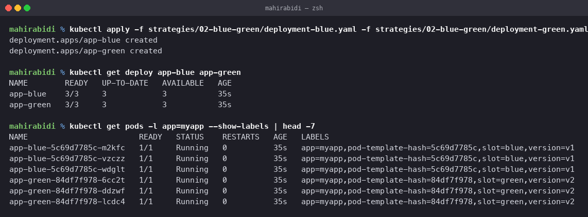
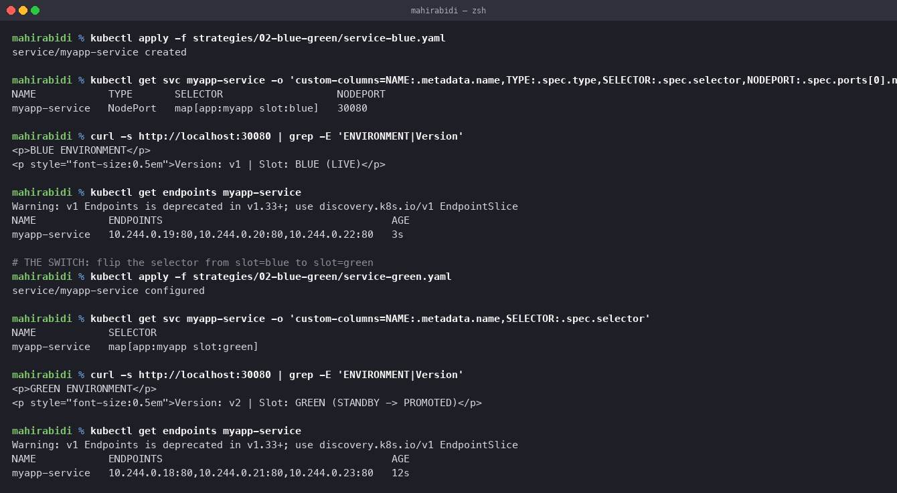
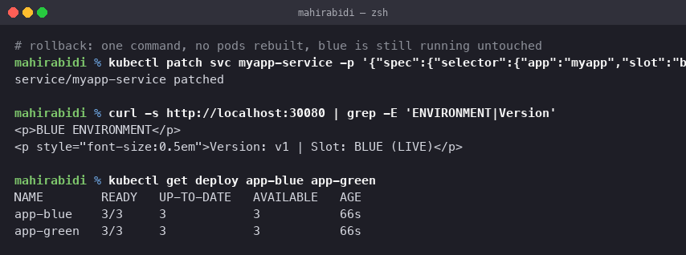
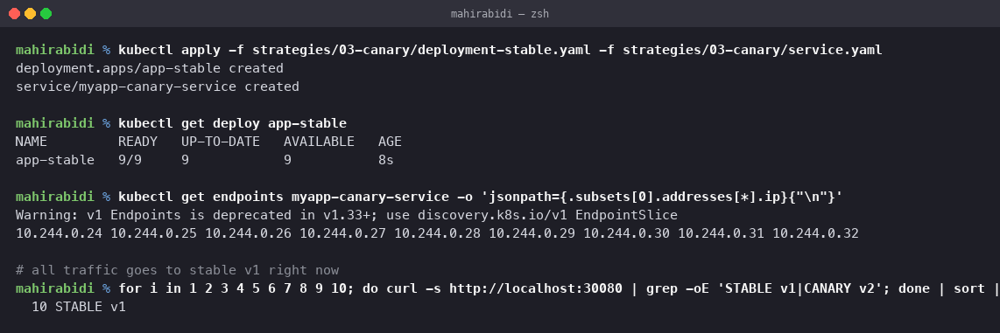
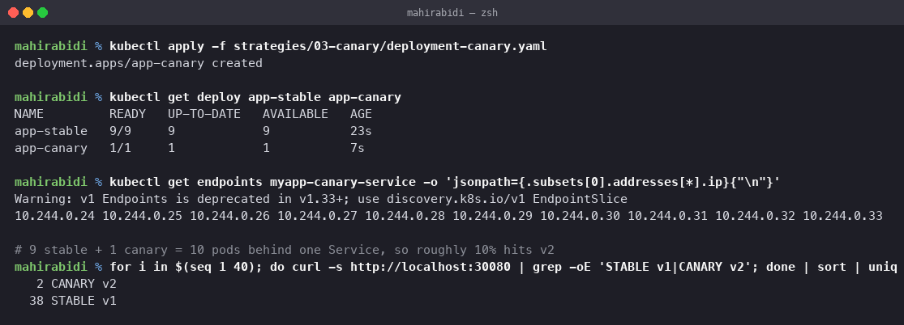
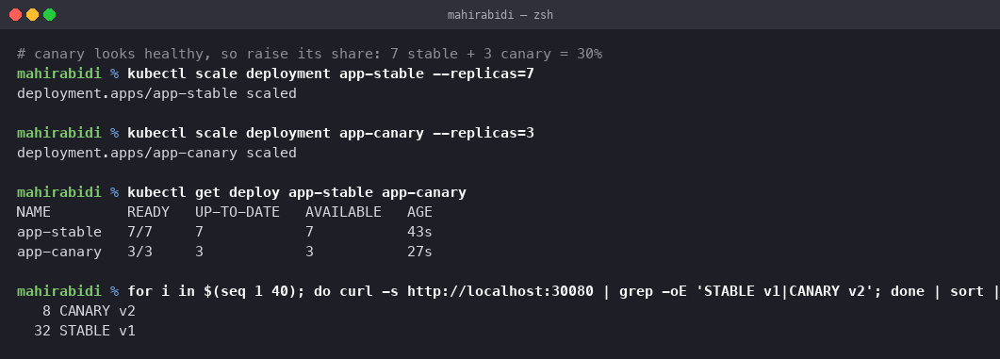
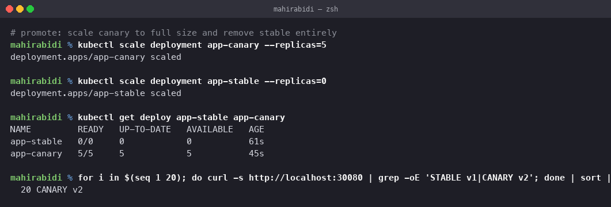
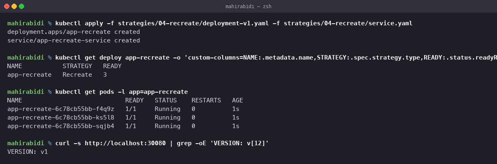
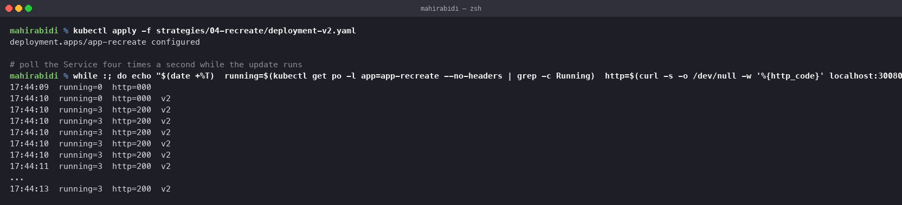
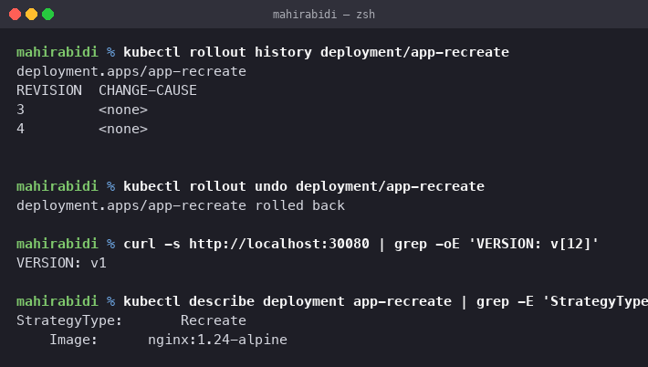

# Deployment Strategies

Session 10, Task 1. All four strategies, each one deployed, updated and rolled back on a
real cluster.

Rolling update is the first one and is already covered in detail in `../README.md`, which
has the full rollout and rollback with revision history. The manifests for it are in
`01-rolling-update/` for completeness; the three below are the ones demonstrated here.

**One change from the course manifests.** Each strategy's Service originally used its own
NodePort — 30010, 30020, 30030, 30040. This kind cluster only maps host port 30080, so all
four were retargeted to 30080 and the original is recorded in a comment on the line. The
strategies are run one at a time, so there is no clash. Everything else is unchanged.

The cluster: single node kind, `v1.37.0`, on arm64.

---

## 2. Blue-Green

Two complete environments side by side. Only one receives traffic, and switching is a
change of Service selector rather than a change to any pod.

    kubectl apply -f 02-blue-green/deployment-blue.yaml \
                  -f 02-blue-green/deployment-green.yaml

Blue runs `nginx:1.24-alpine` labelled `slot: blue, version: v1`; green runs
`nginx:1.25-alpine` labelled `slot: green, version: v2`. Three replicas each, so six pods
total — double the resources, which is the cost of this strategy.

Both report `3/3`, and `--show-labels` shows the two groups distinguished only by `slot`
and `version`. Note they share `app: myapp`, which is what lets one Service reach either.

### Pointing the Service at blue

    kubectl apply -f 02-blue-green/service-blue.yaml

    NAME            TYPE       SELECTOR                   NODEPORT
    myapp-service   NodePort   map[app:myapp slot:blue]   30080

    $ curl -s http://localhost:30080 | grep -E 'ENVIRONMENT|Version'
    
BLUE ENVIRONMENT

    
Version: v1 | Slot: BLUE (LIVE)

    $ kubectl get endpoints myapp-service
    myapp-service   10.244.0.19:80,10.244.0.20:80,10.244.0.22:80

Three endpoints, all blue pods. Green is running and reachable by nothing.

### The switch

    kubectl apply -f 02-blue-green/service-green.yaml

The only difference between the two Service files is `slot: blue` versus `slot: green`.

    NAME            SELECTOR
    myapp-service   map[app:myapp slot:green]

    $ curl -s http://localhost:30080 | grep -E 'ENVIRONMENT|Version'
    
GREEN ENVIRONMENT

    
Version: v2 | Slot: GREEN (STANDBY -> PROMOTED)

    $ kubectl get endpoints myapp-service
    myapp-service   10.244.0.18:80,10.244.0.21:80,10.244.0.23:80

The endpoint list changed completely — `.19/.20/.22` became `.18/.21/.23`. Not one pod was
created, destroyed or restarted. The EndpointSlice controller simply re-evaluated the
selector and `kube-proxy` reprogrammed its rules. That is why the cutover is effectively
instant, and why both versions never serve at the same time.

### Rollback

    kubectl patch svc myapp-service -p '{"spec":{"selector":{"app":"myapp","slot":"blue"}}}'

    
BLUE ENVIRONMENT

    NAME        READY   UP-TO-DATE   AVAILABLE   AGE
    app-blue    3/3     3            3           66s
    app-green   3/3     3            3           66s

Back on v1 in one command. Both deployments are still `3/3` and 66 seconds old — nothing
was rebuilt, because blue never stopped running. This is the fastest rollback of any
strategy, and it is the main reason to accept the doubled resource cost.

### Notes

- Pays for two full environments to get an instant, complete cutover.
- Blue is only decommissioned once green has been confirmed stable in production.
- Database schema changes are the hard part: both versions must work against the same
  schema during the switch, or the rollback is not actually available.
- Used where a partial rollout is unacceptable — payment systems, regulated releases.

---

## 3. Canary

A small slice of real traffic goes to the new version first. Here the split is produced by
**pod ratio**: one Service selects both deployments, and `kube-proxy` spreads connections
across every matching pod.

### Stable only

    kubectl apply -f 03-canary/deployment-stable.yaml -f 03-canary/service.yaml

Nine replicas of v1. The Service selects `app: myapp-canary`, which both deployments carry
— the `track` label distinguishes them but is deliberately **not** in the selector.

    app-stable   9/9   9   9   8s

    10.244.0.24 ... 10.244.0.32        # nine endpoints

    $ for i in 1..10; do curl ... ; done | sort | uniq -c
      10 STABLE v1

Ten of ten to v1, as expected with nothing else behind the Service.

### Adding the canary

    kubectl apply -f 03-canary/deployment-canary.yaml

One replica of v2. Ten pods total, so roughly 10% of connections should reach it.

    app-stable   9/9   9   9   23s
    app-canary   1/1   1   1   7s

    10.244.0.24 ... 10.244.0.33        # ten endpoints now

    $ for i in $(seq 1 40); do curl ...; done | sort | uniq -c
       2 CANARY v2
      38 STABLE v1

2 of 40 is 5%, against an expected 10%. That is not a bug and it is worth understanding:
`kube-proxy` picks a backend **at random per connection**, not round-robin, so the split
only approaches the pod ratio over a large number of requests. Forty samples is a small
number. This is also the central limitation of ratio-based canarying — you cannot express
"exactly 10%", and you cannot route by header, cookie or user ID. That needs an ingress
controller or a service mesh.

### Increasing the share

    kubectl scale deployment app-stable --replicas=7
    kubectl scale deployment app-canary --replicas=3

    app-stable   7/7   7   7   43s
    app-canary   3/3   3   3   27s

    $ for i in $(seq 1 40); do curl ...; done | sort | uniq -c
       8 CANARY v2
      32 STABLE v1

8 of 40 is 20%, against an expected 30% — again converging on the ratio rather than
matching it exactly. Note the total stays at ten pods, so capacity is constant while the
mix shifts.

### Promotion

    kubectl scale deployment app-canary --replicas=5
    kubectl scale deployment app-stable --replicas=0

    app-stable   0/0   0   0   61s
    app-canary   5/5   5   5   45s

    $ for i in $(seq 1 20); do curl ...; done | sort | uniq -c
      20 CANARY v2

All traffic on v2. Had the canary misbehaved, the rollback would have been
`kubectl scale deployment app-canary --replicas=0`, which removes it from the endpoint
list immediately and leaves stable serving everything.

### Notes

- The only strategy that tests a release against real production traffic before committing.
- Blast radius is bounded: a bad canary affects roughly its share of users, not all of them.
- Needs monitoring to be worth anything. Without error rates and latency per version, you
  are shifting traffic blind — which is why this pairs with the observability session.
- Slower than the others, deliberately. The waiting is the feature.

---

## 4. Recreate

Terminate everything, then start the new version. The only strategy that accepts downtime
on purpose.

    kubectl apply -f 04-recreate/deployment-v1.yaml -f 04-recreate/service.yaml

    NAME           STRATEGY   READY
    app-recreate   Recreate   3

`strategy.type: Recreate` in the manifest, confirmed in the live object.

### The update, and the outage

    kubectl apply -f 04-recreate/deployment-v2.yaml

Polling the Service four times a second across the update:

    17:44:09  running=0  http=000
    17:44:10  running=0  http=000
    17:44:10  running=3  http=200  v2
    17:44:10  running=3  http=200  v2
    ...

`running=0  http=000` is the whole demonstration. Zero pods exist and the Service has no
endpoints, so `curl` cannot connect at all — exit code 7, no HTTP status. Compare with the
rolling update in `../README.md`, where the same poll never dropped below the full replica
count and never returned anything but 200.

The window here was short, a second or two, because nginx starts quickly and the image was
already cached. A real application with a 30 second boot gives a 30 second outage, and
every request in it fails.

Note also that `http=000` is the same symptom as the broken-selector Service in task 10.
In both cases the cause is an empty endpoint list — once because the pods are gone, once
because the selector matched nothing.

### Rollback

    kubectl rollout undo deployment/app-recreate

    REVISION  CHANGE-CAUSE
    3         <none>
    4         <none>

    VERSION: v1
    StrategyType:  Recreate
    Image:         nginx:1.24-alpine

Rollback works the same way as any Deployment, through revision history — but it is
*itself* a Recreate rollout, so going back incurs a second outage. Worth knowing before
you need it at 3am.

### Why anyone would choose this

Downtime sounds indefensible, and there are four real cases:

1. **Breaking schema migrations.** If v2's database schema is incompatible with v1, the two
   versions must never run at once. Recreate guarantees that; rolling update guarantees the
   opposite.
2. **ReadWriteOnce volumes.** A PVC that only one pod can mount makes an overlap
   impossible — the new pod would sit Pending waiting for a volume the old pod still holds.
3. **State-locked legacy applications.** Software that takes an exclusive lock, or licences
   by instance count, cannot tolerate two copies.
4. **Non-production environments.** In dev or CI, downtime costs nothing and halving the
   resource use is worth more than availability.

---

## Comparison

| | Rolling Update | Blue-Green | Canary | Recreate |
|---|---|---|---|---|
| Downtime | none | none | none | **yes** |
| Resource cost during rollout | ~125% | **200%** | ~110% | **100%** |
| Both versions live at once | yes, briefly | no | yes, by design | **no** |
| Rollback speed | fast, rescale old RS | **instant, flip selector** | instant, scale canary to 0 | slow, another outage |
| Tests on real traffic first | no | no | **yes** | no |
| Granular traffic control | no | no | by pod ratio only | no |
| Default for a Deployment | **yes** | no | no | no |
| Use when | most things | cutover must be total | release is risky | versions cannot overlap |

The one-line summary: rolling update is the sane default; blue-green buys an instant
rollback with double the hardware; canary buys confidence with time; recreate buys
guaranteed non-overlap with an outage.

## Cleanup

    kubectl delete -f 02-blue-green/ -f 03-canary/ -f 04-recreate/ --ignore-not-found
